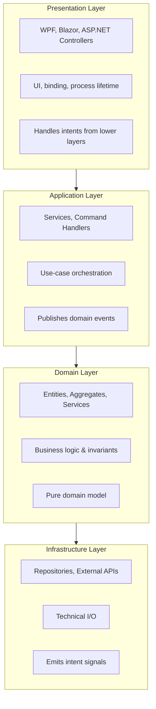

# Layer Separation in DDD

Comprehensive guide to layer responsibilities, boundaries, and prohibited patterns in Domain Driven Design for .NET applications.

## Layer Overview



## Presentation Layer (UI)

### Responsibilities

- **UI Concerns:** Rendering, data binding, user input, validation feedback
- **Process Lifetime:** Owns all application/process termination logic
- **Intent Handling:** Subscribes to intent streams from lower layers and translates into UI actions
- **Thread Marshaling:** Handles dispatcher/synchronization context for UI updates
- **Lifetime Service:** Provides dedicated service for orchestrating shutdown sequence

### Allowed Dependencies

- Application layer services (via interfaces)
- Domain layer types (for display/binding)
- Infrastructure layer types (only for DI registration)
- UI frameworks (WPF, Blazor, ASP.NET Core)

### What It Can Do

```csharp
// ✅ Subscribe to application intents
_orderService.OrderProcessingFailed
    .ObserveOn(_uiScheduler)
    .Subscribe(OnOrderFailed)
    .DisposeWith(_disposables);

// ✅ Decide to shut down based on intent
private void OnCriticalError(ErrorIntent intent)
{
    MessageBox.Show(intent.Message, "Critical Error");
    _lifetimeService.InitiateShutdown(intent.ExitCode);
}

// ✅ Marshal to UI thread
await _dispatcher.InvokeAsync(() => UpdateStatus(status));
```

### What It Cannot Do

- ❌ Directly mutate domain entities (must go through Application services)
- ❌ Implement business logic or invariants
- ❌ Call repositories directly (use Application services)

### Example: Lifetime Service Pattern

```csharp
public interface IApplicationLifetime
{
    void InitiateShutdown(int exitCode);
    void InitiateShutdown(string reason);
    Task ShutdownGracefullyAsync(CancellationToken cancellationToken);
}

public class WpfApplicationLifetime : IApplicationLifetime
{
    private readonly ILogger _logger;

    public WpfApplicationLifetime(ILogger logger)
    {
        _logger = logger;
    }

    public void InitiateShutdown(int exitCode)
    {
        _logger.Info("Initiating shutdown with exit code={0}", exitCode);
        Application.Current.Shutdown(exitCode);
    }

    public void InitiateShutdown(string reason)
    {
        _logger.Info("Initiating shutdown: {0}", reason);
        Application.Current.Shutdown();
    }

    public async Task ShutdownGracefullyAsync(CancellationToken cancellationToken)
    {
        _logger.Info("Graceful shutdown initiated");
        // Cleanup resources
        await Task.Delay(100, cancellationToken); // Give time for pending ops
        Application.Current.Shutdown();
    }
}
```

## Application Layer

### Responsibilities

- **Use-Case Orchestration:** Coordinates domain operations to fulfill business workflows
- **Transaction Management:** Defines transaction boundaries
- **Event Publishing:** Publishes domain events **after** successful state persistence
- **Intent Signaling:** Exposes `IObservable<T>` streams for higher layers to subscribe to
- **DTO Mapping:** Converts domain models to/from DTOs for external contracts

### Allowed Dependencies

- Domain layer (entities, aggregates, services, events)
- Infrastructure interfaces (IRepository, etc.)
- **NO** direct dependency on Infrastructure implementations
- **NO** UI frameworks

### What It Can Do

```csharp
// ✅ Orchestrate domain operations
public class OrderApplicationService
{
    private readonly IOrderRepository _repository;
    private readonly ILogger _logger;
    private readonly Subject<OrderCreatedEvent> _orderCreated = new();

    public IObservable<OrderCreatedEvent> OrderCreated => _orderCreated.AsObservable();

    public async Task<Result<OrderId>> CreateOrderAsync(
        CustomerId customerId,
        List<OrderItemDto> items,
        CancellationToken cancellationToken)
    {
        // Load aggregate
        var customer = await _repository.GetCustomerAsync(customerId, cancellationToken);

        // Tell aggregate what to do (domain enforces rules)
        var order = Order.CreateNew(customer, items.Select(i =>
            new OrderItem(i.ProductId, i.Quantity, i.Price)));

        // Persist
        await _repository.SaveAsync(order, cancellationToken);

        // Publish event AFTER successful persistence
        _orderCreated.OnNext(new OrderCreatedEvent(order.Id, customer.Id));

        return Result.Success(order.Id);
    }

    // ✅ Expose intent signals (not shutdown logic!)
    private readonly Subject<CriticalErrorIntent> _criticalErrors = new();
    public IObservable<CriticalErrorIntent> CriticalErrors => _criticalErrors.AsObservable();
}
```

### What It Cannot Do

```csharp
// ❌ NO process termination
public async Task ProcessOrderAsync(OrderId orderId)
{
    try
    {
        // process...
    }
    catch (DatabaseConnectionException ex)
    {
        _logger.Error(ex);

        // ❌ WRONG: Never terminate process from Application layer
        // Application.Current.Shutdown();
        // Environment.Exit(1);

        // ✅ CORRECT: Emit intent for Presentation to handle
        _criticalErrors.OnNext(new CriticalErrorIntent(ex.Message));
    }
}

// ❌ NO UI thread marshaling
public void UpdateStatus(string status)
{
    // ❌ WRONG: Application layer doesn't know about Dispatcher
    // Dispatcher.CurrentDispatcher.Invoke(() => StatusText = status);

    // ✅ CORRECT: Emit event, let Presentation handle UI updates
    _statusUpdated.OnNext(new StatusUpdatedEvent(status));
}

// ❌ NO background shutdown tasks
// ❌ WRONG: This is process termination logic disguised as background work
private Task MonitorHealthAndShutdownIfNeeded(CancellationToken ct)
{
    return Task.Run(async () =>
    {
        while (!ct.IsCancellationRequested)
        {
            if (await IsSystemUnhealthyAsync())
            {
                Environment.Exit(1); // ❌ FORBIDDEN
            }
        }
    }, ct);
}
```

### Prohibited Patterns

1. **Direct Entity Mutation:** Never expose entities to Presentation layer for direct mutation
   - ✅ Use command/handler pattern or service methods instead

2. **Business Logic:** Never implement domain rules in Application services
   - ✅ Delegate to domain aggregates/services

3. **Cross-Aggregate Transactions:** Avoid updating multiple aggregates in single transaction
   - ✅ Use domain events and eventual consistency instead

## Domain Layer

### Responsibilities

- **Business Logic:** All business rules, invariants, calculations
- **State Encapsulation:** Entities control their own state changes
- **Validation:** Validate operations before allowing state mutation
- **Domain Events (as data):** Define event types, but don't publish them

### Allowed Dependencies

- **NONE** (pure domain model)
- Other domain types (entities, value objects, domain services)
- .NET BCL (System.*, but avoid heavy I/O types)

### What It Can Do

```csharp
// ✅ Enforce invariants through behavior methods
public class Order
{
    private readonly List<OrderItem> _items = new();

    public OrderId Id { get; private init; }
    public CustomerId CustomerId { get; private init; }
    public Money Total { get; private set; }
    public OrderStatus Status { get; private set; }

    // ✅ Tell, don't ask - encapsulated update
    public Result AddItem(ProductId productId, int quantity, Money price, Money customerCreditLimit)
    {
        // Domain logic: check invariants
        var newTotal = Total + (price * quantity);
        if (newTotal > customerCreditLimit)
            return Result.Failure("Order would exceed customer credit limit");

        if (quantity <= 0)
            return Result.Failure("Quantity must be positive");

        // Mutate state only after validation
        var item = new OrderItem(productId, quantity, price);
        _items.Add(item);
        Total = newTotal;

        return Result.Success();
    }
}
```

### What It Cannot Do

```csharp
// ❌ NO event publishing from entities
public class Order
{
    // ❌ WRONG: Entities should not publish events
    private readonly Subject<OrderItemAdded> _itemAdded = new();
    public IObservable<OrderItemAdded> ItemAdded => _itemAdded;

    public void AddItem(OrderItem item)
    {
        _items.Add(item);
        _itemAdded.OnNext(new OrderItemAdded(Id, item.ProductId)); // ❌ NO
    }
}

// ❌ NO infrastructure dependencies
public class Order
{
    // ❌ WRONG: Domain should not know about repositories
    private readonly IProductRepository _productRepository;

    public async Task AddItemAsync(ProductId productId, int quantity)
    {
        var product = await _productRepository.GetAsync(productId); // ❌ NO
        // ...
    }
}

// ❌ NO UI concerns
public class Order
{
    // ❌ WRONG: Domain doesn't know about UI
    public void Validate()
    {
        if (!IsValid())
            MessageBox.Show("Invalid order"); // ❌ NO
    }
}
```

## Infrastructure Layer

### Responsibilities

- **Data Access:** Implement repositories, database context, queries
- **External APIs:** HTTP clients, message queues, email services
- **File I/O:** Reading/writing files, serialization
- **Named Pipes, Sockets:** Network communication
- **Intent Signaling:** Emit `IObservable<T>` when infrastructure events occur

### Allowed Dependencies

- Domain layer (to return domain entities)
- Application layer interfaces (to implement them)
- External libraries (EF Core, Dapper, RestSharp, etc.)
- **NO** UI frameworks
- **NO** Presentation layer types

### What It Can Do

```csharp
// ✅ Implement repositories
public class OrderRepository : IOrderRepository
{
    private readonly DbContext _context;
    private readonly ILogger _logger;

    public async Task<Order> GetAsync(OrderId id, CancellationToken ct)
    {
        return await _context.Orders
            .Include(o => o.Items)
            .FirstOrDefaultAsync(o => o.Id == id, ct);
    }

    public async Task SaveAsync(Order order, CancellationToken ct)
    {
        _context.Orders.Update(order);
        await _context.SaveChangesAsync(ct);
    }
}

// ✅ Emit intent signals (not shutdown logic!)
public class NamedPipeServer : IDisposable
{
    private readonly Subject<ClientDisconnectedIntent> _clientDisconnected = new();
    public IObservable<ClientDisconnectedIntent> ClientDisconnected => _clientDisconnected;

    private async Task ReadLoopAsync(CancellationToken ct)
    {
        try
        {
            // read from pipe...
        }
        catch (IOException ex)
        {
            _logger.Error(ex);

            // ✅ Emit intent - let higher layers decide what to do
            _clientDisconnected.OnNext(new ClientDisconnectedIntent(ex.Message));
        }
    }
}
```

### What It Cannot Do

```csharp
// ❌ NO process termination
public class DatabaseConnectionMonitor
{
    public async Task MonitorConnectionAsync(CancellationToken ct)
    {
        while (!ct.IsCancellationRequested)
        {
            if (!await CanConnectAsync())
            {
                // ❌ WRONG: Infrastructure decides to shut down
                // Environment.Exit(1);

                // ✅ CORRECT: Emit intent
                _connectionLost.OnNext(new DatabaseConnectionLostIntent());
            }
        }
    }
}

// ❌ NO UI thread manipulation
public class NotificationRepository
{
    public async Task SaveNotificationAsync(Notification notification)
    {
        await _context.SaveChangesAsync();

        // ❌ WRONG: Infrastructure layer calling UI
        // Dispatcher.CurrentDispatcher.Invoke(() =>
        //     NotificationToast.Show(notification.Message));

        // ✅ CORRECT: Emit event
        _notificationSaved.OnNext(new NotificationSavedEvent(notification.Id));
    }
}
```

## Intent Signal Pattern (Detailed)

### Definition

An **intent** is a neutral signal emitted by a lower layer indicating that something happened. The intent does NOT prescribe action—it simply informs. The Presentation layer receives intents and decides what action to take.

### Why Use Intents?

- **Maintains layer boundaries:** Lower layers don't depend on UI or process lifetime
- **Testability:** Infrastructure/Application layers can be tested without UI
- **Flexibility:** Different UI implementations can handle same intent differently (shutdown vs. retry vs. log)

### Intent Pattern Template

```csharp
// 1. Define intent in Application or Infrastructure layer
public readonly record struct ServerDisconnectedIntent(string Reason);

// 2. Expose as observable from service
public interface IConnectionMonitor
{
    IObservable<ServerDisconnectedIntent> ServerDisconnected { get; }
}

// 3. Presentation subscribes and decides action
public class MainViewModel : IDisposable
{
    private readonly CompositeDisposable _disposables = new();
    private readonly IApplicationLifetime _lifetime;
    private readonly IConnectionMonitor _connectionMonitor;

    public MainViewModel(
        ILogger logger,
        IApplicationLifetime lifetime,
        IConnectionMonitor connectionMonitor)
    {
        _lifetime = lifetime;
        _connectionMonitor = connectionMonitor;

        // Subscribe to intent
        _connectionMonitor.ServerDisconnected
            .ObserveOn(Scheduler.CurrentThread) // or UI scheduler
            .Subscribe(OnServerDisconnected)
            .DisposeWith(_disposables);
    }

    private void OnServerDisconnected(ServerDisconnectedIntent intent)
    {
        // Presentation decides what to do
        var result = MessageBox.Show(
            $"Server disconnected: {intent.Reason}\n\nRetry or Exit?",
            "Connection Lost",
            MessageBoxButton.YesNo);

        if (result == MessageBoxResult.No)
        {
            _lifetime.InitiateShutdown("User chose to exit after disconnect");
        }
        else
        {
            // Retry logic...
        }
    }

    public void Dispose() => _disposables.Dispose();
}
```

### Common Intent Types

- **Connection Lost:** `ConnectionLostIntent`, `ServerDisconnectedIntent`
- **Critical Errors:** `DatabaseUnavailableIntent`, `ConfigurationInvalidIntent`
- **User Actions:** `UserRequestedCloseIntent`, `SessionExpiredIntent`
- **Resource Issues:** `DiskFullIntent`, `MemoryLowIntent`

## Layer Boundary Checklist

Use this checklist when reviewing code:

### Presentation Layer

- [ ] No business logic or invariants
- [ ] No direct repository calls (goes through Application services)
- [ ] Lifetime service handles all shutdown logic
- [ ] Subscribes to intents from Application/Infrastructure
- [ ] Uses Dispatcher/UI scheduler for thread marshaling

### Application Layer

- [ ] No process termination (`Application.Current.Shutdown`, `Environment.Exit`)
- [ ] No UI framework dependencies
- [ ] Publishes domain events AFTER successful persistence
- [ ] Exposes intent signals as `IObservable<T>`
- [ ] Orchestrates domain operations without implementing business rules

### Domain Layer

- [ ] No infrastructure dependencies (no repositories, no DB contexts)
- [ ] No event publishing from entities
- [ ] Enforces invariants through behavior methods (tell, don't ask)
- [ ] Uses strongly-typed IDs (not primitives)
- [ ] Remains pure (no I/O, no UI)

### Infrastructure Layer

- [ ] No process termination
- [ ] No UI thread manipulation
- [ ] Emits intent signals for higher layers
- [ ] Implements repository interfaces from Domain/Application
- [ ] Handles technical I/O concerns only

## Terminology

- **Intent:** A neutral signal from lower layer indicating something happened (doesn't prescribe action)
- **Action:** The decision made by Presentation layer in response to an intent
- **Lifetime Service:** Presentation-owned service responsible for orchestrating shutdown
- **Tell, Don't Ask:** Pattern where you call behavior methods on aggregates instead of querying state and mutating externally
- **Aggregate:** Cluster of domain objects (entities, value objects) treated as single unit with consistency boundary
