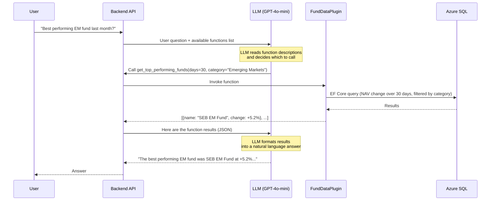
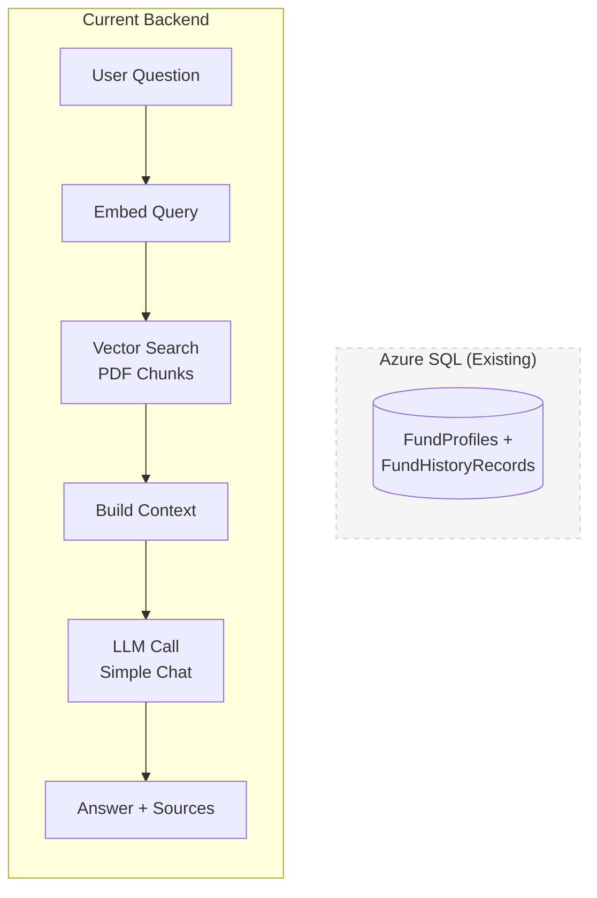
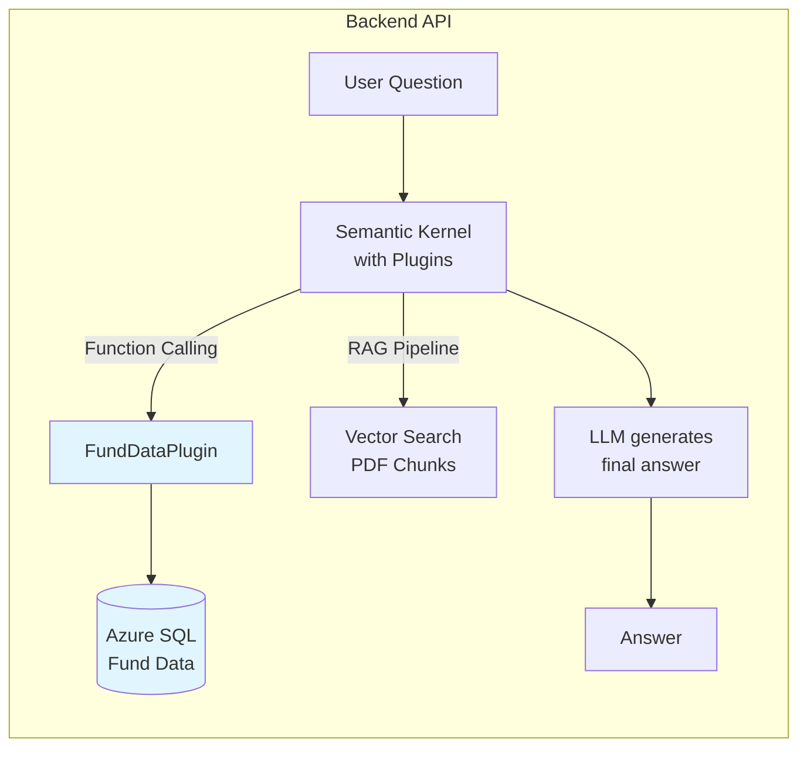
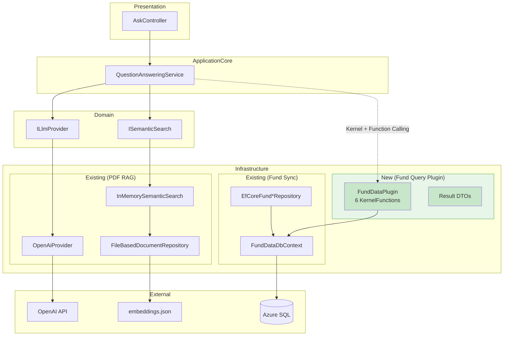
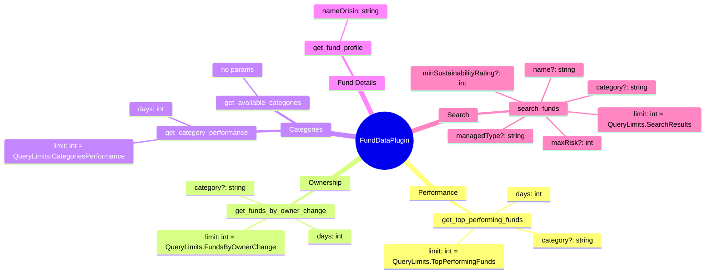
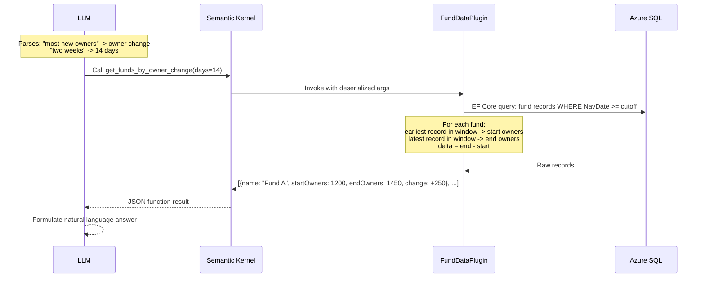
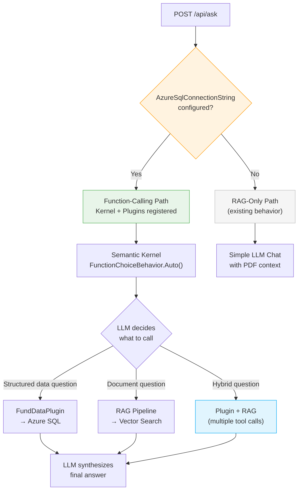

# Fund Data Query Feature — Design Plan

## Status

**Plan version:** v2 (2026-03-06) — Updated to reflect Azure SQL fund infrastructure that now exists.

> **v1 (original)** assumed no existing fund infrastructure in the backend. Since then, the backend gained full fund sync support with Azure SQL, EF Core domain models, repositories, and a `FundsController`. This v2 adapts the plugin design to the current codebase.

## The Problem

The backend currently only answers questions about **PDF fund documents** (factsheets, PRIIP/KID documents) using a classic RAG pipeline: embed the question, find similar text chunks, send context to the LLM.

But YieldRaccoon has synced a **goldmine of structured fund data** to Azure SQL — a year's worth of daily NAV prices, ownership counts, risk metrics, and fund profiles for ~60 funds. None of this data is queryable through the Q&A endpoint today.

Users want to ask questions like:

**Fund data queries** (structured data — plugin):

Here are more examples organized by the 6 plugin functions:

**Performance** (`get_top_performing_funds`):

- _"What are the top 5 best performing funds this year?"_
- _"Which funds lost the most value in the last 30 days?"_
- _"Best performing technology funds this week?"_

**Ownership** (`get_funds_by_owner_change`):

- _"Which funds are people selling the most right now?"_
- _"What emerging markets fund gained the most new investors this month?"_

**Categories** (`get_category_performance`):

- _"How did different fund categories perform last month?"_
- _"What's the worst performing category this year?"_

**Fund Profile** (`get_fund_profile`):

- _"What are the fees for SEB Emerging Markets Fund?"_
- _"What's the ESG score and sustainability rating for Spiltan Globalfond?"_
- _"Tell me everything about SE0008613939"_

**Search** (`search_funds`):

- _"Show me low-risk passive index funds with good sustainability ratings"_
- _"What Article 9 funds are available?"_
- _"Find me cheap actively managed funds with risk level below 4"_

**Hybrid** (plugin + RAG together):

- _"How did Spiltan Globalfond perform last month, and what's their investment strategy?"_
- _"Which emerging markets fund grew the most, and what risks does its factsheet mention?"_

**Performance + Document context:**

- _"Which fund performed best last month, and what's its investment objective?"_
- _"Show me the worst performing funds this quarter — do their factsheets mention any risk warnings?"_
- _"How did Spiltan Globalfond do this year, and what sectors does it invest in?"_

**Ownership trends + Document context:**

- _"Which fund is losing the most owners? What does its PRIIP document say about liquidity risk?"_
- _"What fund gained the most investors recently, and what's its recommended holding period according to the factsheet?"_

**Search + Document context:**

- _"Find me a low-risk passive fund — what do the factsheets say about their fee structures?"_
- _"Which Article 9 sustainable funds do we have, and what ESG criteria do their documents describe?"_

**Profile + Document context:**

- _"What are the fees for Spiltan Globalfond, and how does the factsheet describe its benchmark?"_
- _"Tell me about SE0008613939 — include what the KID document says about potential losses"_

**Category + Document context:**

- _"What's the best performing category, and what do the fund documents say about that market segment?"_

The key pattern: the first half asks for **numbers/rankings** (plugin), the second half asks for **explanations/context** (PDF RAG). These are the questions where the hybrid approach really shines — neither source alone gives a complete answer.

These are **structured data queries** — aggregations, rankings, time-series comparisons. They can't be answered with vector similarity search over PDF text. They need actual database queries.

## The Solution: Semantic Kernel Plugins + Function Calling

Instead of building a separate query API with custom parsing, we let the **LLM figure out what data it needs** using Semantic Kernel's native plugin system and function calling.

### How It Works



### The Key Insight

We don't need to build a query parser or intent classifier. The LLM already understands natural language — we just need to give it **well-described functions** it can call. Semantic Kernel handles all the plumbing:

1. **Serialization** — SK converts our C# plugin methods into JSON function schemas the LLM understands
2. **Function calling** — With `FunctionChoiceBehavior.Auto()`, the LLM autonomously decides *which* functions to call and *what parameters* to pass
3. **Marshaling** — SK deserializes the LLM's function call arguments into C# types and invokes our code
4. **Result handling** — SK sends function results back to the LLM, which formulates the final answer

The LLM becomes an intelligent query router — it reads the user's question, picks the right function(s), extracts parameters like time periods and category names, and then synthesizes the results into a human-readable answer.

## Architecture

### Before (Current)



### After (Proposed)



The LLM decides the routing: fund performance questions go through the plugin, document questions go through RAG, and mixed questions can use both.

### Layer Architecture



## What Already Exists (v2 Update)

The following infrastructure was built as part of the YieldRaccoon cloud sync feature and **does not need to be created**:

| Component | File | Notes |
| --- | --- | --- |
| `FundProfile` entity | `Domain/FundData/Models/FundProfile.cs` | 35+ properties, ISIN PK |
| `FundHistoryRecord` entity | `Domain/FundData/Models/FundHistoryRecord.cs` | Nav, NavDate, NumberOfOwners, etc. |
| `IsinId` value object | `Domain/FundData/ValueObjects/IsinId.cs` | 12-char ISIN validation |
| `FundDataDbContext` | `Infrastructure/FundData/FundDataDbContext.cs` | EF Core with SQL Server |
| Repository interfaces | `Domain/FundData/Interfaces/` | Write-only (UpsertAsync, InsertIfNotExistsRange) |
| Repository implementations | `Infrastructure/FundData/Repositories/` | EF Core + SQL Server |
| `FundsController` | `Controllers/FundsController.cs` | POST /api/funds/list, POST /api/funds/about |
| `FundSyncService` | `ApplicationCore/Services/FundSyncService.cs` | DTO-to-entity mapping |
| `BackendOptions.AzureSqlConnectionString` | `Configuration/BackendOptions.cs` | Feature gate for fund data |
| `Microsoft.EntityFrameworkCore.SqlServer` | `Backend.API.csproj` | Already a dependency |

## Plugin Design

### Configuration Constants

All limit values are defined as named constants in `FundDataPlugin` for easy tuning:

```csharp
public static class QueryLimits
{
    public const int TopPerformingFunds = 10;
    public const int FundsByOwnerChange = 10;
    public const int CategoriesPerformance = 20;
    public const int SearchResults = 10;
}
```

These cap how many results each `[KernelFunction]` returns to the LLM. Keeping results compact avoids blowing through token budgets. Changing a limit is a single-line edit.

### Data Scope

`FundHistoryRecords` are populated by **two sync paths** with different data completeness:

| Sync Path | Fields Written | Frequency | Behavior |
| --- | --- | --- | --- |
| **Chart history** | `Nav`, `NavDate` | Bulk daily records | Insert-only (skip existing ISIN+NavDate pairs) |
| **List sync** | `NumberOfOwners`, `Capital`, `Risk`, `SharpeRatio`, `StandardDeviation` | One record per fund per sync run | Enriches existing records — only updates fields that are **null** (never overwrites) |

This means:

- **`Nav` + `NavDate`** are **dense** — present on every history record (from chart sync)
- **`NumberOfOwners`** is **sparse** — only populated on records later enriched by a list sync
- Other enriched fields (`Capital`, `Risk`, `SharpeRatio`, `StandardDeviation`) are outside the scope of this feature

The plugin accounts for this: performance queries use dense Nav data, ownership queries filter to records where `NumberOfOwners` is not null.

From `FundProfiles`, all static fields are available for filtering and display (category, fees, ESG scores, risk level, etc.).

### Functions

The `FundDataPlugin` exposes 6 functions — each answering a different class of question:

### Function Map



### Function Details

| Function | Answers Questions Like | What It Does |
| --- | --- | --- |
| `get_top_performing_funds` | "Best performing fund last month" | Compares NAV at start vs end of period, ranks by % change |
| `get_funds_by_owner_change` | "Which fund gained most owners in 2 weeks" | Compares `NumberOfOwners` at start vs end, ranks by delta |
| `get_category_performance` | "Best performing category this week" | Averages per-fund NAV % change within each category |
| `get_fund_profile` | "Tell me about SEB Emerging Markets Fund" | Returns static fund data: fees, risk, ESG, current NAV |
| `search_funds` | "Low-risk passive index funds" | Multi-criteria filter: risk, category, managed type, sustainability |
| `get_available_categories` | *(helper)* | Lists all categories so the LLM uses valid names |

### Query Flow Example

For *"What fund gained the most new owners in the last two weeks?"*:



## Key Design Decisions

### 1. Reuse Existing FundDataDbContext via IDbContextFactory

The plugin queries the **existing** `FundDataDbContext` (Azure SQL) via `IDbContextFactory<FundDataDbContext>`. No separate DbContext needed.

**Why:**

- `FundDataDbContext` already has `FundProfiles` and `FundHistoryRecords` DbSets with full EF Core configuration
- Domain entities (`FundProfile`, `FundHistoryRecord`) are already mapped
- Avoids duplicating entity definitions and EF configurations

**DI lifetime solution:** The plugin is registered as a singleton on the `Kernel`, but `DbContext` is scoped. We use `IDbContextFactory<FundDataDbContext>` — each function call creates a short-lived context with `QueryTrackingBehavior.NoTracking`.

**Change required in Program.cs:** Replace `AddDbContext<FundDataDbContext>` with `AddDbContextFactory<FundDataDbContext>`. This also registers the DbContext as scoped, so existing repositories continue to work unchanged.

### 2. Plugin Queries DbContext Directly (not via repositories)

The plugin sits in Infrastructure layer and uses `IDbContextFactory<FundDataDbContext>` directly, rather than going through domain repository interfaces.

**Why:**

- Existing repositories are write-only (UpsertAsync, InsertIfNotExistsRangeAsync) — adding 6+ read methods would bloat them
- Plugin queries are complex aggregations (GROUP BY, window comparisons, rankings) that don't fit clean repository abstractions
- The plugin is inherently Infrastructure — it depends on EF Core and SK attributes
- Keeps domain repositories focused on their existing sync responsibilities

### 3. Function Calling Alongside RAG (same endpoint)

Both capabilities live behind `POST /api/ask`. The LLM decides the routing.



**Why:**

- Users shouldn't need to know which endpoint handles their question type
- The LLM naturally understands when to query structured data vs. search documents
- Allows hybrid answers: "The SEB EM Fund returned +5.2% last month *(from plugin)* and its strategy focuses on large-cap emerging market equities *(from PDF RAG)*"

### 4. Bypass ILlmProvider for Function Calling

The current `ILlmProvider.GenerateChatCompletionAsync(systemPrompt, userPrompt)` is too limited — it has no concept of execution settings or `Kernel`. The function-calling path uses `IChatCompletionService` directly with `FunctionChoiceBehavior.Auto()`.

**Why:**

- Function calling requires the `Kernel` to be passed to `GetChatMessageContentAsync()` (so SK can find and invoke plugins)
- The existing RAG path remains untouched

### 5. Feature is Optional

Fund data queries are only enabled when `AzureSqlConnectionString` is configured (same gate as existing fund sync). Without it, the backend works exactly as before — pure PDF RAG.

### 6. Groq Provider — Marked for Removal

> **Groq is scheduled for removal from the codebase.** It does not reliably support function calling via the OpenAI-compatible API. The function-calling path requires OpenAI. Any remaining Groq code should be removed in a separate cleanup task.

## Files to Create

| File | Purpose |
| --- | --- |
| `Infrastructure/FundData/Plugins/FundDataPlugin.cs` | SK native plugin with 6 `[KernelFunction]` methods + `QueryLimits` constants class |
| `Infrastructure/FundData/Plugins/Results/FundPerformanceResult.cs` | Result record for performance ranking |
| `Infrastructure/FundData/Plugins/Results/FundOwnerChangeResult.cs` | Result record for ownership change ranking |
| `Infrastructure/FundData/Plugins/Results/CategoryPerformanceResult.cs` | Result record for category aggregation |
| `Infrastructure/FundData/Plugins/Results/FundProfileResult.cs` | Result record for fund detail lookup |
| `Infrastructure/FundData/Plugins/Results/FundSearchResult.cs` | Result record for multi-criteria search |

## Files to Modify

| File | Changes |
| --- | --- |
| `Program.cs` | Change `AddDbContext` to `AddDbContextFactory`; register `FundDataPlugin` on Kernel after `builder.Build()` (gated on `hasAzureSql && hasApiKeys`) |
| `ApplicationCore/Services/QuestionAnsweringService.cs` | Add function-calling path: inject `Kernel` + `IChatCompletionService`, use `FunctionChoiceBehavior.Auto()` when plugins exist, keep existing RAG path as fallback |
| `ApplicationCore/Configuration/SystemPromptFactory.cs` | Add `CreateWithFundData()` method describing both RAG and function-calling capabilities |
| `ApplicationCore/Configuration/ApplicationOptions.cs` | Add `FundDataSystemPrompt` property for the enhanced prompt |

## Files NOT Modified

| File | Why |
| --- | --- |
| `BackendOptions.cs` | `AzureSqlConnectionString` already serves as the feature gate |
| `appsettings.json` | No new settings needed |
| `Backend.API.csproj` | `Microsoft.EntityFrameworkCore.SqlServer` + `Microsoft.SemanticKernel` already present |
| `FundDataDbContext.cs` | Plugin reads it as-is via factory |
| Domain entities | Read as-is, no changes |
| Domain repositories | Write-only, not touched |
| `AskController.cs` | Delegates to `IQuestionAnsweringService`, routing is internal |

## Important Notes

**Token budget:** Plugin functions return structured JSON. Default limits (see `QueryLimits` class) keep results compact. The LLM consumes these tokens to formulate answers — keeping results small avoids blowing through context windows.

**Data freshness:** The backend queries Azure SQL directly with no caching. For a hobby project with ~60 funds, this is perfectly adequate.

**Kernel plugin registration timing:** The `Kernel` is built before `builder.Build()`, but `IDbContextFactory` is registered during service configuration. The plugin is added to the Kernel *after* `builder.Build()` using `app.Services` to resolve dependencies — this is safe because it happens before `app.Run()`.

## Verification

1. **Unit tests:** Test each plugin function with an in-memory EF Core provider seeded with known data
2. **Manual testing (fund data only):** Ask "What fund gained the most new owners in the last 2 weeks?" — should call `get_funds_by_owner_change`
3. **Manual testing (RAG only):** Ask "What is the risk level of Spiltan Globalfond?" — should use document context as before
4. **Hybrid test:** Ask a question that requires both plugin data and PDF context to verify both paths work together
5. **Feature-off test:** Start without `AzureSqlConnectionString` — should work exactly as before (pure RAG)
6. **Existing tests:** `dotnet test Backend.Tests` — all existing tests must pass
