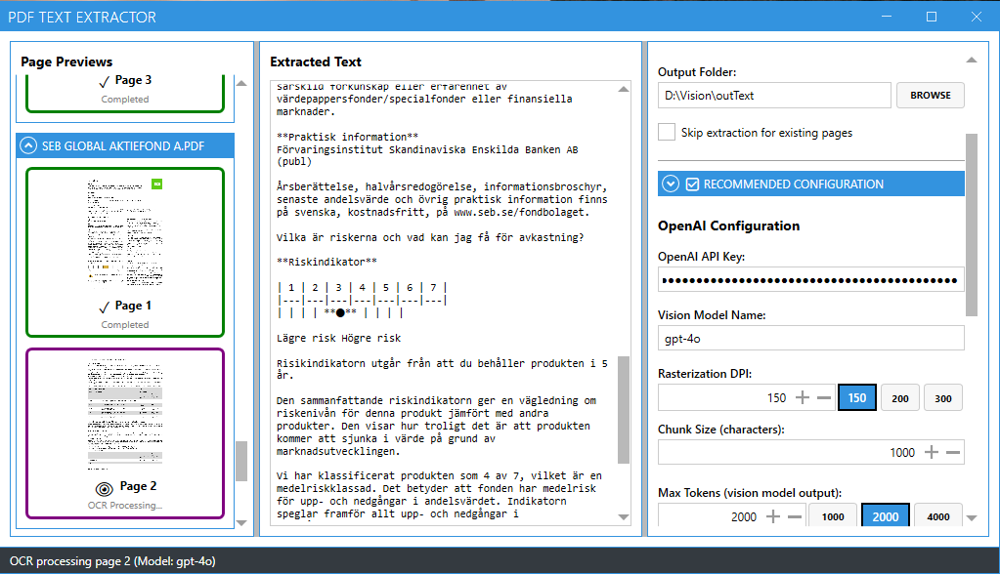

# 📄 PdfTextExtractor

PDF text extraction library with support for native text extraction (PdfPig) and OCR (LM Studio, OpenAI).

Features Domain-Driven Design, Rx.NET event streams, and WPF GUI.

## Tech Stack

| Technology | Version | Purpose |
| ---------- | ------- | ------- |
| **.NET** | 9.0 | Runtime framework |
| **C#** | 12.0 | Programming language |
| **Autofac** | 8.0.0-9.0.0 | Dependency injection |
| **System.Reactive** | 6.0.0-6.1.0 | Event streams (Rx.NET) |
| **PdfPig** | 0.1.12 | Native PDF text extraction |
| **PDFtoImage** | 5.0.0 | PDF rasterization for OCR |
| **SixLabors.ImageSharp** | 3.1.12 | Image processing |
| **Microsoft.Extensions.Http** | 9.0.0 | HTTP client for APIs |
| **DevExpressMvvm** | 24.1.6 | WPF MVVM framework |
| **MahApps.Metro** | 2.4.11 | WPF modern UI library |
| **NLog** | 6.0.7 | Structured logging |



## Projects

- **PdfTextExtractor.Core** - Core library (DDD architecture, extractors, events)
- **PdfTextExtractor.Wpf** - WPF desktop application with DevExpress MVVM
- **PdfTextExtractor.Core.Tests** - NUnit tests with AutoFixture
- **PdfTextExtractor** - Stub project

## Extraction Methods

| Method | Type | Cost | Speed | Notes |
| ------ | ---- | ---- | ----- | ----- |
| **PdfPig** | Native | Free | Fast | Best for text-based PDFs |
| **LM Studio** | OCR (local) | Free | Medium | Requires GPU, qwen2.5-vl-7b model |
| **OpenAI** | OCR (cloud) | $0.003/page | Fast | Requires API key, gpt-4o model |

## Example Documents

The [docs](docs) folder contains sample files demonstrating the extraction pipeline:

| File | Type | Description |
| ---- | ---- | ----------- |
| [pdf_example.pdf](docs/pdf_example.pdf) | PDF | Original source document (3 pages) |
| [pdf_example_page_001.png](docs/pdf_example_page_001.png) | PNG | Rasterized page 1 (2480x3507 px) |
| [pdf_example_page_002.png](docs/pdf_example_page_002.png) | PNG | Rasterized page 2 (2480x3507 px) |
| [pdf_example_page_003.png](docs/pdf_example_page_003.png) | PNG | Rasterized page 3 (2480x3507 px) |
| [pdf_example.txt](docs/pdf_example.txt) | TXT | OCR-extracted text output |

These files illustrate the complete extraction workflow from PDF input to text output, including the intermediate rasterization step used by OCR methods.

## Quick Start

### Using PdfPig (Native Text Extraction)

```csharp
using PdfTextExtractor.Core;
using PdfTextExtractor.Core.Configuration;

using var lib = new PdfTextExtractorLib();

// Subscribe to events
lib.Events.Subscribe(e => Console.WriteLine($"[{e.Timestamp:HH:mm:ss}] {e.GetType().Name}"));

// Extract
var result = await lib.ExtractWithPdfPigAsync(new PdfPigParameters
{
    PdfFolderPath = "./pdfs",
    OutputFolderPath = "./output",
    ChunkSize = 1000
});

Console.WriteLine($"Output: {result.PageTextFiles}");
Console.WriteLine($"Pages: {result.TotalPages} (Extracted: {result.ExtractedPages}, Skipped: {result.SkippedPages})");
```

### Using LM Studio (Local OCR)

**Prerequisites:** LM Studio running with qwen2.5-vl-7b model loaded, 8K context length.

```csharp
var result = await lib.ExtractWithLMStudioAsync(new LMStudioParameters
{
    PdfFolderPath = "./pdfs",
    OutputFolderPath = "./output",
    LMStudioUrl = "http://localhost:1234",
    VisionModelName = "qwen/qwen2.5-vl-7b",
    RasterizationDpi = 150,
    MaxTokens = 1500, // Requires 8K context for 5K+ chars/page
    ChunkSize = 1000
});
```

**LM Studio Configuration:**

- Context Length: 8192 (required for 5K+ characters/page)
- GPU Offload: 12 layers (GTX 1060 6GB)
- DPI 150 = ~6K chars/page (~2 min/page)

See [INTEGRATION_TEST_RESULTS.md](INTEGRATION_TEST_RESULTS.md) for performance data.

### Using OpenAI (Cloud OCR)

```csharp
var result = await lib.ExtractWithOpenAIAsync(new OpenAIParameters
{
    PdfFolderPath = "./pdfs",
    OutputFolderPath = "./output",
    ApiKey = "sk-...",
    VisionModelName = "gpt-4o",
    RasterizationDpi = 150,
    MaxTokens = 2000,
    DetailLevel = "high", // "high", "low", or "auto"
    ChunkSize = 1000
});
```

**Cost:** ~$0.003/page (high detail), ~$0.0002/page (low detail)

## Architecture

### DDD Layers

- **Domain** (Pure): Value Objects, Entities, Aggregate Root (ExtractionSession), 23 Events
- **Infrastructure**: Extractors (PdfPig, LMStudio, OpenAI), File System, Event Bus (Rx.NET)
- **Configuration**: Parameters for each extraction method


### Event System

All operations publish Rx.NET observable events:
- **Batch**: BatchExtractionStarted/Completed/Failed/Cancelled
- **Document**: DocumentExtractionStarted/Completed/Failed/Cancelled
- **Page**: PageExtractionStarted/Completed/Failed, EmptyPageDetected
- **OCR**: PageRasterizationStarted/Completed/Failed, OcrProcessingStarted/Completed/Failed
- **Text**: TextChunked, ChunkCreated
- **Infrastructure**: TempImageSaved, TempFilesCleanedUp, ExtractionProgressUpdated

## API Reference

### IPdfTextExtractorLib

```csharp
public interface IPdfTextExtractorLib : IDisposable
{
    IObservable<PdfExtractionEventBase> Events { get; }

    string[] GetPdfFiles(string folderPath);
    string[] GetTextFiles(string folderPath);

    Task<ExtractionResult> ExtractWithPdfPigAsync(PdfPigParameters parameters, CancellationToken ct = default);
    Task<ExtractionResult> ExtractWithLMStudioAsync(LMStudioParameters parameters, CancellationToken ct = default);
    Task<ExtractionResult> ExtractWithOpenAIAsync(OpenAIParameters parameters, CancellationToken ct = default);
}
```

### Parameters

**PdfPigParameters:**

```csharp
public class PdfPigParameters
{
    public required string PdfFolderPath { get; init; }
    public required string OutputFolderPath { get; init; }
    public int ChunkSize { get; init; } = 1000;
}
```

**LMStudioParameters:**

```csharp
public class LMStudioParameters
{
    public required string PdfFolderPath { get; init; }
    public required string OutputFolderPath { get; init; }
    public string LMStudioUrl { get; init; } = "http://localhost:1234";
    public required string VisionModelName { get; init; }
    public int RasterizationDpi { get; init; } = 300;
    public int MaxTokens { get; init; } = 2000;
    public int ChunkSize { get; init; } = 1000;
}
```

**OpenAIParameters:**

```csharp
public class OpenAIParameters
{
    public required string PdfFolderPath { get; init; }
    public required string OutputFolderPath { get; init; }
    public required string ApiKey { get; init; }
    public string VisionModelName { get; init; } = "gpt-4o";
    public int RasterizationDpi { get; init; } = 150;
    public int MaxTokens { get; init; } = 2000;
    public string DetailLevel { get; init; } = "high"; // "low", "high", "auto"
    public int ChunkSize { get; init; } = 1000;
}
```

**ExtractionResult:**

```csharp
public class ExtractionResult
{
    public required string PdfFilePath { get; init; }

    /// <summary>
    /// Path to the merged text file containing all pages.
    /// Pages are concatenated directly to preserve table layouts that may span multiple pages.
    /// </summary>
    public required string PageTextFiles { get; init; }

    public int TotalPages { get; init; }
    public int SkippedPages { get; init; }
    public int ExtractedPages { get; init; }
    public TimeSpan Duration { get; init; }
    public TextExtractionMethod Method { get; init; }
    public int TotalPromptTokens { get; init; }  // OCR methods only
    public int TotalCompletionTokens { get; init; }  // OCR methods only
    public int TotalTokens { get; init; }  // OCR methods only
}
```

## Events

All extraction operations publish Rx.NET observable events. Subscribe via `lib.Events.OfType<TEvent>()` for progress tracking, logging, and UI updates.

**Base Event:**

```csharp
public abstract class PdfExtractionEventBase
{
    public Guid EventId { get; init; }
    public DateTimeOffset Timestamp { get; init; }
    public Guid CorrelationId { get; init; } // Tracks single PDF
    public Guid SessionId { get; init; }     // Tracks batch
    public string ExtractorName { get; init; } // "PdfPig", "LMStudio", "OpenAI"
}
```

**Event Categories (23 total):**

- **Batch** (4): BatchExtractionStarted/Completed/Failed/Cancelled
- **Document** (4): DocumentExtractionStarted/Completed/Failed/Cancelled
- **Page** (4): PageExtractionStarted/Completed/Failed, EmptyPageDetected
- **OCR** (6): PageRasterizationStarted/Completed/Failed, OcrProcessingStarted/Completed/Failed
- **Text** (2): TextChunked, ChunkCreated
- **Infrastructure** (3): TempImageSaved, TempFilesCleanedUp, ExtractionProgressUpdated

**Usage Example:**

```csharp
using System.Reactive.Linq;

lib.Events.OfType<DocumentExtractionStarted>()
    .Subscribe(e => Console.WriteLine($"Started: {e.FileName}"));

lib.Events.OfType<ExtractionProgressUpdated>()
    .Subscribe(e => Console.WriteLine($"Progress: {e.OverallPercentage:F1}%"));

lib.Events.OfType<DocumentExtractionCompleted>()
    .Subscribe(e => Console.WriteLine($"Completed: {e.TotalPages} pages in {e.Duration.TotalSeconds:F1}s"));
```

## Testing

### Running Tests

```bash
cd PdfTextExtractor
dotnet test PdfTextExtractor.Core.Tests/PdfTextExtractor.Core.Tests.csproj
```

### Test Framework

- **NUnit** - Test framework
- **AutoFixture** - Test data generation
- **AutoMoq** - Automatic mocking

See [PdfTextExtractor.Core.Tests/Integration/README.md](PdfTextExtractor.Core.Tests/Integration/README.md) for LM Studio integration test details.

## Documentation

- [INTEGRATION_TEST_RESULTS.md](INTEGRATION_TEST_RESULTS.md) - LM Studio OCR performance data (GPU config, DPI tests, context window requirements)
- [PdfTextExtractor.Core.Tests/Integration/README.md](PdfTextExtractor.Core.Tests/Integration/README.md) - Integration test setup and troubleshooting

## License

Part of the SemanticKernel-FundDocsQnA solution.
