# 📄 PdfTextExtractor

Project aims to help debugging and OCR text etc. fill it.
## Tech stack


## 📋 Table of Contents

- [Overview](#-overview)
- [Tech Stack](#-tech-stack)
- [Architecture](#-architecture)
- [Quick Start](#-quick-start)
- [API Reference](#-api-reference)
- [Domain Events](#-domain-events)
- [Event Catalog](#-event-catalog)
- [Project Structure](#-project-structure)

---

## 🎯 Overview

**PdfTextExtractor** is a multi-project solution providing PDF text extraction capabilities through:

- **📦 PdfTextExtractor.Core** - Reusable class library with DDD architecture
- **⌨️ PdfTextExtractor.Cli** - Command-line interface (`pdftextextractor.exe`)
- **🖥️ PdfTextExtractor.Wpf** - Windows desktop GUI (`PdfTextExtractor.exe`)

**Key Features:**

- ✅ **Multiple extraction methods**: PdfPig (native text), LM Studio (OCR), OpenAI (OCR)
- ✅ **Real-time events**: Rx.NET observable streams for progress tracking and UI updates
- ✅ **Domain-Driven Design**: Clean separation of concerns with Domain/ApplicationCore/Infrastructure layers
- ✅ **Autofac DI**: Fully configured dependency injection container
- ✅ **Batch processing**: Extract multiple PDFs with session tracking
- ✅ **Text chunking**: Automatic sentence-based text chunking for RAG/embeddings

---

## 🛠️ Tech Stack

### Core Technologies

| Technology | Version | Purpose |
|------------|---------|---------|
|  | 9.0 | Runtime framework |
|  | 12.0 | Programming language |

### NuGet Packages

| Package | Version | Purpose |
|---------|---------|---------|
| **Autofac** | 8.0.0 | 🔧 Dependency injection container |
| **System.Reactive** | 6.0.0 | 📡 Rx.NET for IObservable event streams |
| **PdfPig** | 0.1.12 | 📄 Native PDF text extraction |
| **SixLabors.ImageSharp** | 3.1.12 | 🖼️ Image processing for OCR rasterization |
| **Microsoft.Extensions.Http** | 9.0.0 | 🌐 HTTP client for LM Studio/OpenAI APIs |
| **System.Text.Json** | 9.0.0 | 📋 JSON serialization |
| **Microsoft.Extensions.Logging.Abstractions** | 9.0.0 | 📝 Logging infrastructure |

### Supported Extraction Methods

| Method | Status | Description |
|--------|--------|-------------|
| **PdfPig** | ✅ Implemented | Native PDF text extraction (fast, no OCR) |
| **LM Studio** | ✅ Implemented | OCR via vision models (local, self-hosted) |
| **OpenAI** | ✅ Implemented | OCR via vision models (cloud-based, gpt-4o) |

---

## 🏗️ Architecture

### DDD Layered Architecture

```mermaid
graph TD
    A[🎯 Entry Point<br/>PdfTextExtractorLib<br/>Autofac DI] --> B[🔄 ApplicationCore Layer<br/>Use Cases, DTOs, Parameters]
    B --> C[💎 Domain Layer<br/>Entities, Value Objects, Events<br/>PURE - No Dependencies]
    B --> D[⚙️ Infrastructure Layer<br/>Extractors, File System, Event Bus]
    D --> C

    style A fill:#e1f5ff,stroke:#0077cc
    style B fill:#fff4e6,stroke:#ff9800
    style C fill:#e8f5e9,stroke:#4caf50
    style D fill:#f3e5f5,stroke:#9c27b0
```



### Project Structure

```mermaid
graph LR
    A[📦 PdfTextExtractor.Core<br/>Class Library] --> B[⌨️ PdfTextExtractor.Cli<br/>Console App]
    A --> C[🖥️ PdfTextExtractor.Wpf<br/>WPF Desktop GUI]

    style A fill:#4caf50,color:#fff
    style B fill:#2196f3,color:#fff
    style C fill:#ff9800,color:#fff
```



### Domain Layer Structure

```mermaid
graph TD
    subgraph "💎 Domain Layer (Pure Business Logic)"
        A[📝 Value Objects<br/>FilePath, PageNumber<br/>SessionId, CorrelationId]
        B[🏛️ Entities<br/>TextChunk, Page, Document]
        C[👑 Aggregate Root<br/>ExtractionSession]
        D[📡 Domain Events<br/>23 events across 5 categories]
    end

    A --> B
    B --> C
    C --> D

    style A fill:#bbdefb
    style B fill:#c5e1a5
    style C fill:#ffccbc
    style D fill:#f8bbd0
```



---

## 🚀 Quick Start

### 1. Installation

Reference the `PdfTextExtractor.Core` library in your project:

```xml
<ItemGroup>
  <ProjectReference Include="..\PdfTextExtractor.Core\PdfTextExtractor.Core.csproj" />
</ItemGroup>
```

### 2. Basic Usage

```csharp
using PdfTextExtractor.Core;
using PdfTextExtractor.Core.Configuration;

// Create library instance (Autofac DI initialized automatically)
using var lib = new PdfTextExtractorLib();

// Subscribe to events (Rx.NET observable)
lib.Events.Subscribe(e =>
    Console.WriteLine($"[{e.Timestamp:HH:mm:ss}] {e.GetType().Name}"));

// Get PDF files from folder
var pdfFiles = lib.GetPdfFiles("./pdfs");
Console.WriteLine($"Found {pdfFiles.Length} PDF files");

// Extract text using PdfPig
var result = await lib.ExtractWithPdfPigAsync(new PdfPigParameters
{
    PdfFolderPath = "./pdfs",
    OutputFolderPath = "./output",
    ChunkSize = 1000 // Characters per chunk
});

Console.WriteLine($"Extracted {result.TotalPages} pages, {result.TotalChunks} chunks");
Console.WriteLine($"Output: {result.TextFilePath}");
Console.WriteLine($"Duration: {result.Duration.TotalSeconds:F1}s");
```

### 3. Event-Driven Progress Tracking

```csharp
using System.Reactive.Linq;
using PdfTextExtractor.Core.Domain.Events;
using PdfTextExtractor.Core.Domain.Events.Document;
using PdfTextExtractor.Core.Domain.Events.Infrastructure;

var lib = new PdfTextExtractorLib();

// Filter events by type
lib.Events.OfType<DocumentExtractionStarted>()
    .Subscribe(e => Console.WriteLine($"📄 Started: {e.FileName}"));

lib.Events.OfType<ExtractionProgressUpdated>()
    .Subscribe(e => Console.WriteLine($"⏳ Progress: {e.OverallPercentage:F1}% - {e.CurrentOperation}"));

lib.Events.OfType<PageExtractionCompleted>()
    .Subscribe(e => Console.WriteLine($"✅ Page {e.PageNumber} done: {e.ChunkCount} chunks"));

lib.Events.OfType<DocumentExtractionCompleted>()
    .Subscribe(e => Console.WriteLine($"🎉 Completed: {e.TotalPages} pages in {e.Duration.TotalSeconds:F1}s"));

// Run extraction
await lib.ExtractWithPdfPigAsync(new PdfPigParameters
{
    PdfFolderPath = "./pdfs",
    OutputFolderPath = "./output"
});
```

---

## 📚 API Reference

### IPdfTextExtractorLib

Main entry point for the library.

#### Properties

```csharp
/// <summary>
/// Observable stream of all extraction events (Rx.NET).
/// </summary>
IObservable<PdfExtractionEventBase> Events { get; }
```

#### Methods

##### GetPdfFiles

```csharp
/// <summary>
/// Get all PDF file paths from the specified folder.
/// </summary>
/// <exception cref="DirectoryNotFoundException">Folder does not exist</exception>
string[] GetPdfFiles(string folderPath);
```

##### GetTextFiles

```csharp
/// <summary>
/// Get all text file paths from the specified folder.
/// </summary>
/// <returns>Empty array if folder doesn't exist</returns>
string[] GetTextFiles(string folderPath);
```

##### ExtractWithPdfPigAsync

```csharp
/// <summary>
/// Extract text using PdfPig (native PDF text extraction).
/// </summary>
/// <param name="parameters">PdfPig extraction parameters</param>
/// <param name="cancellationToken">Cancellation token</param>
/// <returns>Extraction result with output file path and statistics</returns>
Task<ExtractionResult> ExtractWithPdfPigAsync(
    PdfPigParameters parameters,
    CancellationToken cancellationToken = default);
```

**PdfPigParameters:**

```csharp
public class PdfPigParameters
{
    public required string PdfFolderPath { get; init; }
    public required string OutputFolderPath { get; init; }
    public int ChunkSize { get; init; } = 1000; // Default: 1000 characters
}
```

##### ExtractWithLMStudioAsync

```csharp
/// <summary>
/// Extract text using LM Studio vision models (OCR).
/// </summary>
Task<ExtractionResult> ExtractWithLMStudioAsync(
    LMStudioParameters parameters,
    CancellationToken cancellationToken = default);
```

**LMStudioParameters:**

```csharp
public class LMStudioParameters
{
    public required string PdfFolderPath { get; init; }
    public required string OutputFolderPath { get; init; }
    public string LMStudioUrl { get; init; } = "http://localhost:1234";
    public required string VisionModelName { get; init; }
    public int RasterizationDpi { get; init; } = 300;
    public int ChunkSize { get; init; } = 1000;
    public int MaxTokens { get; init; } = 2000;  // Vision model output limit
}
```

**MaxTokens Configuration:**

⚠️ **Critical Requirement:** Extracting 5,000+ characters per page requires 8,192+ context length in LM Studio.

**Context Window Limitations (Based on Integration Testing):**

With **4,096 context length** (default):

- DPI 150 images: ~3,600 tokens (image encoding)
- Available for output: ~496 tokens (~2,000 characters max)
- **Cannot extract 5,000+ characters per page**
- Configuration: DPI 150 + maxTokens 200 = ~800 chars per page (safe baseline)

With **8,192 context length** (recommended):

- DPI 150 images: ~3,600 tokens (image encoding)
- Available for output: ~4,592 tokens (~18,000 characters max)
- **Can extract 5,000-8,000 characters per page** ✅
- Configuration: DPI 150 + maxTokens 1500 = ~6,000 chars per page (recommended)

**Recommended Production Configuration:**

```csharp
var parameters = new LMStudioParameters
{
    RasterizationDpi = 150,        // Low DPI to minimize image tokens
    MaxTokens = 1500,              // Allows ~6,000 characters per page
    // Requires: LM Studio context length >= 8,192
};
```

**Context Calculation Formula:**

```text
image_tokens + max_tokens ≤ context_length
```

**DPI Impact on Image Tokens (Measured):**

- DPI 150: ~3,600 tokens (✅ Use this for 5K+ char extraction with 8K context)
- DPI 200: ~3,800 tokens (⚠️ Exceeds 4K context with maxTokens > 200)
- DPI 300: ~5,000+ tokens (❌ Exceeds 4K context even with maxTokens = 0)

**Setup Instructions for 5K+ Character Extraction:**

1. Open LM Studio
2. Unload current model (if loaded)
3. Reload `qwen/qwen2.5-vl-7b` with **Context Length = 8192** (or higher)
4. Verify GPU memory is sufficient (~8GB+ VRAM recommended for 8K context)
5. Use configuration: DPI 150 + maxTokens 1500

##### ExtractWithOpenAIAsync

```csharp
/// <summary>
/// Extract text using OpenAI vision models (OCR).
/// </summary>
Task<ExtractionResult> ExtractWithOpenAIAsync(
    OpenAIParameters parameters,
    CancellationToken cancellationToken = default);
```

**OpenAIParameters:**

```csharp
public class OpenAIParameters
{
    public required string PdfFolderPath { get; init; }
    public required string OutputFolderPath { get; init; }
    public required string ApiKey { get; init; }
    public string VisionModelName { get; init; } = "gpt-4o";
    public int RasterizationDpi { get; init; } = 150;
    public int ChunkSize { get; init; } = 1000;
    public int MaxTokens { get; init; } = 2000;
    public string DetailLevel { get; init; } = "high";  // "low", "high", or "auto"
}
```

**Supported Models:**

- **gpt-4o** (default) - Latest multimodal model, recommended for production
- **gpt-4o-mini** - Faster, cheaper alternative for cost-sensitive scenarios

**Cost Estimation (gpt-4o):**

| Detail Level | Cost per Page | 10 Pages | 100 Pages |
|--------------|---------------|----------|-----------|
| **High** (recommended) | ~$0.003 | ~$0.03 | ~$0.30 |
| **Low** (cost-saving) | ~$0.0002 | ~$0.002 | ~$0.02 |

**Detail Level Options:**

- `"high"` - Full resolution processing, better text extraction quality (~$0.003/page)
- `"low"` - 512×512 downsampling, faster and cheaper (~$0.0002/page)
- `"auto"` - Model automatically selects appropriate level

**Recommended Configuration:**

```csharp
var parameters = new OpenAIParameters
{
    PdfFolderPath = "./pdfs",
    OutputFolderPath = "./output",
    ApiKey = "sk-...",              // Your OpenAI API key
    VisionModelName = "gpt-4o",     // Recommended
    RasterizationDpi = 150,         // Balance quality/cost
    MaxTokens = 2000,               // Full-page extraction
    DetailLevel = "high"            // Better accuracy
};
```

**Setup Requirements:**

1. Get an OpenAI API key from [platform.openai.com](https://platform.openai.com/)
2. Ensure billing is enabled on your OpenAI account
3. Store API key securely (environment variable or user secrets)
4. Test with a small PDF (1-2 pages) to estimate costs

**Security Note:** API keys are never persisted to disk by the library.

### ExtractionResult

```csharp
public class ExtractionResult
{
    public required string PdfFilePath { get; init; }
    public required string TextFilePath { get; init; }
    public int TotalPages { get; init; }
    public int TotalChunks { get; init; }
    public TimeSpan Duration { get; init; }
    public TextExtractionMethod Method { get; init; }
}
```

---

## 📡 Domain Events

### Event Architecture

The library uses **Rx.NET observables** to publish domain events during extraction operations. All events inherit from `PdfExtractionEventBase` with rich metadata for tracking.


### Base Event Class

All events inherit from `PdfExtractionEventBase` with the following metadata:

```csharp
public abstract class PdfExtractionEventBase
{
    public Guid EventId { get; init; }          // Unique event instance ID
    public DateTimeOffset Timestamp { get; init; } // UTC timestamp
    public required Guid CorrelationId { get; init; } // Tracks single file extraction
    public required Guid SessionId { get; init; }     // Tracks batch operation
    public required string ExtractorName { get; init; } // "PdfPig", "LMStudio", etc.
}
```

**Metadata Properties:**

- **EventId**: Unique identifier for event deduplication/event sourcing
- **Timestamp**: When event occurred (UTC), for timeline reconstruction
- **CorrelationId**: Links all events for a single PDF file
- **SessionId**: Links all events for a batch operation
- **ExtractorName**: Identifies which extractor raised the event

### Event Flow

```mermaid
graph TD
    A[📋 BatchExtractionStarted] --> B[📄 DocumentExtractionStarted]
    B --> C[📃 PageExtractionStarted]
    C --> D{OCR?}
    D -->|Yes| E[🖼️ PageRasterizationStarted]
    D -->|No| F[✂️ TextChunked]
    E --> G[🖼️ PageRasterizationCompleted]
    G --> H[👁️ OcrProcessingStarted]
    H --> I[👁️ OcrProcessingCompleted]
    I --> F
    F --> J[📦 ChunkCreated x N]
    J --> K[✅ PageExtractionCompleted]
    K --> L[📊 ExtractionProgressUpdated]
    L --> M{More pages?}
    M -->|Yes| C
    M -->|No| N[🎉 DocumentExtractionCompleted]
    N --> O{More files?}
    O -->|Yes| B
    O -->|No| P[✨ BatchExtractionCompleted]

    style A fill:#e3f2fd
    style B fill:#fff3e0
    style C fill:#f3e5f5
    style D fill:#fce4ec
    style P fill:#e8f5e9
```



---

## 📊 Event Catalog

### 🎯 Event Categories

| Category | Count | Purpose |
|----------|-------|---------|
| **📋 Batch** | 4 | Track batch operations (multiple PDFs) |
| **📄 Document** | 4 | Track individual PDF document processing |
| **📃 Page** | 4 | Track individual page processing |
| **🖼️ OCR** | 6 | Track rasterization and OCR processing |
| **✂️ Text Processing** | 2 | Track text chunking operations |
| **⚙️ Infrastructure** | 3 | Track temp files and progress updates |
| **Total** | **23** | Complete event coverage |

### 📋 Batch Events

#### BatchExtractionStarted

Raised before processing any PDF files in a batch.

```csharp
public class BatchExtractionStarted : PdfExtractionEventBase
{
    public string[] FilePaths { get; init; }  // All PDF paths to process
    public int TotalFiles { get; init; }      // Total files in batch
}
```

#### BatchExtractionCompleted

Raised after all PDF files processed successfully.

```csharp
public class BatchExtractionCompleted : PdfExtractionEventBase
{
    public string[] OutputFilePaths { get; init; } // Output text file paths
    public int TotalFilesProcessed { get; init; }  // Files completed
    public TimeSpan TotalDuration { get; init; }   // Total time
}
```

#### BatchExtractionFailed

Raised when batch processing fails.

```csharp
public class BatchExtractionFailed : PdfExtractionEventBase
{
    public string ErrorMessage { get; init; }              // Error description
    public string ExceptionType { get; init; }             // Exception type
    public int FilesProcessedBeforeFailure { get; init; }  // Completed count
}
```

#### BatchExtractionCancelled

Raised when batch operation is cancelled.

```csharp
public class BatchExtractionCancelled : PdfExtractionEventBase
{
    public string Reason { get; init; }                        // Cancellation reason
    public int FilesProcessedBeforeCancellation { get; init; } // Completed count
}
```

### 📄 Document Events

#### DocumentExtractionStarted

Raised before opening/processing a PDF document.

```csharp
public class DocumentExtractionStarted : PdfExtractionEventBase
{
    public string FilePath { get; init; }      // Full path to PDF
    public string FileName { get; init; }      // Filename only
    public long FileSizeBytes { get; init; }   // File size
}
```

#### DocumentExtractionCompleted

Raised after successfully processing all pages.

```csharp
public class DocumentExtractionCompleted : PdfExtractionEventBase
{
    public string FilePath { get; init; }        // Full path to PDF
    public int TotalPages { get; init; }         // Pages processed
    public int TotalChunks { get; init; }        // Chunks created
    public string OutputFilePath { get; init; }  // Output text file
    public TimeSpan Duration { get; init; }      // Processing time
}
```

#### DocumentExtractionFailed

Raised when document processing fails.

```csharp
public class DocumentExtractionFailed : PdfExtractionEventBase
{
    public string FilePath { get; init; }            // Full path to PDF
    public string ErrorMessage { get; init; }        // Error description
    public string ExceptionType { get; init; }       // Exception type
    public int? PageNumberWhereFailed { get; init; } // Page number (if known)
}
```

#### DocumentExtractionCancelled

Raised when document processing is cancelled.

```csharp
public class DocumentExtractionCancelled : PdfExtractionEventBase
{
    public string FilePath { get; init; }                      // Full path to PDF
    public int PagesProcessedBeforeCancellation { get; init; } // Completed pages
}
```

### 📃 Page Events

#### PageExtractionStarted

Raised before processing a specific page.

```csharp
public class PageExtractionStarted : PdfExtractionEventBase
{
    public string FilePath { get; init; }  // Full path to PDF
    public int PageNumber { get; init; }   // Page number (1-based)
    public int TotalPages { get; init; }   // Total pages in document
}
```

#### PageExtractionCompleted

Raised after page is fully processed.

```csharp
public class PageExtractionCompleted : PdfExtractionEventBase
{
    public string FilePath { get; init; }         // Full path to PDF
    public int PageNumber { get; init; }          // Page number (1-based)
    public int ExtractedTextLength { get; init; } // Text length
    public int ChunkCount { get; init; }          // Chunks created
}
```

#### PageExtractionFailed

Raised when page processing fails.

```csharp
public class PageExtractionFailed : PdfExtractionEventBase
{
    public string FilePath { get; init; }      // Full path to PDF
    public int PageNumber { get; init; }       // Page number (1-based)
    public string ErrorMessage { get; init; }  // Error description
    public string ExceptionType { get; init; } // Exception type
}
```

#### EmptyPageDetected

Raised when a page has no extractable text.

```csharp
public class EmptyPageDetected : PdfExtractionEventBase
{
    public string FilePath { get; init; }  // Full path to PDF
    public int PageNumber { get; init; }   // Page number (1-based)
}
```

### 🖼️ OCR Events

#### PageRasterizationStarted

Raised before converting page to image.

```csharp
public class PageRasterizationStarted : PdfExtractionEventBase
{
    public string FilePath { get; init; }    // Full path to PDF
    public int PageNumber { get; init; }     // Page number (1-based)
    public int TargetDpi { get; init; }      // Target DPI
}
```

#### PageRasterizationCompleted

Raised after page is rasterized to image.

```csharp
public class PageRasterizationCompleted : PdfExtractionEventBase
{
    public string FilePath { get; init; }       // Full path to PDF
    public int PageNumber { get; init; }        // Page number (1-based)
    public string TempImagePath { get; init; }  // Temp image file path
    public long ImageSizeBytes { get; init; }   // Image file size
}
```

#### PageRasterizationFailed

Raised when page rasterization fails.

```csharp
public class PageRasterizationFailed : PdfExtractionEventBase
{
    public string FilePath { get; init; }      // Full path to PDF
    public int PageNumber { get; init; }       // Page number (1-based)
    public string ErrorMessage { get; init; }  // Error description
    public string ExceptionType { get; init; } // Exception type
}
```

#### OcrProcessingStarted

Raised before OCR processing on page image.

```csharp
public class OcrProcessingStarted : PdfExtractionEventBase
{
    public string FilePath { get; init; }       // Full path to PDF
    public int PageNumber { get; init; }        // Page number (1-based)
    public string VisionModelName { get; init; } // Model name
}
```

#### OcrProcessingCompleted

Raised after OCR text extraction is completed.

```csharp
public class OcrProcessingCompleted : PdfExtractionEventBase
{
    public string FilePath { get; init; }         // Full path to PDF
    public int PageNumber { get; init; }          // Page number (1-based)
    public int ExtractedTextLength { get; init; } // Text length
    public TimeSpan ProcessingDuration { get; init; } // OCR time
    public string ExtractedText { get; init; }    // Extracted text content
}
```

#### OcrProcessingFailed

Raised when OCR processing fails.

```csharp
public class OcrProcessingFailed : PdfExtractionEventBase
{
    public string FilePath { get; init; }      // Full path to PDF
    public int PageNumber { get; init; }       // Page number (1-based)
    public string ErrorMessage { get; init; }  // Error description
    public string ExceptionType { get; init; } // Exception type
}
```

### ✂️ Text Processing Events

#### TextChunked

Raised after text is split into chunks.

```csharp
public class TextChunked : PdfExtractionEventBase
{
    public string FilePath { get; init; }   // Full path to PDF
    public int PageNumber { get; init; }    // Page number (1-based)
    public int ChunkCount { get; init; }    // Chunks created
    public int[] ChunkSizes { get; init; }  // Size of each chunk (chars)
}
```

#### ChunkCreated

Raised when an individual text chunk is created.

```csharp
public class ChunkCreated : PdfExtractionEventBase
{
    public string FilePath { get; init; }        // Full path to PDF
    public int PageNumber { get; init; }         // Page number (1-based)
    public int ChunkIndex { get; init; }         // Chunk index (0-based)
    public int ContentLength { get; init; }      // Chunk length
    public string ContentPreview { get; init; }  // First 100 chars
}
```

### ⚙️ Infrastructure Events

#### TempImageSaved

Raised when a rasterized page image is saved.

```csharp
public class TempImageSaved : PdfExtractionEventBase
{
    public string FilePath { get; init; }       // Full path to PDF
    public int PageNumber { get; init; }        // Page number (1-based)
    public string TempImagePath { get; init; }  // Temp image path
    public long ImageSizeBytes { get; init; }   // Image file size
}
```

#### TempFilesCleanedUp

Raised when temporary files are deleted.

```csharp
public class TempFilesCleanedUp : PdfExtractionEventBase
{
    public string[] DeletedFilePaths { get; init; } // Deleted paths
    public int TotalFilesDeleted { get; init; }     // Count
}
```

#### ExtractionProgressUpdated

Raised periodically to report progress.

```csharp
public class ExtractionProgressUpdated : PdfExtractionEventBase
{
    public string FilePath { get; init; }          // Full path to PDF
    public double OverallPercentage { get; init; } // Progress (0-100)
    public int PagesProcessed { get; init; }       // Pages done
    public int TotalPages { get; init; }           // Total pages
    public string CurrentOperation { get; init; }  // Operation description
}
```

---

## 🗂️ Project Structure

### PdfTextExtractor.Core (Class Library)

```
PdfTextExtractor.Core/
├── 📁 Domain/ (Pure business logic - NO external dependencies)
│   ├── 📁 ValueObjects/ (6 files)
│   │   ├── FilePath.cs
│   │   ├── PageNumber.cs
│   │   ├── ChunkContent.cs
│   │   ├── ExtractorType.cs
│   │   ├── SessionId.cs
│   │   └── CorrelationId.cs
│   ├── 📁 Entities/ (3 files)
│   │   ├── TextChunk.cs
│   │   ├── Page.cs
│   │   └── Document.cs
│   ├── 📁 Aggregates/ (1 file)
│   │   └── ExtractionSession.cs (Aggregate Root)
│   └── 📁 Events/ (26 files)
│       ├── PdfExtractionEventBase.cs
│       ├── IEventPublisher.cs
│       ├── 📁 Batch/ (4 events)
│       ├── 📁 Document/ (4 events)
│       ├── 📁 Page/ (4 events)
│       ├── 📁 Ocr/ (6 events)
│       ├── 📁 TextProcessing/ (2 events)
│       └── 📁 Infrastructure/ (3 events)
├── 📁 Infrastructure/ (Technical implementations)
│   ├── 📁 FileSystem/ (4 files)
│   │   ├── IFileSystemService.cs
│   │   ├── FileSystemService.cs
│   │   ├── ITextFileWriter.cs
│   │   └── TextFileWriter.cs
│   ├── 📁 EventBus/ (1 file)
│   │   └── ReactiveEventPublisher.cs (Rx.NET)
│   ├── 📁 Rasterization/ (2 files)
│   │   ├── IRasterizationService.cs
│   │   └── PdfPageRasterizer.cs
│   ├── 📁 LMStudio/ (2 files)
│   │   ├── ILMStudioVisionClient.cs
│   │   └── LMStudioVisionClient.cs
│   ├── 📁 OpenAI/ (2 files)
│   │   ├── IOpenAIVisionClient.cs
│   │   └── OpenAIVisionClient.cs
│   └── 📁 Extractors/ (4 files)
│       ├── IPdfTextExtractor.cs
│       ├── PdfPigExtractor.cs (✅ Implemented)
│       ├── LMStudioOcrExtractor.cs (✅ Implemented)
│       └── OpenAIOcrExtractor.cs (✅ Implemented)
├── 📁 Configuration/ (4 files)
│   ├── TextExtractionMethod.cs (enum)
│   ├── PdfPigParameters.cs
│   ├── LMStudioParameters.cs
│   └── OpenAIParameters.cs
├── 📁 Models/ (2 files)
│   ├── DocumentChunk.cs
│   └── ExtractionResult.cs
├── 📄 IPdfTextExtractorLib.cs (Public API interface)
├── 📄 PdfTextExtractorLib.cs (Main entry point + Autofac module)
└── 📄 PdfTextExtractor.Core.csproj
```

### PdfTextExtractor.Cli (Console Application)

```
PdfTextExtractor.Cli/
├── 📄 Program.cs (CLI entry point)
├── 📄 PdfTextExtractor.Cli.csproj
└── 🔗 References PdfTextExtractor.Core
```

**Executable**: `pdftextextractor.exe` or `pdfextract.exe`

### PdfTextExtractor.Wpf (WPF Application)

```
PdfTextExtractor.Wpf/
├── 📄 MainWindow.xaml (WPF UI)
├── 📄 MainWindow.xaml.cs (Code-behind)
├── 📄 PdfTextExtractor.Wpf.csproj
└── 🔗 References PdfTextExtractor.Core
```

**Executable**: `PdfTextExtractor.exe`

---

## 🎓 Usage Examples

### Example 1: CLI with Event Logging

```csharp
using PdfTextExtractor.Core;
using PdfTextExtractor.Core.Configuration;
using PdfTextExtractor.Core.Domain.Events.Document;
using PdfTextExtractor.Core.Domain.Events.Infrastructure;
using System.Reactive.Linq;

class Program
{
    static async Task Main(string[] args)
    {
        using var lib = new PdfTextExtractorLib();

        // Subscribe to events
        lib.Events.OfType<DocumentExtractionStarted>()
            .Subscribe(e => Console.WriteLine($"[{e.Timestamp:HH:mm:ss}] 📄 Starting: {e.FileName}"));

        lib.Events.OfType<ExtractionProgressUpdated>()
            .Subscribe(e => Console.WriteLine($"  ⏳ {e.OverallPercentage:F1}% - {e.CurrentOperation}"));

        lib.Events.OfType<DocumentExtractionCompleted>()
            .Subscribe(e => Console.WriteLine($"[{e.Timestamp:HH:mm:ss}] ✅ Done: {e.TotalPages} pages, {e.Duration.TotalSeconds:F1}s"));

        lib.Events.OfType<DocumentExtractionFailed>()
            .Subscribe(e => Console.WriteLine($"[{e.Timestamp:HH:mm:ss}] ❌ Error: {e.ErrorMessage}"));

        // Extract
        var result = await lib.ExtractWithPdfPigAsync(new PdfPigParameters
        {
            PdfFolderPath = args.Length > 0 ? args[0] : "./pdfs",
            OutputFolderPath = "./output"
        });

        Console.WriteLine($"\n🎉 Extraction complete!");
        Console.WriteLine($"  Output: {result.TextFilePath}");
        Console.WriteLine($"  Pages: {result.TotalPages}");
        Console.WriteLine($"  Chunks: {result.TotalChunks}");
        Console.WriteLine($"  Duration: {result.Duration.TotalSeconds:F1}s");
    }
}
```

### Example 2: WPF with Progress Bar

```csharp
using PdfTextExtractor.Core;
using PdfTextExtractor.Core.Configuration;
using PdfTextExtractor.Core.Domain.Events.Infrastructure;
using System.Reactive.Linq;
using System.Windows;

public partial class MainWindow : Window
{
    private readonly PdfTextExtractorLib _lib;

    public MainWindow()
    {
        InitializeComponent();
        _lib = new PdfTextExtractorLib();

        // Subscribe to progress updates
        _lib.Events.OfType<ExtractionProgressUpdated>()
            .Subscribe(e => Dispatcher.Invoke(() =>
            {
                ProgressBar.Value = e.OverallPercentage;
                StatusLabel.Content = e.CurrentOperation;
            }));

        // Subscribe to completion
        _lib.Events.OfType<DocumentExtractionCompleted>()
            .Subscribe(e => Dispatcher.Invoke(() =>
            {
                MessageBox.Show($"Extraction complete!\n\n" +
                              $"Pages: {e.TotalPages}\n" +
                              $"Chunks: {e.TotalChunks}\n" +
                              $"Duration: {e.Duration.TotalSeconds:F1}s",
                              "Success", MessageBoxButton.OK, MessageBoxImage.Information);
            }));
    }

    private async void ExtractButton_Click(object sender, RoutedEventArgs e)
    {
        var result = await _lib.ExtractWithPdfPigAsync(new PdfPigParameters
        {
            PdfFolderPath = PdfFolderTextBox.Text,
            OutputFolderPath = OutputFolderTextBox.Text
        });
    }
}
```

## 📝 License

This project is part of the SemanticKernel-FundDocsQnA solution.

---

Built with ❤️ using Domain-Driven Design and Rx.NET
