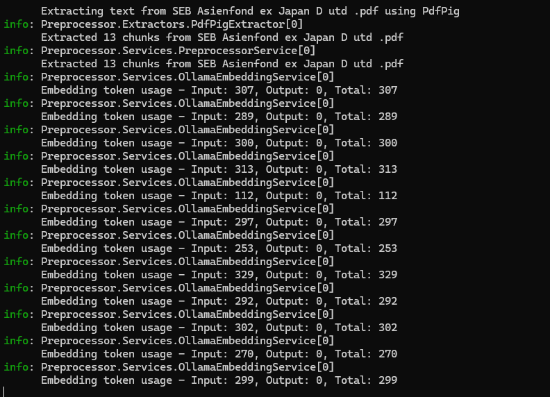

# Preprocessor

> Part of [PDF Q&A Application](../README.md). See [Configuration & Secrets Guide](../docs/SECRETS-MANAGEMENT.md) for complete project configuration.

A .NET Console application that extracts text from PDF documents and generates embeddings using Semantic Kernel with Ollama, LM Studio, or OpenAI.

**Note:** The Preprocessor has no secrets - all configuration is via CLI arguments (documented below).

## Purpose

Convert PDFs into searchable embeddings (run once, or when adding new PDFs).



## Quick Start

The Preprocessor supports two modes (verbs):

1. **`json` verb** - Generate embeddings → save to local JSON file (default workflow)
2. **`cosmosdb` verb** - Generate embeddings → upload to backend API (Cosmos DB)

### Quick Start: JSON Mode (Local File)

```bash
# Default: OpenAI provider, reads from pdfs/, writes to embeddings.json
dotnet run -- json

# With Ollama (local, free)
dotnet run -- json --provider ollama --embedding-model nomic-embed-text

# With custom paths
dotnet run -- json -i ./my-pdfs -o ./output.json
```

### Quick Start: Cosmos DB Mode (Upload to Backend)

```bash
# Upload to backend API (requires backend running with Cosmos DB support)
dotnet run -- cosmosdb --url http://localhost:5000 --key your-api-key

# Or set API key via environment variable
$env:FUNDDOCS_API_KEY = "your-api-key"
dotnet run -- cosmosdb --url http://localhost:5000
```

Create a `pdfs` folder in your build output directory and add PDF files there.

## Prerequisites

- .NET 9 SDK
- **Embedding Provider**: Choose one (OpenAI is default for production compatibility)
  - OpenAI (default) - Cloud-based, requires API key (~$0.02 per 1M tokens)
  - LM Studio - GUI-based, port 1234, free
  - Ollama - CLI-based, port 11434, free

## Choosing a Provider

| Provider | Port/URL | Best For | Endpoint | Cost |
|----------|----------|----------|----------|------|
| **OpenAI** (default) | Cloud API | Production deployment, backend compatibility | `/v1/embeddings` (cloud) | ~$0.02 per 1M tokens |
| **LM Studio** | 1234 | GUI workflows, visual model management, beginners | `/v1/embeddings` (OpenAI-compatible) | Free (local) |
| **Ollama** | 11434 | CLI workflows, automation, servers | `/api/embed` (native) | Free (local) |

Use `--provider openai` (default), `--provider lmstudio`, or `--provider ollama` to select your provider.

⚠️ **CRITICAL:** OpenAI embeddings (1536 dimensions) are NOT compatible with Ollama/LM Studio embeddings (384 dimensions). When switching providers, you MUST regenerate ALL embeddings from scratch.

### Embedding Provider Setup (Windows)

#### Option 1: Ollama (CLI)

1. Download installer from [ollama.com/download/windows](https://ollama.com/download/windows)
2. Run the installer and follow prompts
3. Open PowerShell and pull models:

   ```powershell
   ollama pull nomic-embed-text   # embeddings (required)
   ```

#### Option 2: LM Studio (GUI)

1. Download from [lmstudio.ai](https://lmstudio.ai/)
2. Search and download models in the app:
   - `nomic-embed-text` for embeddings
3. Start the local server (Developer tab → Start Server)
4. Use with `--ollama-url http://localhost:1234`

#### Option 3: OpenAI (Cloud)

**⚠️ For Production Deployment Only** - Required for compatibility with backend semantic search.

1. **Get an API key** from [https://platform.openai.com/api-keys](https://platform.openai.com/api-keys)

2. **Set the API key** via environment variable (recommended):

   ```powershell
   # Windows (PowerShell)
   $env:OPENAI_API_KEY = "sk-..."

   # Linux/macOS (Bash)
   export OPENAI_API_KEY="sk-..."
   ```

3. **Run with OpenAI provider:**

   ```bash
   dotnet run -- --provider openai --embedding-model text-embedding-3-small -i ./pdfs -o ./output.json
   ```

**Important Notes:**

- **Cost:** ~$0.02 per 1M tokens (batch processing ~10MB of PDFs costs a few cents)
- **Model:** Must use `text-embedding-3-small` for backend compatibility
- **Dimensions:** Outputs 1536-dimensional embeddings (vs 384 for local models)
- **Regeneration Required:** Cannot mix OpenAI embeddings with Ollama/LM Studio embeddings
- **API Key Security:** Never commit API keys to version control. Use environment variables.

#### Alternative Models

| Purpose     | Option              | Alternatives                     |
|-------------|--------------------|----------------------------------|
| Embeddings  | `--embedding-model` | `mxbai-embed-large`, `all-minilm`|

#### Choosing a Nomic Embed Text Model

**For Ollama users:**

```bash
ollama pull nomic-embed-text  # Automatically gets the latest stable version (v1.5)
```

**For LM Studio users:**

When browsing models in LM Studio, you'll see multiple Nomic Embed Text versions. Here's how to choose:

| Model Name | Description | Recommendation |
|------------|-------------|----------------|
| **nomic-embed-text-v1.5-GGUF** | Latest stable release | ✅ **Recommended** - Best balance of quality and performance |
| Nomic-embed-text-v1.5-Embedding-GGUF | Same as v1.5-GGUF | Alternative naming, functionally identical |
| nomic-embed-text-v1-GGUF | Original v1 release | Use only if you need compatibility with older systems |
| nomic-embed-text-v2-moe-GGUF | Mixture of Experts (experimental) | Larger and slower, potentially better quality but not widely tested |
| Nomic-Embed-Text-V2-GGUF | Version 2 (non-MoE) | Not as mature as v1.5, avoid for now |

**Quick recommendation:** Download `nomic-embed-text-v1.5-GGUF` in LM Studio for the best experience.

**Using LM Studio:**

1. Search for and download the model in LM Studio's model browser
2. Load the model in the "Embedding" section
3. Start the local server (Developer tab → Start Server)
4. Use `--ollama-url http://localhost:1234` when running the preprocessor
5. The `--embedding-model` parameter can be any value (LM Studio uses the loaded model)

## CLI Parameters

### Common Parameters (both verbs)

| Parameter          | Short | Required | Default                   | Description                    |
|--------------------|-------|----------|---------------------------|--------------------------------|
| `--input`          | `-i`  | No       | `pdfs`                    | Folder with PDFs               |
| `--provider`       | `-p`  | No       | `openai`                  | `ollama`, `lmstudio`, or `openai` |
| `--embedding-model`| -     | No       | `text-embedding-3-small`  | Embedding model (use `nomic-embed-text` for local providers) |
| `--ollama-url`     | -     | No       | Auto (provider-based)     | Provider endpoint override     |
| `--openai-api-key` | -     | No       | `null`                    | OpenAI API key (or set `OPENAI_API_KEY` env var) |

### `json` Verb Parameters

| Parameter          | Short | Required | Default                   | Description                    |
|--------------------|-------|----------|---------------------------|--------------------------------|
| `--output`         | `-o`  | No       | `./embeddings.json`       | Output JSON path               |
| `--append`         | `-a`  | No       | `false`                   | Append to existing JSON        |
| `--method`         | `-m`  | No       | `pdfpig`                  | Extraction method              |

### `cosmosdb` Verb Parameters

| Parameter          | Short | Required | Default                   | Description                    |
|--------------------|-------|----------|---------------------------|--------------------------------|
| `--url`            | `-u`  | No       | `http://localhost:5000`   | Backend API URL                |
| `--key`            | `-k`  | No       | `null`                    | API key (or set `FUNDDOCS_API_KEY` env var) |
| `--operation`      | `-o`  | No       | `add`                     | Operation: `add`, `update`, `replace-all` |
| `--batch-size`     | `-b`  | No       | `100`                     | Embeddings per API request     |

## Usage

### JSON Verb Examples

```bash
# Default: OpenAI provider, reads from pdfs/, writes to embeddings.json
dotnet run -- json

# LM Studio (local, free)
dotnet run -- json --provider lmstudio --embedding-model nomic-embed-text

# Ollama (local, free)
dotnet run -- json --provider ollama --embedding-model nomic-embed-text

# Custom input/output paths
dotnet run -- json -i ./custom/pdfs -o ./custom/embeddings.json

# Append to existing file (incremental processing)
dotnet run -- json -i ./new-pdfs --append

# Override default provider URL
dotnet run -- json --provider lmstudio --ollama-url http://localhost:8080
```

### Cosmos DB Verb Examples

```bash
# Upload to backend API (default: add operation)
dotnet run -- cosmosdb --url https://my-backend.azurewebsites.net --key api-key-here

# Set API key via environment variable (recommended)
$env:FUNDDOCS_API_KEY = "your-api-key"
dotnet run -- cosmosdb --url https://my-backend.azurewebsites.net

# Update operation (replace embeddings for existing PDFs)
dotnet run -- cosmosdb --operation update --url http://localhost:5000 --key api-key

# Replace all embeddings (delete old, upload new)
dotnet run -- cosmosdb --operation replace-all --url http://localhost:5000 --key api-key

# Custom batch size (default: 100 embeddings per request)
dotnet run -- cosmosdb --batch-size 50 --url http://localhost:5000 --key api-key

# Use with Ollama (local embeddings + backend upload)
dotnet run -- cosmosdb --provider ollama --embedding-model nomic-embed-text --url http://localhost:5000 --key api-key
```

### Production Deployment Workflow

When deploying to Azure or other production environments:

1. **Regenerate embeddings with OpenAI** (required for backend compatibility):

   ```bash
   # Set API key
   $env:OPENAI_API_KEY = "sk-..."

   # Generate embeddings with OpenAI
   dotnet run --project Preprocessor -- --provider openai --embedding-model text-embedding-3-small -i ./Preprocessor/pdfs -o ./embeddings.json
   ```

2. **Copy to backend**:

   ```bash
   cp ./embeddings.json ./backend/Backend.API/Data/embeddings.json
   ```

3. **Verify dimensions** (should be 1536):

   ```powershell
   # Check first embedding array length in JSON
   (Get-Content ./embeddings.json | ConvertFrom-Json)[0].embedding.Count
   # Should output: 1536
   ```

4. **Deploy to Azure** with the updated embeddings file.

## Output Format

```json
[
  {
    "id": "document_page1_chunk0",
    "text": "Extracted text content...",
    "embedding": [0.123, -0.456, ...],
    "source": "document.pdf",
    "page": 1
  }
]
```

## Token Usage Tracking

The Preprocessor automatically logs token usage information from embedding providers.

### How It Works

- **OpenAI**: Logs actual token counts from API responses (InputTokenCount, OutputTokenCount)
- **Ollama/LM Studio**: Logs token counts if the provider supports usage metadata (typically 0 for these providers)

### Log Output

Token usage is logged at `Information` level:

```text
Embedding token usage - Input: 45, Output: 0, Total: 45
Batch embeddings token usage - Input: 450, Output: 0, Total: 450, Texts: 10
```

### Cost Tracking

For OpenAI, you can calculate estimated costs:

- **text-embedding-3-small**: ~$0.02 per 1M input tokens
- Monitor logs to track total tokens per run and estimate costs

Example:

- 1M input tokens ≈ $0.02
- 10M input tokens ≈ $0.20
- 100M input tokens ≈ $2.00

### Future: Application Insights Integration

Token usage can be integrated with Azure Application Insights for centralized monitoring. Currently logs to console; Application Insights integration can be added as needed.

## Running Tests

```bash
dotnet test
```
