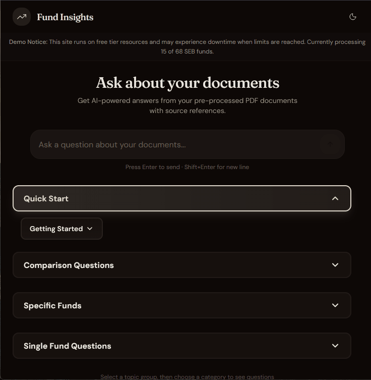
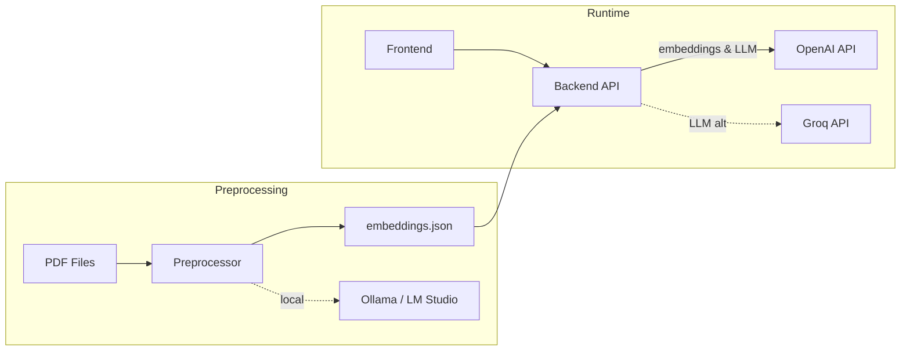

# Fund Insights

A tool that analyzes investment fund factsheets (PRIIP/KID documents), generates relevant questions, and provides answers to common investor queries about fund basics, risk profiles, costs, performance scenarios, and investment terms.

| Feature | Description |
| --------- | ------------- |
| **Semantic Search** | Vector embeddings for accurate document retrieval |
| **Natural Language Q&A** | Ask questions, get answers with source citations |
| **Low Cost** | Free-tier cloud services (Groq, OpenAI) |
| **Local Processing** | Generate embeddings with LM Studio or Ollama |

---

## 🎬 Demo

**Try it live:** [Fund Insights](https://agreeable-mushroom-0c5446003.6.azurestaticapps.net/)

> ⚠️ **Demo Notice:** This site runs on free tier resources and may experience downtime when limits are reached. Currently processing 15 of 68 SEB funds.



**Supported Languages:** All PDF files are in Swedish, but questions can be asked in any language. The AI will respond in the language of your question.

**Example PDF:** [SEB Emerging Marketsfond C USD - Lux.pdf](docs/images/SEB%20Emerging%20Marketsfond%20C%20USD%20-%20Lux.pdf)

---

## 🤖 For AI Agents

**IMPORTANT:** Before implementing any changes, consult [Status.md](Status.md)

- What features are already implemented
- Current implementation status of each component
- Known issues and limitations

**Instructions for AI assistants:**

1. **Before starting work:** Check [Status.md](Status.md) to verify feature status
2. **During implementation:** Update status from ❌ to ⏳ (in progress)
3. **After completion:** Update status to ✅ and document any new features or changes
4. **Always maintain:** Keep Status.md synchronized with actual implementation state

---

## 📋 Overview

A low-cost hobby project that enables semantic Q&A over PDF documents. Upload PDFs, generate embeddings locally, and ask questions in natural language.

**Key Features:**

- Semantic search using vector embeddings
- Natural language Q&A with source citations
- Free-tier cloud services (Groq, OpenAI)
- Local embedding generation (LM Studio/Ollama)

---

## 🏗️ Architecture



### Components

| Component | Tech Stack | Description |
| ----------- | ------------ | ------------- |
| [Preprocessor](Preprocessor/README.md) | .NET 9, PdfPig, Semantic Kernel | Extract text from PDFs, generate embeddings |
| [Backend](backend/README.md) | ASP.NET Core 9, Semantic Kernel | Semantic search + Q&A API |
| [Frontend](frontend/README.md) | Next.js 16, TypeScript, shadcn/ui | Chat interface |

---

## 🚀 Quick Start

### Prerequisites

| Requirement | Version | Notes |
| ------------- | --------- | ------- |
| .NET SDK | 9.0+ | [Download](https://dotnet.microsoft.com/download) |
| Node.js | 18+ | [Download](https://nodejs.org/) |
| LM Studio or Ollama | Latest | For local embedding generation |
| Groq API Key | - | [Get free key](https://console.groq.com) |
| OpenAI API Key | - | [Get key](https://platform.openai.com) |

> **Configuration:** See [Configuration & Secrets Guide](docs/SECRETS-MANAGEMENT.md) for complete setup instructions.

### 1. Generate Embeddings

```bash
cd Preprocessor/Preprocessor
# Add PDFs to ./pdfs folder
dotnet run
```

### 2. Start Backend

```bash
cd backend/Backend.API
dotnet user-secrets set "BackendOptions:GroqApiKey" "your-key"
dotnet user-secrets set "BackendOptions:OpenAIApiKey" "your-key"
cp ../../Preprocessor/Preprocessor/bin/Debug/net9.0/output.json Data/embeddings.json
dotnet run
```

### 3. Start Frontend

```bash
cd frontend
npm install && cp .env.example .env.local
npm run dev
```

Open [http://localhost:3000](http://localhost:3000)

---

## 📁 Project Structure

```plaintext
.
├── Preprocessor/           # PDF text extraction & embeddings
├── backend/                # ASP.NET Core API
│   ├── Backend.API/        # Main API project
│   └── Backend.Tests/      # Unit tests
├── frontend/               # Next.js web app
├── docs/                   # Guides
│   ├── AZURE-DEPLOYMENT.md
│   └── SECRETS-MANAGEMENT.md
└── azure-setup.sh          # Azure deployment script
```

---

## ☁️ Deployment

Deploy to Azure with near-zero cost (~$0.03/month):

| Resource | Tier | Cost |
| ---------- | ------ | ------ |
| Azure App Service | F1 Free | $0 |
| Azure Static Web Apps | Free | $0 |
| Application Insights | Free (5GB) | $0 |
| Azure Key Vault | Standard | ~$0.03 |
| OpenAI Embeddings | Pay-per-use | ~$0.003 |
| Groq LLM | Free tier | $0 |

### Quick Deploy

```bash
# 1. Create Azure resources (backend + frontend)
./azure-setup.sh

# 2. Add secrets to GitHub (from script output)
#    - AZURE_WEBAPP_PUBLISH_PROFILE
#    - AZURE_STATIC_WEB_APPS_API_TOKEN

# 3. Add variable to GitHub
#    - NEXT_PUBLIC_API_URL

# 4. Push to main - triggers automatic deployment
git push origin main
```

### GitHub Workflows

| Workflow | Purpose |
| ---------- | --------- |
| `deploy-backend.yml` | Deploy backend to Azure App Service |
| `deploy-frontend.yml` | Deploy frontend to Azure Static Web Apps |
| `pr-checks.yml` | Run tests and checks on pull requests |

See [Azure Deployment Guide](docs/AZURE-DEPLOYMENT.md) for complete documentation.

---

## 📚 Documentation

| Document | Description |
| ---------- | ------------- |
| [Configuration & Secrets](docs/SECRETS-MANAGEMENT.md) | Environment variables, API keys, settings |
| [Azure Deployment](docs/AZURE-DEPLOYMENT.md) | Production deployment guide |
| [Backend API](backend/README.md) | API endpoints and configuration |
| [Frontend](frontend/README.md) | Development and testing |
| [Preprocessor](Preprocessor/README.md) | PDF processing options |
| [Project Status](Status.md) | Implementation progress |

---

## 🛠️ Tech Stack

| Layer | Technologies |
| ------- | -------------- |
| **Preprocessor** | .NET 9, PdfPig, Semantic Kernel, Ollama/LM Studio |
| **Backend** | ASP.NET Core 9, Semantic Kernel, OpenAI, Groq |
| **Frontend** | Next.js 16, TypeScript, Tailwind CSS, shadcn/ui |
| **Infrastructure** | Azure App Service, Static Web Apps, Key Vault, Application Insights |

---

## 📄 License

This is a hobby project for learning Semantic Kernel and AI integration.
