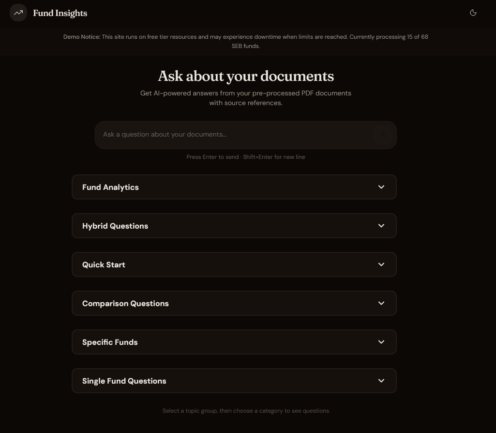
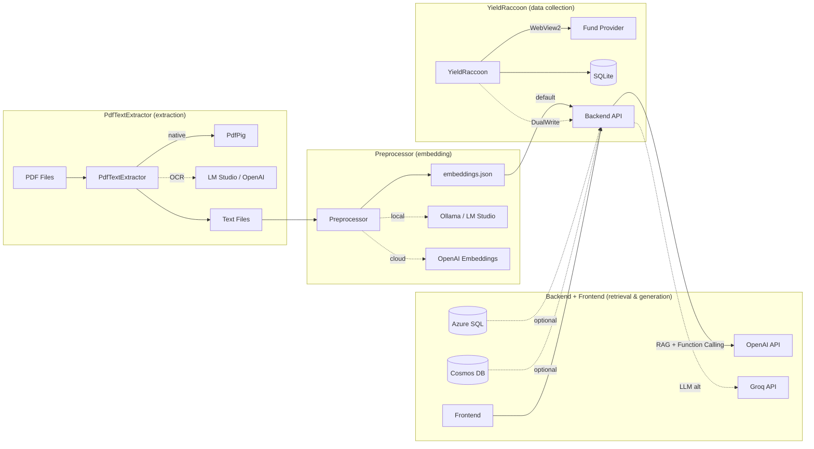

# Fund Insights

> [!NOTE]
> Microsoft is [sunsetting Semantic Kernel](https://devblogs.microsoft.com/agent-framework/semantic-kernel-and-microsoft-agent-framework/) in favor of the new **Microsoft Agent Framework**. Development continues at [KanelBulleKapital](https://github.com/Muhomorik/KanelBulleKapital) using the Agent Framework.

A tool that analyzes investment fund factsheets (PRIIP/KID documents), generates relevant questions, and provides answers to common investor queries about fund basics, risk profiles, costs, performance scenarios, and investment terms.

| Feature | Description |
| --------- | ------------- |
| **Semantic Search** | Vector embeddings for accurate document retrieval (RAG over PDF factsheets) |
| **Function Calling** | Structured fund data queries (performance, ownership, categories) via Semantic Kernel plugins |
| **Hybrid Answers** | LLM autonomously combines RAG + function calling for comprehensive responses |
| **Natural Language Q&A** | Ask questions, get answers with source citations |
| **Low Cost** | Free-tier cloud services (OpenAI, Azure SQL, Cosmos DB) |
| **Local Processing** | Generate embeddings with LM Studio or Ollama |
| **Flexible Storage** | In-memory (default) or Azure Cosmos DB vector search |

---

## 🎬 Demo

**Try it live:** [Fund Insights](https://agreeable-mushroom-0c5446003.6.azurestaticapps.net/)

> ⚠️ **Demo Notice:** This site runs on free tier resources and may experience downtime when limits are reached. Currently processing 15 of 68 SEB funds.
>
> ❄️ **Cold Start:** The backend runs on Azure App Service free tier — expect ~30s cold start after 1 hour of inactivity.



**Supported Languages:** All PDF files are in Swedish, but questions can be asked in any language. The AI will respond in the language of your question.

**Example PDF:** [SEB Emerging Marketsfond C USD - Lux.pdf](docs/images/SEB%20Emerging%20Marketsfond%20C%20USD%20-%20Lux.pdf)

---

## 🤖 For AI Agents

**IMPORTANT:** Before implementing any changes, consult [Status.md](Status.md)

- What features are already implemented
- Current implementation status of each component
- Known issues and limitations

**Instructions for AI assistants:**

1. **Before starting work:** Check [Status.md](Status.md) to verify feature status
2. **During implementation:** Update status from ❌ to ⏳ (in progress)
3. **After completion:** Update status to ✅ and document any new features or changes
4. **Always maintain:** Keep Status.md synchronized with actual implementation state

---

## 📋 Overview

A low-cost hobby project that enables semantic Q&A over PDF documents. Upload PDFs, generate embeddings locally, and ask questions in natural language.

**Key Features:**

- Semantic search using vector embeddings (RAG over PDF documents)
- Function calling over structured fund data (performance, ownership, categories)
- Hybrid answers — LLM autonomously combines both approaches
- Natural language Q&A with source citations
- Local embedding generation (LM Studio/Ollama)
- Switchable vector storage: in-memory (default) or Azure Cosmos DB

---

## 🏗️ Architecture


```mermaid
flowchart LR
    subgraph PdfTextExtractor ["PdfTextExtractor (extraction)"]
        PDF[PDF Files] --> PTE[PdfTextExtractor]
        PTE -->|native| PDFPIG[PdfPig]
        PTE -.->|OCR| LMS[LM Studio / OpenAI]
        PTE --> TXT[Text Files]
    end

    subgraph Preprocessor ["Preprocessor (embedding)"]
        TXT --> PRE[Preprocessor]
        PRE --> EMB[embeddings.json]
        PRE -.->|local| LOCAL[Ollama / LM Studio]
        PRE -.->|cloud| OAI_EMB[OpenAI Embeddings]
    end

    subgraph YieldRaccoon ["YieldRaccoon (data collection)"]
        YR[YieldRaccoon] -->|WebView2| FP[Fund Provider]
        YR --> DB[(SQLite)]
        YR -.->|DualWrite| API
    end

    subgraph Runtime ["Backend + Frontend (retrieval & generation)"]
        FE[Frontend] --> API[Backend API]
        EMB -->|default| API
        COSMOS[(Cosmos DB)] -.->|optional| API
        AZSQL[(Azure SQL)] -.->|optional| API
        API -->|RAG + Function Calling| OAI[OpenAI API]
        API -.->|LLM alt| GROQ[Groq API]
    end
```

### Components

| Component | Tech Stack | Description |
| ----------- | ------------ | ------------- |
| [PdfTextExtractor](PdfTextExtractor/ReadMe.Md) | .NET 9, PdfPig, LM Studio, OpenAI | PDF text extraction library with native + OCR support |
| [Preprocessor](Preprocessor/README.md) | .NET 9, Semantic Kernel | Read pre-extracted text files, generate embeddings (file or Cosmos DB) |
| [Backend](backend/README.md) | ASP.NET Core 9, Semantic Kernel 1.68, Azure SQL | RAG over PDF documents + function calling over structured fund data (FundDataPlugin) |
| [Frontend](frontend/README.md) | Next.js 16, React 19, TypeScript, shadcn/ui | Chat interface with dark/light theme |
| [YieldRaccoon](YieldRaccoon/README.md) | .NET 9, WPF, EF Core, Rx.NET, WebView2 | Fund data crawler with cloud sync, data/statistics export, and privacy filter |

---

## 🚀 Quick Start

### Prerequisites

| Requirement | Version | Notes |
| ------------- | --------- | ------- |
| .NET SDK | 9.0+ | [Download](https://dotnet.microsoft.com/download) |
| Node.js | 18+ | [Download](https://nodejs.org/) |
| LM Studio or Ollama | Latest | For local embedding generation |
| OpenAI API Key | - | [Get key](https://platform.openai.com) (required) |
| Groq API Key | - | [Get free key](https://console.groq.com) (optional alternative) |

> **Configuration:** See [Configuration & Secrets Guide](docs/SECRETS-MANAGEMENT.md) for complete setup instructions.

### 1. Extract Text from PDFs

```bash
cd PdfTextExtractor
dotnet run --project PdfTextExtractor.Wpf
# Use the WPF GUI to extract text files from your PDFs
```

See [PdfTextExtractor README](PdfTextExtractor/ReadMe.Md) for CLI and API usage.

### 2. Generate Embeddings

```bash
cd Preprocessor/Preprocessor
# Ensure text files from step 1 are in ./pdfs folder alongside the PDFs
dotnet run
```

### 3. Start Backend

```bash
cd backend/Backend.API
dotnet user-secrets set "BackendOptions:OpenAIApiKey" "your-key"
dotnet user-secrets set "BackendOptions:LlmProvider" "OpenAI"
cp ../../Preprocessor/Preprocessor/bin/Debug/net9.0/output.json Data/embeddings.json
dotnet run
```

> **Optional:** Add Azure SQL for structured fund queries (`AzureSqlConnectionString`), or use Groq as a free LLM alternative. See [Backend README](backend/README.md).

### 4. Start Frontend

```bash
cd frontend
npm install && cp .env.example .env.local
npm run dev
```

Open [http://localhost:3000](http://localhost:3000)

---

## 📁 Project Structure

```plaintext
.
├── Preprocessor/           # Embedding generation from pre-extracted text
├── backend/                # ASP.NET Core API
│   ├── Backend.API/        # Main API project
│   └── Backend.Tests/      # Unit tests
├── frontend/               # Next.js web app
├── PdfTextExtractor/       # PDF extraction library (native + OCR)
│   ├── PdfTextExtractor.Core/       # Core library (DDD, extractors, events)
│   ├── PdfTextExtractor.Wpf/        # WPF desktop application
│   └── PdfTextExtractor.Core.Tests/ # NUnit tests
├── YieldRaccoon/           # Fund price crawler (WPF desktop)
│   ├── YieldRaccoon.Domain/         # Business logic, entities, value objects
│   ├── YieldRaccoon.Application/    # Use-case orchestration, interfaces
│   ├── YieldRaccoon.Infrastructure/ # EF Core, event stores, services
│   └── YieldRaccoon.Wpf/           # WPF UI with WebView2
├── docs/                   # Guides
│   ├── AZURE-DEPLOYMENT.md
│   └── SECRETS-MANAGEMENT.md
└── azure-setup.sh          # Azure deployment script
```

---

## ☁️ Deployment

Deploy to Azure with near-zero cost (~$0.03/month):

| Resource | Tier | Cost |
| ---------- | ------ | ------ |
| Azure App Service | F1 Free | $0 |
| Azure Static Web Apps | Free | $0 |
| Application Insights | Free (5GB) | $0 |
| Azure Key Vault | Standard | ~$0.03 |
| Azure Cosmos DB | Free tier (1000 RU/s) | $0 |
| Azure SQL | Basic (optional) | ~$5/month |
| OpenAI Embeddings + LLM | Pay-per-use | ~$0.003 |
| Groq LLM | Free tier (optional) | $0 |

### Quick Deploy

```bash
# 1. Create Azure resources (backend + frontend)
./azure-setup.sh

# 2. Add secrets to GitHub (from script output)
#    - AZURE_WEBAPP_PUBLISH_PROFILE
#    - AZURE_STATIC_WEB_APPS_API_TOKEN

# 3. Add variable to GitHub
#    - NEXT_PUBLIC_API_URL

# 4. Push to main - triggers automatic deployment
git push origin main
```

### GitHub Workflows

| Workflow | Purpose |
| ---------- | --------- |
| `deploy-backend.yml` | Deploy backend to Azure App Service |
| `deploy-frontend.yml` | Deploy frontend to Azure Static Web Apps |
| `pr-checks.yml` | Run tests and checks on pull requests |

See [Azure Deployment Guide](docs/AZURE-DEPLOYMENT.md) for complete documentation.

---

## 📚 Documentation

| Document | Description |
| ---------- | ------------- |
| [Configuration & Secrets](docs/SECRETS-MANAGEMENT.md) | Environment variables, API keys, settings |
| [Azure Deployment](docs/AZURE-DEPLOYMENT.md) | Production deployment guide |
| [Backend API](backend/README.md) | API endpoints and configuration |
| [Frontend](frontend/README.md) | Development and testing |
| [Preprocessor](Preprocessor/README.md) | Embedding generation and providers |
| [PdfTextExtractor](PdfTextExtractor/ReadMe.Md) | PDF extraction library (native + OCR) |
| [YieldRaccoon](YieldRaccoon/README.md) | Fund price crawler desktop app |
| [Project Status](Status.md) | Implementation progress |

---

## 🛠️ Tech Stack

| Layer | Technologies |
| ------- | -------------- |
| **Preprocessor** | .NET 9, Semantic Kernel, Ollama/LM Studio/OpenAI |
| **Backend** | ASP.NET Core 9, Semantic Kernel 1.68, OpenAI, Azure SQL, Cosmos DB |
| **Frontend** | Next.js 16, TypeScript, Tailwind CSS, shadcn/ui |
| **PdfTextExtractor** | .NET 9, PdfPig, LM Studio, OpenAI, Rx.NET, WPF |
| **YieldRaccoon** | .NET 9, WPF, EF Core, Rx.NET, WebView2, DevExpress MVVM, Autofac |
| **Infrastructure** | Azure App Service, Static Web Apps, Key Vault, Application Insights, Cosmos DB |

---

## 📄 License

This is a hobby project for learning Semantic Kernel and AI integration.
