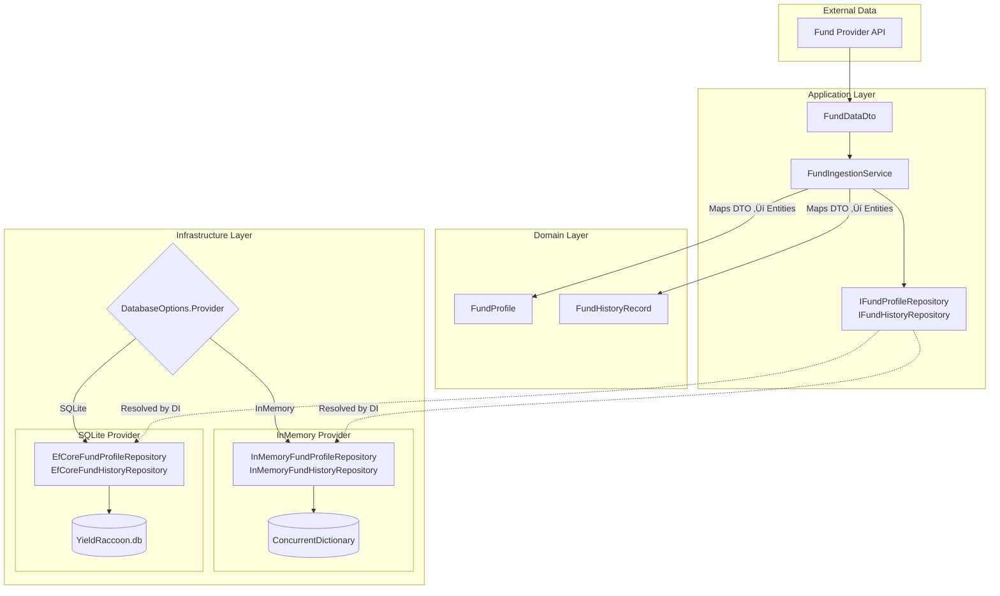

# YieldRaccoon

A massively over-engineered fund price crawler that sneaks around financial websites like a raccoon rummaging through garbage bins at 3 AM.

I've taken the simple task of "check if number went up or down" and wrapped it in layers of DDD, CQRS, event sourcing, reactive programming, and enough design patterns to make a senior architect weep with joy (or horror - it's hard to tell).

Because why scrape a website with a simple script when you can architect a *solution* with Aggregates, Value Objects, and Domain Events? 🦝

*Disclaimer: No actual banks were named in the making of this README. We use generic terms like "fund provider" because lawyers exist and we'd like to stay employed. The over-engineering, however, is 100% real, deeply unnecessary, and very entertaining for those who appreciate watching a simple HTTP request transform into a saga of bounded contexts and eventual consistency.*

## Preview


## ⚠️ CRITICAL SECURITY REQUIREMENT

**NEVER USE ACTUAL BANK/FINANCIAL INSTITUTION NAMES IN CODE OR DOCUMENTATION**

- ❌ **FORBIDDEN:** Never write specific financial institution names (e.g., "Avanza", "Nordnet") in code, comments, XML docs, logs, or any text
- ✅ **ALLOWED:** Use generic terms: "fund provider", "financial data source", "fund platform", "data provider"
- ✅ **ALLOWED:** Use placeholders in URLs: `https://<fund-provider>.com/funds/{isin}`
- **Reason:** Legal compliance, neutrality, and avoiding brand-specific dependencies

**This is non-negotiable. Code review will reject any mentions of specific bank names.**

## Key Technologies

| Technology | Version | Purpose |
| ------------ | --------- | --------- |
| .NET | 9.0 | Framework |
| WPF | - | Desktop UI |
| Entity Framework Core | 9.0 | SQLite persistence |
| DevExpressMvvm | 24.1.6 | MVVM framework |
| Autofac | 9.0.0 | Dependency injection |
| Rx.NET | 6.1.0 | Reactive programming |
| MahApps.Metro | 2.4.11 | Modern UI toolkit |
| NLog | 6.0.7 | Logging |

## Project Structure

```plaintext
YieldRaccoon.sln
├── YieldRaccoon.Domain/              # Core business logic (no dependencies)
│   ├── Entities/                     # FundProfile, FundHistoryRecord
│   ├── Events/AboutFund/             # IAboutFundEvent, session & navigation events
│   └── ValueObjects/                 # FundId, AboutFundSessionId, AboutFundFetchSlot
│
├── YieldRaccoon.Application/         # Use-case orchestration
│   ├── DTOs/                         # FundDataDto
│   ├── Models/                       # AboutFundPageData, AboutFundScheduleItem, session state
│   ├── Repositories/                 # IFundProfileRepository, IFundHistoryRepository
│   └── Services/                     # IAboutFundOrchestrator, IAboutFundPageDataCollector
│
├── YieldRaccoon.Infrastructure/      # Technical concerns
│   ├── Data/                         # EF Core DbContext, configurations
│   │   └── Repositories/             # EfCore* and InMemory* repository implementations
│   ├── EventStore/                   # InMemoryCrawlEventStore, InMemoryAboutFundEventStore
│   └── Services/                     # AboutFundOrchestrator, PageDataCollector, ResponseParser
│
└── YieldRaccoon.Wpf/                 # WPF UI
    ├── ViewModels/                   # DevExpress MVVM ViewModels
    ├── Views/                        # XAML views
    ├── Services/                     # WebView2 interceptor, page interactor
    └── Configuration/                # DatabaseOptions, YieldRaccoonOptions
```

## Database Persistence

Fund data persists to SQLite via EF Core. Configure in `appsettings.json`:

```json
{
  "Database": {
    "Provider": "SQLite",
    "ConnectionString": "Data Source=YieldRaccoon.db"
  }
}
```

| Provider | Description |
| ---------- | ------------- |
| `InMemory` | Session-scoped cache only (default) |
| `SQLite` | Persistent local database |

**Default SQLite file location:**

- File name: `YieldRaccoon.db`
- Location: Same folder as the executable
  - Development: `YieldRaccoon.Wpf/bin/Debug/net9.0-windows/YieldRaccoon.db`
  - Published: Application installation folder

**Database Tables:**

| Table | Purpose |
| ------- | --------- |
| `FundProfiles` | Static fund data (name, fees, ESG scores) - keyed by ISIN |
| `FundHistoryRecords` | Time-series data (NAV, owners, ratings) - FK to FundProfiles |

<details>
<summary><strong>SQLite Schema</strong></summary>

```sql
CREATE TABLE FundProfiles (
    Isin                     TEXT    NOT NULL
                                     CONSTRAINT PK_FundProfiles PRIMARY KEY,
    Name                     TEXT    NOT NULL,
    OrderbookId              TEXT,
    Category                 TEXT,
    CompanyName              TEXT,
    FundType                 TEXT,
    IsIndexFund              INTEGER,
    CurrencyCode             TEXT,
    ManagedType              TEXT,
    StartDate                TEXT,
    Buyable                  INTEGER,
    HasCashDividends         INTEGER,
    HasCurrencyExchangeFee   INTEGER,
    RecommendedHoldingPeriod TEXT,
    ManagementFee            REAL,
    TotalFee                 REAL,
    TransactionFee           REAL,
    OngoingFee               REAL,
    MinimumBuy               REAL,
    Capital                  REAL,
    NumberOfOwners           INTEGER,
    Rating                   INTEGER,
    Risk                     INTEGER,
    SharpeRatio              REAL,
    StandardDeviation        REAL,
    SustainabilityLevel      TEXT,
    SustainabilityRating     INTEGER,
    EsgScore                 REAL,
    EnvironmentalScore       REAL,
    SocialScore              REAL,
    GovernanceScore          REAL,
    LowCarbon                INTEGER,
    EuArticleType            TEXT,
    FirstSeenAt              TEXT    NOT NULL,
    CrawlerLastUpdatedAt     TEXT
);

CREATE TABLE FundHistoryRecords (
    Id                INTEGER NOT NULL
                              CONSTRAINT PK_FundHistoryRecords PRIMARY KEY,
    FundId            TEXT    NOT NULL,
    Nav               REAL,
    NavDate           TEXT,
    Capital           REAL,
    NumberOfOwners    INTEGER,
    Risk              INTEGER,
    SharpeRatio       REAL,
    StandardDeviation REAL,
    CONSTRAINT FK_FundHistoryRecords_FundProfiles_FundId FOREIGN KEY (
        FundId
    )
    REFERENCES FundProfiles (Isin) ON DELETE CASCADE
);
```

</details>

View to show funds by number of values.

```sql

CREATE VIEW vw_FundProfileHistoryCounts AS
SELECT
    fp.Isin,
    fp.OrderbookId,
    fp.Name,
    COUNT(fhr.Id) AS HistoryRecordCount
FROM FundProfiles fp
LEFT JOIN FundHistoryRecords fhr ON fhr.FundId = fp.Isin
GROUP BY fp.Isin, fp.Name, fp.OrderbookId
ORDER BY HistoryRecordCount DESC
LIMIT 60;

```

## Repository Architecture

The application supports swappable repository implementations based on configuration.



**Key points:**

- Repositories accept **domain entities** (`FundProfile`, `FundHistoryRecord`), not DTOs
- `FundIngestionService` maps DTOs to entities before calling repositories
- DI container resolves the correct implementation based on `DatabaseOptions.Provider`
- InMemory repositories use `ConcurrentDictionary` for thread-safe, session-scoped storage

## Automatic Pagination

Crawl sessions automatically load all funds by clicking "Show more" buttons on paginated lists.


**Commands:**

- `StartSessionCommand` - Begins automated crawl with randomized delays
- `LoadNextBatchCommand` - Manual single batch load
- `StopSessionCommand` - Cancel running session

**Features:** ISIN deduplication, randomized delays (20-60s), progress tracking.

## Domain Events

Events track crawl session lifecycle and batch loading progress.


| Category | Events |
| ---------- | -------- |
| Session | `Started`, `Completed`, `Failed`, `Cancelled` |
| Batch | `Scheduled`, `DelayStarted`, `DelayCompleted`, `Started`, `Completed`, `Failed` |
| Daily | `DailyCrawlScheduled`, `DailyCrawlReady` |

### AboutFund Browsing Events

Events tracking fund detail page browsing sessions — automated navigation through fund overview pages sorted by history record count. Separate bounded context with its own `IAboutFundEvent` interface and `InMemoryAboutFundEventStore`.


| Category | Events | Key Properties |
| ---------- | -------- | ---------------- |
| Session | `AboutFundSessionStarted` | `SessionId`, `TotalFunds`, `FirstOrderbookId` |
| Session | `AboutFundSessionCompleted` | `SessionId`, `FundsVisited`, `Duration` |
| Session | `AboutFundSessionCancelled` | `SessionId`, `FundsVisited`, `Reason` |
| Navigation | `AboutFundNavigationStarted` | `SessionId`, `Isin`, `OrderbookId`, `Index`, `Url` |
| Navigation | `AboutFundNavigationCompleted` | `SessionId`, `Isin`, `OrderbookId`, `Index` |
| Navigation | `AboutFundNavigationFailed` | `SessionId`, `Isin`, `Reason` |

### WebView2 Network Interception

How the AboutFund browser's network traffic is intercepted and routed to data collection. The `AboutFundResponseInterceptor` captures HTTP responses via `CoreWebView2.WebResourceResponseReceived` and calls `IAboutFundOrchestrator.NotifyResponseCaptured()`. The orchestrator routes matched responses through `AboutFundResponseParser` → `IAboutFundPageDataCollector`, which accumulates per-fund data slots until all have resolved.

```mermaid
sequenceDiagram
    participant DI as Autofac DI
    participant Win as AboutFundWindow
    participant VM as AboutFundWindowViewModel
    participant WV2 as WebView2 Control
    participant Beh as AboutFundWebView2Behavior
    participant Int as AboutFundResponseInterceptor
    participant Orc as AboutFundOrchestrator
    participant Parser as AboutFundResponseParser
    participant Col as AboutFundPageDataCollector

    Note over DI,Col: Window Creation
    DI->>Win: Resolve(logger, viewModel, interceptor)
    DI->>Int: Resolve(logger, orchestrator)
    DI->>VM: Resolve(orchestrator, childVMs, scheduler)
    Win->>Win: InitializeComponent()
    Win->>WV2: Subscribe CoreWebView2InitializationCompleted

    Note over Beh,WV2: WebView2 Initialization
    Beh->>WV2: EnsureCoreWebView2Async()
    WV2-->>Beh: CoreWebView2 ready
    Beh->>VM: OnBrowserLoadingChanged(true/false)
    WV2-->>Win: CoreWebView2InitializationCompleted
    Win->>Int: Initialize(WebView2)
    Int->>WV2: Subscribe WebResourceResponseReceived

    Note over WV2,Col: Runtime — Response Capture
    VM->>Win: NavigationRequested event
    Win->>WV2: Navigate(url)
    Orc->>Col: BeginCollection(isin, orderbookId)
    WV2->>Int: WebResourceResponseReceived
    Int->>Int: Create AboutFundInterceptedRequest
    Int-->>VM: Raise RequestIntercepted (network inspector UI)
    Int->>Orc: NotifyResponseCaptured(request)
    Orc->>Parser: TryRoute(request)
    Parser->>Col: ReceiveChartTimePeriods(json)
    Note over Col: ChartTimePeriods slot: ✅

    Note over WV2,Col: Runtime — Page Interaction
    Orc->>WV2: PageInteractor.ActivateSekViewAsync()
    alt Button found
        WV2->>Int: WebResourceResponseReceived (SEK endpoint)
        Int->>Orc: NotifyResponseCaptured(request)
        Orc->>Parser: TryRoute(request)
        Parser->>Col: ReceiveSekPerformance(json)
        Note over Col: SekPerformance slot: ✅
    else Button not found
        Orc->>Col: FailSlot(SekPerformance, reason)
        Note over Col: SekPerformance slot: ❌
    end
    Col-->>Orc: Completed (all slots resolved)
    Orc->>Orc: OnPageDataCollected → single DB write

    Note over Win,Int: Window Close
    Win->>Int: Dispose()
    Int->>WV2: Unsubscribe WebResourceResponseReceived
    Win->>VM: Dispose()
```



### AboutFund Page Data Collection

Each fund detail page requires multiple interactions (clicks) that trigger separate API calls. The `AboutFundPageDataCollector` accumulates responses into typed slots and signals completion when all have resolved, enabling a single database write per fund.


**Slot states:** Each `AboutFundFetchSlot` is independently `Pending` then `Succeeded` or `Failed`.

| Slot | Triggered by | Filled by |
| ---- | ------------ | --------- |
| `ChartTimePeriods` | Initial page load | Interceptor matching `chart/timeperiods/` |
| `SekPerformance` | Clicking settings checkbox | Interceptor matching SEK endpoint, or `FailSlot` if button not found |

**Completion:** `IsComplete` is true when every slot is resolved (succeeded **or** failed). Failed slots do not block the session. `IsFullySuccessful` is available separately for reporting.

## Layer Responsibilities

| Layer | Purpose | Key Patterns |
| ------- | --------- | -------------- |
| Domain | Business logic, entities, value objects | Strongly-typed IDs, aggregates |
| Application | Use-case orchestration, interfaces | Repository pattern, DTOs |
| Infrastructure | EF Core, web scraping, event publishing | Rx.NET, SQLite |
| Presentation | WPF UI, ViewModels | DevExpress MVVM, Autofac |

## Build and Run

```bash
cd YieldRaccoon
dotnet build
dotnet run --project YieldRaccoon.Wpf
```

## Development Skills

Use these skills for implementation guidance:

| Skill | Use For |
| ------- | --------- |
| `/dotnet-domain-driven-design` | Domain entities, aggregates, value objects |
| `/dotnet-wpf-mvvm` | ViewModels, data binding, commands |
| `/dotnet-unit-testing-nunit` | NUnit tests with AutoFixture |

**Key Principles:**

- Strongly-typed IDs using `readonly record struct`
- Intent signals with `IObservable<T>`
- Layer separation (no UI dependencies in Domain/Application)
- ILogger as first constructor parameter
