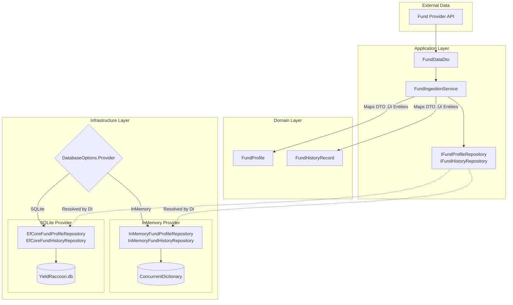

# YieldRaccoon

A massively over-engineered fund price crawler that sneaks around financial websites like a raccoon rummaging through garbage bins at 3 AM.

I've taken the simple task of "check if number went up or down" and wrapped it in layers of DDD, CQRS, event sourcing, reactive programming, and enough design patterns to make a senior architect weep with joy (or horror - it's hard to tell).

Because why scrape a website with a simple script when you can architect a *solution* with Aggregates, Value Objects, and Domain Events? 🦝

*Disclaimer: No actual banks were named in the making of this README. We use generic terms like "fund provider" because lawyers exist and we'd like to stay employed. The over-engineering, however, is 100% real, deeply unnecessary, and very entertaining for those who appreciate watching a simple HTTP request transform into a saga of bounded contexts and eventual consistency.*

## Preview

Main window


About fund window


## Privacy filter

`PrivacyFilterService` is a reusable static utility — any window with a WebView2 can plug it in. See [PRIVACY-OVERLAY.md](YieldRaccoon.Wpf/PRIVACY-OVERLAY.md) for the full architecture and implementation details.

## ⚠️ CRITICAL SECURITY REQUIREMENT

**NEVER USE ACTUAL BANK/FINANCIAL INSTITUTION NAMES IN CODE OR DOCUMENTATION**

- ❌ **FORBIDDEN:** Never write specific financial institution names (e.g., "Avanza", "Nordnet") in code, comments, XML docs, logs, or any text
- ✅ **ALLOWED:** Use generic terms: "fund provider", "financial data source", "fund platform", "data provider"
- ✅ **ALLOWED:** Use placeholders in URLs: `https://<fund-provider>.com/funds/{isin}`
- **Reason:** Legal compliance, neutrality, and avoiding brand-specific dependencies

**This is non-negotiable. Code review will reject any mentions of specific bank names.**

## Key Technologies

| Technology | Version | Purpose |
| ------------ | --------- | --------- |
| .NET | 9.0 | Framework |
| WPF | - | Desktop UI |
| Entity Framework Core | 9.0 | SQLite persistence |
| DevExpressMvvm | 24.1.6 | MVVM framework |
| Autofac | 9.0.0 | Dependency injection |
| Rx.NET | 6.1.0 | Reactive programming |
| MahApps.Metro | 2.4.11 | Modern UI toolkit |
| WebView2 | 1.0.2903 | Embedded Chromium browser |
| Magick.NET | 14.10.2 | Privacy filter image processing |
| NLog | 6.0.7 | Logging |

## Project Structure

```plaintext
YieldRaccoon.sln
├── YieldRaccoon.Domain/              # Core business logic (no dependencies)
│   ├── Entities/                     # FundProfile, FundHistoryRecord
│   ├── Events/AboutFund/             # IAboutFundEvent, session & navigation events
│   └── ValueObjects/                 # IsinId, OrderBookId, AboutFundSessionId, AboutFundFetchSlot
│
├── YieldRaccoon.Application/         # Use-case orchestration
│   ├── Configuration/                # Options records (ResponseParser, PageInteractor, RandomDelayProvider, FundDetailsUrlBuilder)
│   ├── DTOs/                         # FundDataDto
│   ├── Models/                       # AboutFundPageData (7 slots), CollectionSchedule/Step, session phases
│   ├── Repositories/                 # IFundProfileRepository, IFundHistoryRepository
│   └── Services/                     # IAboutFundOrchestrator, IAboutFundPageDataCollector,
│                                     # IAboutFundChartIngestionService, IRandomDelayProvider
│
├── YieldRaccoon.Infrastructure/      # Technical concerns
│   ├── Data/                         # EF Core DbContext, configurations, value converters
│   │   └── Repositories/             # EfCore* and InMemory* repository implementations
│   ├── EventStore/                   # InMemoryCrawlEventStore, InMemoryAboutFundEventStore
│   ├── Models/                       # Anti-corruption layer (chart API response shapes)
│   └── Services/                     # AboutFundOrchestrator, PageDataCollector (incl. response routing),
│                                     # ChartIngestionService, RandomDelayProvider, FundDetailsUrlBuilder
│
└── YieldRaccoon.Wpf/                 # WPF UI
    ├── Modules/                      # Autofac DI modules (NLogModule, PresentationModule)
    ├── ViewModels/                   # DevExpress MVVM ViewModels
    ├── Behaviors/                    # WebView2 behaviors (privacy refresh, auto-scroll)
    ├── Views/                        # XAML views
    ├── Services/                     # WebView2 interceptor, page interactor, PrivacyFilterService
    └── Configuration/                # DatabaseOptions, YieldRaccoonOptions (FastMode, AutoStartOverview)
```

## Database Persistence

Fund data persists to SQLite via EF Core. Configure in `appsettings.json`:

```json
{
  "Database": {
    "Provider": "SQLite",
    "ConnectionString": "Data Source=YieldRaccoon.db"
  }
}
```

| Provider | Description |
| ---------- | ------------- |
| `InMemory` | Session-scoped cache only (default) |
| `SQLite` | Persistent local database |

**Default SQLite file location:**

- File name: `YieldRaccoon.db`
- Location: Same folder as the executable
  - Development: `YieldRaccoon.Wpf/bin/Debug/net9.0-windows/YieldRaccoon.db`
  - Published: Application installation folder

**Database Tables:**

| Table | Purpose |
| ------- | --------- |
| `FundProfiles` | Static fund data (name, fees, ESG scores, visit tracking) - keyed by ISIN |
| `FundHistoryRecords` | Time-series data (NAV, owners, ratings) - FK to FundProfiles, unique per (FundId, NavDate) |

<details>
<summary><strong>SQLite Schema</strong></summary>

```sql
CREATE TABLE FundProfiles (
    Isin                     TEXT    NOT NULL
                                     CONSTRAINT PK_FundProfiles PRIMARY KEY,
    Name                     TEXT    NOT NULL,
    OrderbookId              TEXT,
    Category                 TEXT,
    CompanyName              TEXT,
    FundType                 TEXT,
    IsIndexFund              INTEGER,
    CurrencyCode             TEXT,
    ManagedType              TEXT,
    StartDate                TEXT,
    Buyable                  INTEGER,
    HasCashDividends         INTEGER,
    HasCurrencyExchangeFee   INTEGER,
    RecommendedHoldingPeriod TEXT,
    ManagementFee            REAL,
    TotalFee                 REAL,
    TransactionFee           REAL,
    OngoingFee               REAL,
    MinimumBuy               REAL,
    Capital                  REAL,
    NumberOfOwners           INTEGER,
    Rating                   INTEGER,
    Risk                     INTEGER,
    SharpeRatio              REAL,
    StandardDeviation        REAL,
    SustainabilityLevel      TEXT,
    SustainabilityRating     INTEGER,
    EsgScore                 REAL,
    EnvironmentalScore       REAL,
    SocialScore              REAL,
    GovernanceScore          REAL,
    LowCarbon                INTEGER,
    EuArticleType            TEXT,
    FirstSeenAt              TEXT    NOT NULL,
    CrawlerLastUpdatedAt     TEXT,
    AboutFundLastVisitedAt   TEXT
);

CREATE TABLE FundHistoryRecords (
    Id                INTEGER NOT NULL
                              CONSTRAINT PK_FundHistoryRecords PRIMARY KEY,
    FundId            TEXT    NOT NULL,
    Nav               REAL,
    NavDate           TEXT,
    Capital           REAL,
    NumberOfOwners    INTEGER,
    Risk              INTEGER,
    SharpeRatio       REAL,
    StandardDeviation REAL,
    CONSTRAINT FK_FundHistoryRecords_FundProfiles_FundId FOREIGN KEY (
        FundId
    )
    REFERENCES FundProfiles (Isin) ON DELETE CASCADE
);

CREATE INDEX IX_FundHistoryRecords_FundId_NavDate
    ON FundHistoryRecords (FundId, NavDate DESC);

CREATE UNIQUE INDEX UX_FundHistoryRecords_FundId_NavDate
    ON FundHistoryRecords (FundId, NavDate);
```

</details>

<details>
<summary><strong>Useful Views</strong></summary>

**Fund profile history counts** — shows funds sorted by number of history records:

```sql
CREATE VIEW vw_FundProfileHistoryCounts AS
SELECT
    fp.Isin,
    fp.OrderbookId,
    fp.Name,
    COUNT(fhr.Id) AS HistoryRecordCount
FROM FundProfiles fp
LEFT JOIN FundHistoryRecords fhr ON fhr.FundId = fp.Isin
GROUP BY fp.Isin, fp.Name, fp.OrderbookId
ORDER BY HistoryRecordCount DESC
LIMIT 60;
```

**Ownership change (2 weeks)** — shows change in NumberOfOwners over the last two weeks:

```sql
CREATE VIEW vw_OwnershipChangeTwoWeeks AS
WITH latest AS (
    SELECT FundId, NumberOfOwners, NavDate,
           ROW_NUMBER() OVER (PARTITION BY FundId ORDER BY NavDate DESC) AS rn
    FROM FundHistoryRecords
    WHERE NavDate >= date('now', '-3 days')
),
two_weeks_ago AS (
    SELECT FundId, NumberOfOwners, NavDate,
           ROW_NUMBER() OVER (PARTITION BY FundId ORDER BY NavDate DESC) AS rn
    FROM FundHistoryRecords
    WHERE NavDate <= date('now', '-14 days')
)
SELECT
    p.Name,
    l.FundId AS Isin,
    t.NumberOfOwners AS OwnersTwoWeeksAgo,
    l.NumberOfOwners AS OwnersNow,
    l.NumberOfOwners - t.NumberOfOwners AS Change,
    ROUND((l.NumberOfOwners - t.NumberOfOwners) * 100.0 / t.NumberOfOwners, 2) AS ChangePct
FROM latest l
JOIN two_weeks_ago t ON l.FundId = t.FundId AND t.rn = 1
JOIN FundProfiles p ON l.FundId = p.Isin
WHERE l.rn = 1
  AND t.NumberOfOwners IS NOT NULL
  AND l.NumberOfOwners IS NOT NULL;
```

Query examples:

```sql
-- Biggest gainers
SELECT * FROM vw_OwnershipChangeTwoWeeks ORDER BY Change DESC;

-- Biggest losers
SELECT * FROM vw_OwnershipChangeTwoWeeks ORDER BY Change ASC;

-- Top 10 by percentage growth
SELECT * FROM vw_OwnershipChangeTwoWeeks ORDER BY ChangePct DESC LIMIT 10;
```

</details>

## Repository Architecture

The application supports swappable repository implementations based on configuration.



**Key points:**

- Repositories accept **domain entities** (`FundProfile`, `FundHistoryRecord`), not DTOs
- `FundIngestionService` maps DTOs to entities before calling repositories
- DI container resolves the correct implementation based on `DatabaseOptions.Provider`
- InMemory repositories use `ConcurrentDictionary` for thread-safe, session-scoped storage
- `GetFundsOrderedByHistoryCountAsync` returns funds prioritized for browsing (unvisited first, then fewest history records)
- `UpdateLastVisitedAtAsync` tracks when the AboutFund orchestrator last visited a fund
- `AddRangeIfNotExistsAsync` inserts only new history records, deduplicating by (FundId, NavDate) composite key

## Automatic Pagination

Crawl sessions automatically load all funds by clicking "Show more" buttons on paginated lists.


**Commands:**

- `StartSessionCommand` - Begins automated crawl with randomized delays
- `LoadNextBatchCommand` - Manual single batch load
- `StopSessionCommand` - Cancel running session

**Features:** ISIN deduplication, randomized delays (20-60s), progress tracking.

Both the main window and AboutFund browser support a privacy mode that hides live browser content behind an oil-paint-filtered screenshot — useful during screen sharing or when someone's looking over your shoulder.

## Domain Events

Events track crawl session lifecycle and batch loading progress.


| Category | Events |
| ---------- | -------- |
| Session | `Started`, `Completed`, `Failed`, `Cancelled` |
| Batch | `Scheduled`, `DelayStarted`, `DelayCompleted`, `Started`, `Completed`, `Failed` |
| Daily | `DailyCrawlScheduled`, `DailyCrawlReady` |

### AboutFund Browsing Events

Events tracking fund detail page browsing sessions — automated navigation through fund overview pages sorted by history record count. Separate bounded context with its own `IAboutFundEvent` interface and `InMemoryAboutFundEventStore`.


| Category | Events | Key Properties |
| ---------- | -------- | ---------------- |
| Session | `AboutFundSessionStarted` | `SessionId`, `TotalFunds`, `FirstOrderbookId` (`OrderBookId`) |
| Session | `AboutFundSessionCompleted` | `SessionId`, `FundsVisited`, `Duration` |
| Session | `AboutFundSessionCancelled` | `SessionId`, `FundsVisited`, `Reason` |
| Navigation | `AboutFundNavigationStarted` | `SessionId`, `Isin`, `OrderbookId` (`OrderBookId`), `Url` |
| Navigation | `AboutFundNavigationCompleted` | `SessionId`, `Isin`, `OrderbookId` (`OrderBookId`) |
| Navigation | `AboutFundNavigationFailed` | `SessionId`, `Isin`, `Reason` |

### WebView2 Network Interception

How the AboutFund browser's network traffic is intercepted and routed to data collection. The `AboutFundResponseInterceptor` captures HTTP responses via `CoreWebView2.WebResourceResponseReceived` and forwards them to `IAboutFundPageDataCollector.NotifyResponseCaptured()`. The collector routes matched responses to data slots using `EndpointPattern` URL fragment matching (configured via `ResponseParserOptions`). After the final interaction (`SelectMax`) succeeds, the collector enters the Draining phase — the next matched response triggers completion and chart data ingestion.

```mermaid
sequenceDiagram
    participant DI as Autofac DI
    participant Win as AboutFundWindow
    participant VM as AboutFundWindowViewModel
    participant WV2 as WebView2 Control
    participant Beh as AboutFundWebView2Behavior
    participant Int as AboutFundResponseInterceptor
    participant Orc as AboutFundOrchestrator
    participant Col as AboutFundPageDataCollector
    participant PI as PageInteractor
    participant Ingest as ChartIngestionService

    Note over DI,Ingest: Window Creation
    DI->>Win: Resolve(logger, viewModel, interceptor)
    DI->>Int: Resolve(logger, collector)
    DI->>VM: Resolve(orchestrator, childVMs, scheduler)
    Win->>Win: InitializeComponent()
    Win->>WV2: Subscribe CoreWebView2InitializationCompleted

    Note over Beh,WV2: WebView2 Initialization
    Beh->>WV2: EnsureCoreWebView2Async()
    WV2-->>Beh: CoreWebView2 ready
    Beh->>VM: OnBrowserLoadingChanged(true/false)
    WV2-->>Win: CoreWebView2InitializationCompleted
    Win->>Int: Initialize(WebView2)
    Int->>WV2: Subscribe WebResourceResponseReceived

    Note over WV2,Ingest: Session Start — Pre-calculate Full Schedule
    VM->>Orc: StartSessionAsync()
    Orc->>Orc: CalculateSessionSchedule() via IRandomDelayProvider
    Orc->>Col: BeginCollection(schedule)
    Orc-->>Win: NavigateToUrl event (Uri)
    Win->>WV2: Navigate(url)

    Note over WV2,Ingest: Collection — Scheduled Interactions (8 steps)
    loop For each step (ActivateSekView, Select1M...SelectMax)
        Col->>Col: Timer fires at pre-calculated time
        Col->>PI: Execute interaction (e.g., SelectPeriod1YearAsync)
        PI->>WV2: Execute JS (click button)
        WV2->>Int: WebResourceResponseReceived
        Int->>Col: NotifyResponseCaptured(request)
        Col->>Col: TryRouteResponse → URL pattern match → fill slot
        Note over Col: Slot filled (e.g., Chart1Year: Succeeded)
    end

    Note over Col,Ingest: Completion — Draining → Completed
    Col->>Col: SelectMax succeeds → phase = Draining
    Col->>Col: Next matched response → CompleteCollection()
    Col-->>Orc: Completed (AboutFundPageData with 7 slots)
    Orc->>Ingest: IngestChartDataAsync(pageData, isinId)
    Ingest->>Ingest: Deserialize → merge → deduplicate by NavDate
    Ingest-->>Orc: Records persisted

    Note over Win,Int: Window Close
    Win->>Int: Dispose()
    Int->>WV2: Unsubscribe WebResourceResponseReceived
    Win->>VM: Dispose()
```



### AboutFund Page Data Collection

Each fund detail page visit involves 8 scheduled browser interactions that trigger separate API calls for chart data across 7 time periods. The `AboutFundPageDataCollector` receives a pre-calculated `AboutFundCollectionSchedule` from the orchestrator, schedules Rx timers at absolute fire times, executes page interactions via `IAboutFundPageInteractor`, routes intercepted HTTP responses to data slots via URL pattern matching, and signals completion when the final response arrives (or a safety-net timer expires).


#### Collection Phase State Machine

Each fund page visit transitions through a `CollectionPhase` lifecycle:


- **Interacting**: Scheduled button clicks are firing (8 steps over ~90s)
- **Draining**: All interactions fired; awaiting final HTTP response
- **Completed**: Data emitted, ready for ingestion

#### Data Slots (7)

**Slot states:** Each `AboutFundFetchSlot` is independently `Pending` then `Succeeded` or `Failed`.

| Slot | Triggered by | Data source |
| ---- | ------------ | ----------- |
| `Chart1Month` | Clicking "1M" period button | Interceptor matching chart endpoint with 1M period |
| `Chart3Months` | Clicking "3M" period button | Interceptor matching chart endpoint with 3M period |
| `ChartYearToDate` | Clicking "YTD" button | Interceptor matching chart endpoint with YTD period |
| `Chart1Year` | Clicking "1Y" period button | Interceptor matching chart endpoint with 1Y period |
| `Chart3Years` | Clicking "3Y" period button | Interceptor matching chart endpoint with 3Y period |
| `Chart5Years` | Clicking "5Y" period button | Interceptor matching chart endpoint with 5Y period |
| `ChartMax` | Clicking "Max" period button | Interceptor matching chart endpoint with max period |

#### Collection Steps (8)

| Step | Action | Purpose |
| ---- | ------ | ------- |
| `ActivateSekView` | Click SEK checkbox | Switch chart to SEK-denominated view |
| `Select1Month` | Click 1M button | Trigger 1-month chart data API call |
| `Select3Months` | Click 3M button | Trigger 3-month chart data API call |
| `SelectYearToDate` | Click YTD button | Trigger year-to-date chart data API call |
| `Select1Year` | Click 1Y button | Trigger 1-year chart data API call |
| `Select3Years` | Click 3Y button | Trigger 3-year chart data API call |
| `Select5Years` | Click 5Y button | Trigger 5-year chart data API call |
| `SelectMax` | Click Max button | Trigger max-range chart data; transitions to **Draining** phase |

**Completion:** `IsComplete` is true when every slot is resolved (succeeded **or** failed). Failed slots do not block the session. `IsFullySuccessful` is available separately for reporting. A safety-net timer forces completion if the final HTTP response never arrives.

#### Three-Tier Scheduling

The orchestrator owns all scheduling policy. On session start, it pre-calculates the complete timeline — no delays are computed on-the-fly:

1. **Session schedule** (`List<AboutFundCollectionSchedule>`) — one entry per fund with absolute start/stop times and inter-page delays
2. **Step schedule** (`AboutFundScheduledStep`) — per-step absolute fire times within each fund, derived from `IAboutFundPageInteractor.GetMinimumDelay()` (configurable via `PageInteractorOptions`) plus randomized padding via `IRandomDelayProvider` (configurable via `RandomDelayProviderOptions`). Both use minimal timings when `FastMode` is enabled.
3. **Collector execution** — receives the pre-calculated schedule and schedules Rx timers at prescribed times. Does not calculate delays itself.

**Session phases:** `Idle` → `DelayBeforeNavigation` → `Collecting` → `DelayBeforeNavigation` → ... → `Completed`

#### Chart Data Ingestion Pipeline

After page data collection completes, `AboutFundChartIngestionService` runs the ingestion pipeline:

1. Extract raw JSON from succeeded slots
2. Deserialize via anti-corruption models (`AboutFundChartResponse`, `AboutFundChartDataPoint`)
3. Merge all data points across 7 overlapping time periods
4. Deduplicate by NAV date (first occurrence wins — shorter periods may have finer granularity)
5. Convert Unix timestamps to Stockholm-time `DateOnly` (handles CET/CEST transitions)
6. Map to `FundHistoryRecord` entities (Nav + NavDate populated from chart data)
7. Persist via `AddRangeIfNotExistsAsync` (existing records silently skipped)

## Layer Responsibilities

| Layer | Purpose | Key Patterns |
| ------- | --------- | -------------- |
| Domain | Business logic, entities, value objects | Strongly-typed IDs (`IsinId`, `OrderBookId`), aggregates |
| Application | Use-case orchestration, interfaces | Repository pattern, DTOs, `EndpointPattern` URL routing |
| Infrastructure | EF Core, chart ingestion, event publishing | Rx.NET, SQLite, anti-corruption models |
| Presentation | WPF UI, ViewModels | DevExpress MVVM, Autofac, NLog auto-injection |

## Configuration (User Secrets)

Settings are loaded from .NET User Secrets under the `YieldRaccoon` section:

```bash
# Required — fund provider URLs
dotnet user-secrets set "YieldRaccoon:FundListPageUrlOverviewTab" "https://<fund-provider>.com/funds/list?tab=overview"
dotnet user-secrets set "YieldRaccoon:FundDetailsPageUrlTemplate" "https://<fund-provider>.com/fund/{0}"

# Optional — behavior flags
dotnet user-secrets set "YieldRaccoon:AutoStartOverview" "true"
dotnet user-secrets set "YieldRaccoon:FastMode" "true"
```

| Setting | Default | Description |
| ------- | ------- | ----------- |
| `FundListPageUrlOverviewTab` | *(empty)* | URL to the fund list/search page |
| `FundDetailsPageUrlTemplate` | *(empty)* | URL template for fund detail pages (`{0}` = OrderbookId) |
| `AutoStartOverview` | `false` | Auto-start browsing when AboutFund window opens |
| `FastMode` | `false` | Use minimal delays (3-7s clicks, 2s panel animations, 3-8s between pages) instead of human-like timings |

## Build and Run

```bash
cd YieldRaccoon
dotnet build
dotnet run --project YieldRaccoon.Wpf
```

## Development Skills

Use these skills for implementation guidance:

| Skill | Use For |
| ------- | --------- |
| `/dotnet-domain-driven-design` | Domain entities, aggregates, value objects |
| `/dotnet-wpf-mvvm` | ViewModels, data binding, commands |
| `/dotnet-unit-testing-nunit` | NUnit tests with AutoFixture |

**Key Principles:**

- Strongly-typed IDs using `readonly record struct`
- Intent signals with `IObservable<T>`
- Layer separation (no UI dependencies in Domain/Application)
- ILogger as first constructor parameter
