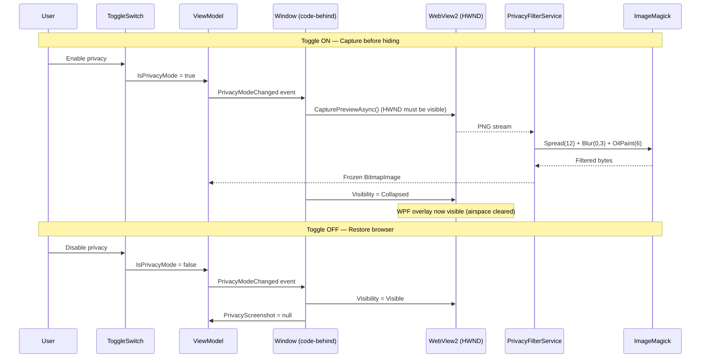
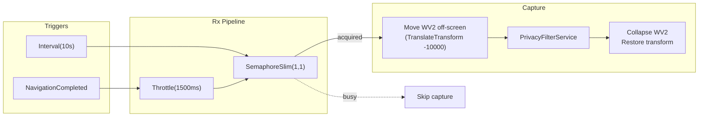

# Privacy Overlay

A reusable oil-paint privacy filter for WebView2 browser windows. Hides live page content behind a stylized screenshot so sensitive data isn't visible during screen sharing or shoulder-surfing.

WebView2 is an HWND control with **airspace issues** (WPF content can't render on top of it). The overlay works around this:

1. **Capture** — PNG screenshot via `CoreWebView2.CapturePreviewAsync()`
2. **Filter** — ImageMagick pipeline: `Spread(12)` → `GaussianBlur(0, 3)` → `OilPaint(6)` — text becomes unreadable while colors and layout stay recognizable
3. **Swap** — collapse the WebView2 control, show the filtered image with a shield icon overlay

The URL bar text is also hidden (transparent foreground) while privacy mode is active.



**Window extras:** Rx-throttled refresh on navigation (1500ms debounce to let the page settle), periodic 10-second refresh for dynamic content (AJAX, late-loading charts), semaphore-guarded capture to prevent overlapping screenshot operations.



`PrivacyFilterService` is a reusable static utility — any window with a WebView2 can plug it in. See [PRIVACY-OVERLAY.md](YieldRaccoon.Wpf/PRIVACY-OVERLAY.md) for the full architecture and implementation details.

## How it works

WebView2 is an HWND control with **airspace issues** -- WPF content cannot render on top of it regardless of z-order. The privacy overlay works around this in three steps:

1. **Capture** -- take a PNG screenshot via `CoreWebView2.CapturePreviewAsync()`
2. **Filter** -- apply ImageMagick's Spread + Blur + OilPaint pipeline, making text unreadable while preserving page colors and structure
3. **Swap** -- collapse the WebView2 control and show the filtered image with an overlay indicator

When privacy mode is toggled off, the WebView2 is restored and the screenshot is cleared.

The URL bar text is also hidden (transparent foreground) while privacy mode is active.

### Navigation while privacy is active

If the orchestrator navigates to a new fund page while privacy mode is on, the screenshot auto-refreshes. The browser is briefly shown off-screen (via `TranslateTransform(-10000, 0)`) to allow capture, then immediately re-hidden. The user never sees live content.

Refresh is **debounced** via Rx `Throttle(1500ms)` -- pages fire multiple `NavigationCompleted` events (subframes, XHR redirects) and capturing too early yields a gray loading page. The screenshot is only captured once the page settles.

A **periodic refresh** (`Observable.Interval(10s)`) also runs while privacy mode is active, keeping the screenshot current when page content updates dynamically (AJAX, charts loading late) without triggering navigation events. The interval ticks are marshaled to the UI thread via `ObserveOn` **before** the `.Where()` filter, since `webView.CoreWebView2` has thread affinity and must be accessed from the dispatcher thread.

Both refresh sources (navigation-debounced and periodic) are guarded by a `SemaphoreSlim(1, 1)` with non-blocking `WaitAsync(0)` -- if a capture is already in flight, the overlapping call is silently skipped. This prevents the off-screen visibility dance from corrupting WebView2 state.

The Rx `Subject` is eagerly initialized as a static readonly field (never null, never recreated). The throttled and periodic subscriptions are stored as `IDisposable` fields and properly disposed/replaced when WebView2 re-initializes, preventing orphaned subscriptions.

## Architecture

```plaintext
AboutFundWindow.xaml          -- Toggle switch in toolbar + overlay XAML + URL bar hiding
AboutFundWindow.xaml.cs       -- Subscribes to PrivacyModeChanged, captures/clears screenshot
AboutFundWindowViewModel.cs   -- IsPrivacyMode, PrivacyScreenshot, PrivacyModeChanged event
AboutFundWebView2Behavior.cs  -- Debounced refresh on NavigationCompleted + periodic 10s refresh (Rx)
PrivacyFilterService.cs       -- Reusable: CaptureAndFilterAsync() + ApplyPrivacyEffect()
```

### PrivacyFilterService (reusable)

`Services/PrivacyFilterService.cs` is a static utility with no UI dependencies. Any window with a WebView2 can use it:

```csharp
// Full pipeline: capture + oil-paint + frozen BitmapImage
var screenshot = await PrivacyFilterService.CaptureAndFilterAsync(
    browser.CoreWebView2, Dispatcher);

// Or just the image processing
byte[] filtered = PrivacyFilterService.ApplyPrivacyEffect(pngStream);
```

### Oil-paint effect parameters

Equivalent to CLI: `magick input.png -spread 12 -blur 0x3 -paint 6 output.png`

| Parameter    | Value | Effect                                                                |
| ------------ | ----- | --------------------------------------------------------------------- |
| Spread       | 12    | Randomly displaces pixels within 12px radius, breaking text structure |
| GaussianBlur | 0x3   | Smooths the spread noise (sigma 3)                                    |
| OilPaint     | 6     | Oil-painting effect, smears remaining detail                          |

The result is a painterly, smeared appearance where page colors and layout are recognizable but text and numbers are unreadable.

## UI

The toggle sits in the browser toolbar, right of the "Go" button:

```plaintext
[ Reload ] [ URL input                        ] [ Go ] [ Normal / Privacy ]
```

When active:

- Browser area shows oil-paint-filtered screenshot with semi-transparent overlay (`yr.OverlayBrush`)
- Shield icon + "Privacy mode" / "Browser content hidden" text centered on overlay
- URL bar text becomes transparent (hidden but binding intact)

## Relation to MainWindow

Both windows use the same privacy overlay approach via `PrivacyFilterService`. MainWindow's toggle, overlay visuals (white shield icon, sentence casing), and oil-paint effect are identical to AboutFundWindow. The only difference is that AboutFundWindow uses `AboutFundWebView2Behavior` for Rx-based debounced refresh on navigation and periodic 10-second refresh, while MainWindow refreshes inline in its `NavigationCompleted` handler and scroll-to-end handler.
