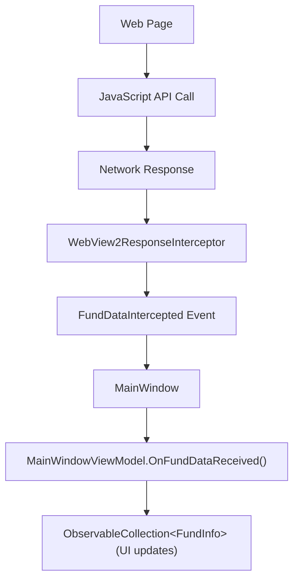
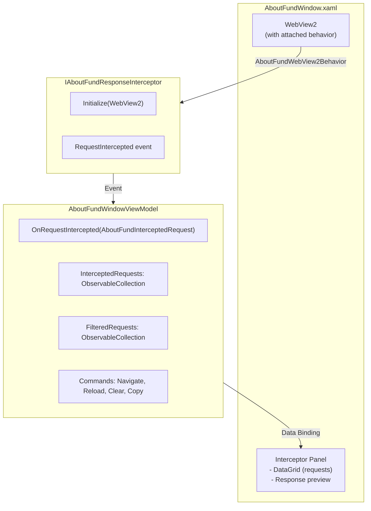

# WebView2 Response Interception Implementation

This document explains how to use and configure the WebView2 response interception feature to capture fund data from JavaScript network calls.

## Overview

The implementation intercepts network responses from the WebView2 browser control and extracts fund data from JSON responses. This allows you to capture data from JavaScript API calls without modifying the web page's code.

There are two interception implementations:

1. **MainWindow (Fund List)** - Intercepts specific API endpoints for fund list data
2. **AboutFundWindow (Network Inspector)** - Intercepts ALL network requests for debugging/exploration

---

## MainWindow Architecture (Fund List Interception)



---

## AboutFundWindow Architecture (Network Inspector)

The AboutFundWindow uses a DDD-compliant architecture with separation of concerns:



### Key Differences from MainWindow

| Aspect | MainWindow | AboutFundWindow |
| ------ | ---------- | --------------- |
| Purpose | Capture fund list data | Network inspector/debugging |
| URL Filtering | Specific patterns only | ALL requests captured |
| Code-behind | WebView2 init + interceptor wiring | Minimal (just DataContext) |
| Initialization | Code-behind | Attached Behavior |
| Service | WebView2ResponseInterceptor | IAboutFundResponseInterceptor |

### AboutFund Files

#### Services

- **`Services/IAboutFundResponseInterceptor.cs`** - Interface:

  ```csharp
  public interface IAboutFundResponseInterceptor : IDisposable
  {
      void Initialize(WebView2 webView);
      event EventHandler<AboutFundInterceptedRequest>? RequestIntercepted;
  }
  ```

- **`Services/AboutFundResponseInterceptor.cs`** - Implementation:
  - Subscribes to `CoreWebView2.WebResourceResponseReceived`
  - Captures ALL network requests (no URL filtering)
  - Extracts response content preview (first 2KB for JSON/text)
  - Raises `RequestIntercepted` event

#### Models

- **`Models/AboutFundInterceptedRequest.cs`** - Captured request data:

  ```csharp
  public class AboutFundInterceptedRequest
  {
      public string Id { get; init; }
      public DateTime Timestamp { get; init; }
      public string Method { get; init; }
      public string Url { get; init; }
      public int StatusCode { get; init; }
      public string ContentType { get; init; }
      public long ContentLength { get; init; }
      public string? ResponsePreview { get; init; }
  }
  ```

#### Behaviors

- **`Behaviors/AboutFundWebView2Behavior.cs`** - Attached behavior:
  - Handles `EnsureCoreWebView2Async()` initialization
  - Wires up navigation events for loading state
  - Creates and initializes `IAboutFundResponseInterceptor`
  - Connects interceptor events to ViewModel

#### ViewModels

- **`ViewModels/AboutFundInterceptedRequestViewModel.cs`** - Request display:

  ```csharp
  public class AboutFundInterceptedRequestViewModel : BindableBase
  {
      // Properties for binding
      public bool IsSuccess => StatusCode >= 200 && StatusCode < 300;
      public bool IsClientError => StatusCode >= 400 && StatusCode < 500;
      public bool IsServerError => StatusCode >= 500;
      public string ShortUrl => Url.Length > 80 ? Url[..77] + "..." : Url;
  }
  ```

- **`ViewModels/AboutFundWindowViewModel.cs`** - Window ViewModel with filtering and commands

### Usage

1. Click the **AboutFund** button in the MainWindow title bar
2. Enter a URL and click **Go** or press Enter
3. All network requests appear in the interceptor panel
4. Use the filter to narrow down by URL pattern
5. Click a request to see response preview
6. Use **Copy URL** or **Copy Response** to extract data

## Files Created

### MainWindow (Fund List) Files

#### 1. Service Layer

- **`Services/WebView2ResponseInterceptor.cs`**
  - Intercepts network responses using `WebResourceResponseReceived` event
  - Filters responses by URL patterns
  - Parses JSON content and raises `FundDataIntercepted` event

#### 2. Model Classes

- **`Models/InterceptedFund.cs`** - Represents a single fund with 70+ properties
- **`Models/InterceptedFundList.cs`** - Represents the API response structure
- **`Models/FundDataInterceptedEventArgs.cs`** - Event args for interception events

#### 3. Integration

- **`MainWindow.xaml.cs`** - Creates and initializes the interceptor
- **`ViewModels/MainWindowViewModel.cs`** - Handles intercepted data and updates UI
- **`MainWindow.xaml`** - Displays the fund list in the left panel

### AboutFundWindow (Network Inspector) Files

**Services:**

- `Services/IAboutFundResponseInterceptor.cs` - Interface for response interception
- `Services/AboutFundResponseInterceptor.cs` - Captures ALL network requests
- `Services/IAboutFundWindowService.cs` - Interface for window management
- `Services/AboutFundWindowService.cs` - Non-modal window service

**Models:**

- `Models/AboutFundInterceptedRequest.cs` - Captured request/response data

**Behaviors:**

- `Behaviors/AboutFundWebView2Behavior.cs` - Attached behavior for WebView2 initialization

**ViewModels:**

- `ViewModels/AboutFundInterceptedRequestViewModel.cs` - Request display with status colors
- `ViewModels/AboutFundWindowViewModel.cs` - Window state and commands

**Views:**

- `Views/AboutFundWindow.xaml` - Split layout with WebView2 and interceptor panel
- `Views/AboutFundWindow.xaml.cs` - Minimal code-behind (DI only)

## Configuration

### Step 1: Configure URL Patterns

Edit [WebView2ResponseInterceptor.cs](Services/WebView2ResponseInterceptor.cs:82) to match your actual API endpoints:

```csharp
private bool ShouldInterceptResponse(string uri)
{
    var patterns = new[]
    {
        "/api/funds",           // REST API endpoint
        "/funds/list",          // Alternative endpoint
        "getFundList",          // JavaScript function name in URL
        // Add your patterns here
    };

    return patterns.Any(pattern =>
        uri.Contains(pattern, StringComparison.OrdinalIgnoreCase));
}
```

### Step 2: Adjust JSON Structure

If your API response structure differs from the default, modify [WebView2ResponseInterceptor.cs](Services/WebView2ResponseInterceptor.cs:117):

```csharp
private FundListResponse? ParseFundData(string jsonContent)
{
    // Option 1: Response has a "funds" property
    // { "funds": [ {...}, {...} ] }
    var fundData = JsonSerializer.Deserialize<FundListResponse>(jsonContent);

    // Option 2: Response is a direct array
    // [ {...}, {...} ]
    var funds = JsonSerializer.Deserialize<List<FundInfo>>(jsonContent);

    // Option 3: Response has nested structure
    // { "data": { "results": [ {...} ] } }
    // Customize parsing logic here
}
```

### Step 3: Customize FundInfo Model

Edit [Models/FundInfo.cs](Models/FundInfo.cs) to match your API response fields:

```csharp
public class FundInfo
{
    [JsonPropertyName("id")]
    public string? Id { get; set; }

    [JsonPropertyName("fundName")]  // Change property name to match API
    public string? Name { get; set; }

    // Add more properties as needed
    [JsonPropertyName("returnRate")]
    public decimal? ReturnRate { get; set; }
}
```

## Testing

### MainWindow Testing

#### Enable Trace Logging

Add to your `nlog.config` to see all intercepted requests:

```xml
<logger name="YieldRaccoon.Wpf.Services.WebView2ResponseInterceptor" minlevel="Trace" writeTo="file" />
```

#### Check Logs

Look for these log messages:

```plaintext
[Trace] Response received: https://example.com/api/funds - Status: 200
[Debug] Intercepting response from: https://example.com/api/funds
[Debug] Response content length: 1524 characters
[Info] Successfully parsed fund data with 15 funds
```

#### Inspect Raw JSON

Temporarily add this to `ProcessResponseAsync()` to see raw responses:

```csharp
_logger.Info($"Raw JSON: {jsonContent}");
```

### AboutFundWindow Testing

The AboutFund window is a visual network inspector - no log configuration needed.

#### Manual Testing Checklist

- [ ] AboutFund button appears in MainWindow title bar with bug icon
- [ ] Clicking opens non-modal window (can use both windows)
- [ ] WebView2 loads default URL
- [ ] URL input + Go button navigates correctly
- [ ] Reload button refreshes the page
- [ ] Recording toggle pauses/resumes interception
- [ ] All network requests appear in DataGrid
- [ ] Status codes are color-coded (green=2xx, orange=4xx, red=5xx)
- [ ] URL filter narrows results
- [ ] Clicking a request shows response preview
- [ ] Copy URL button copies selected URL
- [ ] Copy Response button copies response content
- [ ] Clear button removes all entries
- [ ] Re-clicking AboutFund button brings existing window to focus

#### Enable AboutFund Logging

```xml
<logger name="YieldRaccoon.Wpf.Services.AboutFundResponseInterceptor" minlevel="Trace" writeTo="file" />
<logger name="YieldRaccoon.Wpf.Behaviors.AboutFundWebView2Behavior" minlevel="Debug" writeTo="file" />
```

### Use Browser DevTools

1. Right-click in the WebView2 browser → **Inspect**
2. Go to **Network** tab
3. Look for XHR/Fetch requests
4. Check the **Response** tab to see JSON structure
5. Copy the URL pattern and response structure

## Common Issues

### Issue: No Data Being Intercepted

**Solution:**

1. Check URL patterns in `ShouldInterceptResponse()`
2. Enable Trace logging to see all requests
3. Use browser DevTools to find the actual API endpoint

### Issue: JSON Parsing Errors

**Solution:**

1. Check logs for `JsonException` with error details
2. Compare `FundInfo` properties with actual response structure
3. Use `[JsonExtensionData]` for unknown properties

### Issue: Empty Response Content

**Solution:**

- Response content can only be read once
- Make sure no other code is consuming the stream
- Check for `COMException` in logs

## How It Works

### 1. Event Flow

```csharp
// In MainWindow.xaml.cs:InitializeAsync()
_responseInterceptor = new WebView2ResponseInterceptor(Browser, _logger);
_responseInterceptor.FundDataIntercepted += OnFundDataIntercepted;
_responseInterceptor.Initialize();
```

### 2. Response Interception

```csharp
// WebView2ResponseInterceptor subscribes to WebResourceResponseReceived
Browser.CoreWebView2.WebResourceResponseReceived += OnWebResourceResponseReceived;

// When response arrives:
if (ShouldInterceptResponse(e.Request.Uri))
{
    Stream content = await e.Response.GetContentAsync();
    string json = await new StreamReader(content).ReadToEndAsync();
    var fundData = JsonSerializer.Deserialize<FundListResponse>(json);
    FundDataIntercepted?.Invoke(this, new FundDataInterceptedEventArgs { ... });
}
```

### 3. Data Binding

```csharp
// MainWindowViewModel.OnFundDataReceived()
Funds.Clear();
foreach (var fund in fundData.Funds)
{
    Funds.Add(fund);  // ObservableCollection updates UI automatically
}
```

## Alternative Approaches

If URL pattern matching doesn't work, consider these alternatives:

### A. Inject JavaScript to Capture Data

```csharp
// After navigation completes
await Browser.CoreWebView2.AddScriptToExecuteOnDocumentCreatedAsync(@"
    (function() {
        const originalFetch = window.fetch;
        window.fetch = function(...args) {
            return originalFetch.apply(this, args).then(response => {
                response.clone().json().then(data => {
                    window.chrome.webview.postMessage({
                        type: 'fundData',
                        data: data
                    });
                });
                return response;
            });
        };
    })();
");

// Listen for messages
Browser.CoreWebView2.WebMessageReceived += (s, e) => {
    var message = JsonSerializer.Deserialize<dynamic>(e.WebMessageAsJson);
    if (message.type == "fundData") {
        // Process fund data
    }
};
```

### B. DevTools Protocol (CDP)

Use Chrome DevTools Protocol to enable network domain and listen to responses:

```csharp
await Browser.CoreWebView2.CallDevToolsProtocolMethodAsync("Network.enable", "{}");

var receiver = Browser.CoreWebView2.GetDevToolsProtocolEventReceiver("Network.responseReceived");
receiver.DevToolsProtocolEventReceived += async (s, e) => {
    // Get response body using CDP
    var result = await Browser.CoreWebView2.CallDevToolsProtocolMethodAsync(
        "Network.getResponseBody",
        $"{{\"requestId\": \"{requestId}\"}}"
    );
};
```

## Next Steps

1. **Configure URL patterns** to match your fund API endpoints
2. **Test with DevTools** open to verify interception
3. **Customize models** to match your API response structure
4. **Add error handling** for specific API error codes
5. **Implement caching** if needed to avoid duplicate processing

## Support

For issues or questions:

1. Check logs with Trace level enabled
2. Verify URL patterns match actual requests
3. Compare JSON structure with model classes
4. Review Microsoft Learn WebView2 documentation: <https://learn.microsoft.com/en-us/microsoft-edge/webview2/>
