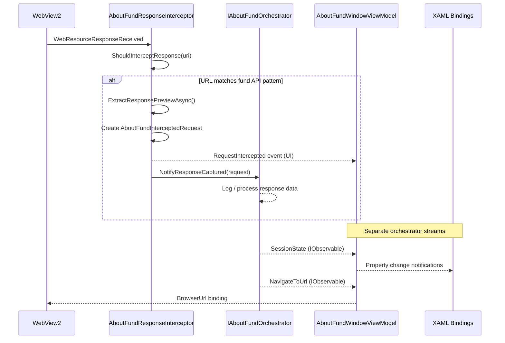
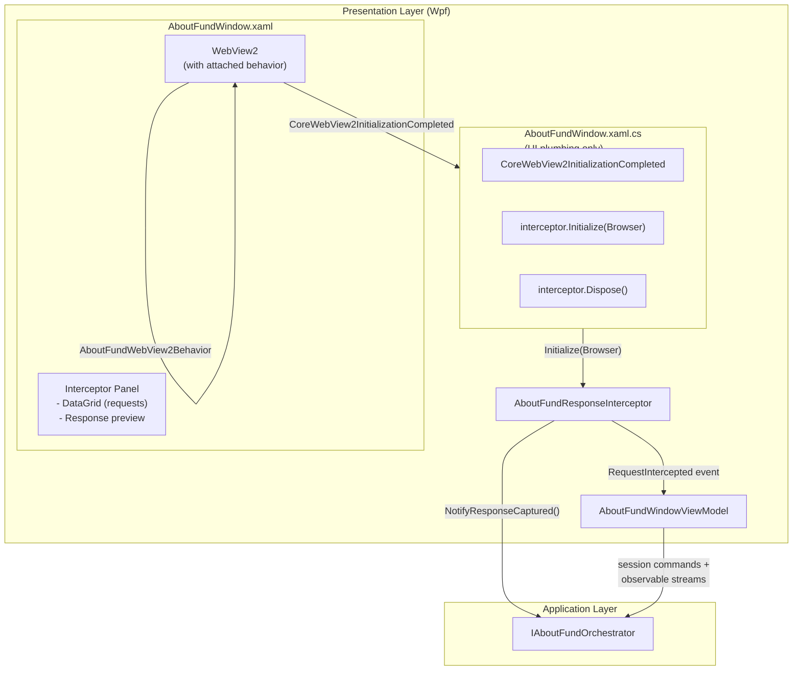
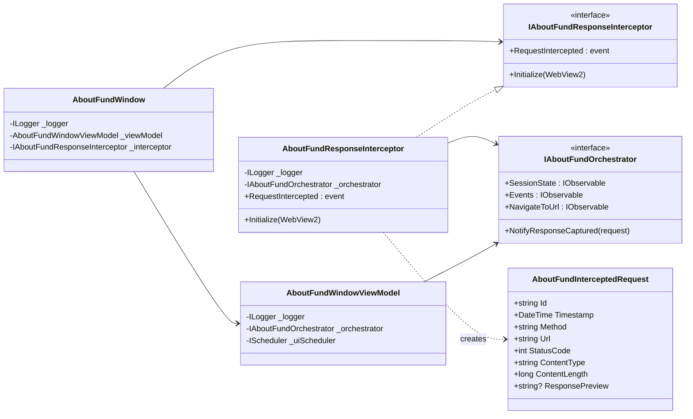

# AboutFund WebView2 Response Interception

Network response interception for the AboutFund browser window — captures fund API responses from WebView2 and forwards them to the application layer orchestrator.

## Data Flow

Runtime sequence from WebView2 network response through to the orchestrator and UI.



## Architecture

The interceptor bridges Presentation → Application directly, keeping the code-behind free of application-layer dependencies:



## Type Dependencies

Constructor injection dependencies between the AboutFund interception components. Arrows show "depends on" direction — all flow toward the Application layer (DDD-compliant).



## Files

**Services:**

- `Services/IAboutFundResponseInterceptor.cs` — Interface for response interception

  ```csharp
  public interface IAboutFundResponseInterceptor : IDisposable
  {
      void Initialize(WebView2 webView);
      event EventHandler<AboutFundInterceptedRequest>? RequestIntercepted;
  }
  ```

- `Services/AboutFundResponseInterceptor.cs` — Implementation:
  - Subscribes to `CoreWebView2.WebResourceResponseReceived`
  - Captures network requests matching fund API URL patterns
  - Extracts response content preview (first 2KB for JSON/text)
  - Raises `RequestIntercepted` event for UI consumers
  - Calls `IAboutFundOrchestrator.NotifyResponseCaptured()` directly (DDD: Presentation → Application)

**Models:**

- `Application/Models/AboutFundInterceptedRequest.cs` — Captured request/response data

**Behaviors:**

- `Behaviors/AboutFundWebView2Behavior.cs` — Attached behavior for WebView2 initialization and navigation events

**ViewModels:**

- `ViewModels/AboutFundWindowViewModel.cs` — Window state, commands, orchestrator subscriptions

**Views:**

- `Views/AboutFundWindow.xaml` — 3-column layout (schedule | browser | control panel)
- `Views/AboutFundWindow.xaml.cs` — Code-behind (UI plumbing only: interceptor init + dispose, no application-layer dependencies)

## Testing

### Manual Checklist

- [ ] AboutFund button opens non-modal window
- [ ] WebView2 loads default URL
- [ ] Network requests appear in interceptor panel
- [ ] Status codes are color-coded (green=2xx, orange=4xx, red=5xx)
- [ ] Clicking a request shows response preview
- [ ] NLog output shows `"Response captured:"` trace from orchestrator

### Enable Logging

```xml
<logger name="YieldRaccoon.Wpf.Services.AboutFundResponseInterceptor" minlevel="Trace" writeTo="file" />
<logger name="YieldRaccoon.Wpf.Behaviors.AboutFundWebView2Behavior" minlevel="Debug" writeTo="file" />
<logger name="YieldRaccoon.Infrastructure.Services.AboutFundOrchestrator" minlevel="Trace" writeTo="file" />
```

### Common Issues

| Issue | Solution |
| ----- | -------- |
| No data intercepted | Check URL patterns in `ShouldInterceptResponse()`, enable Trace logging |
| Empty response content | Response stream consumed by another reader — check for `COMException` in logs |
| Events not reaching UI | Verify `RequestIntercepted` subscription, check UI thread marshalling with `ObserveOn` |
