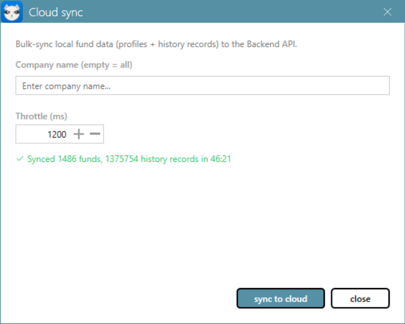
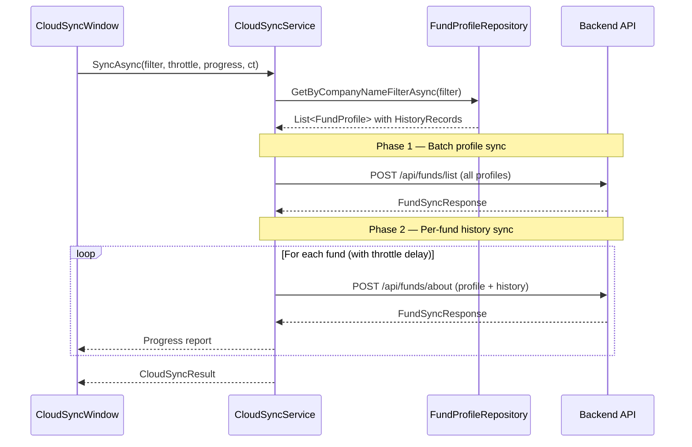
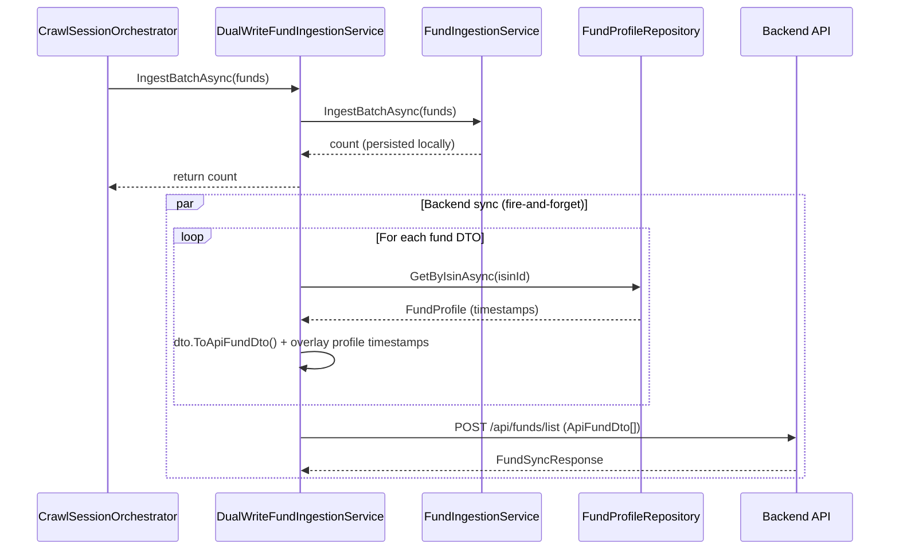
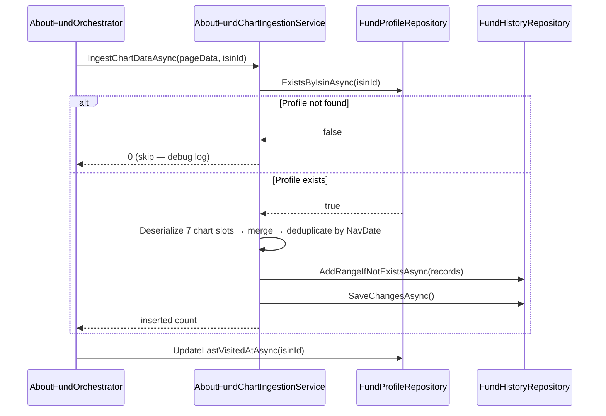

# Cloud Sync

Bulk-sync local fund data (profiles + history records) to the Backend API on demand. Useful for initial population of a new backend database or catch-up syncing after a period of offline crawling.

## Prerequisites

- **Backend API URL** configured in Settings (e.g., `https://your-app.azurewebsites.net`)
- **Backend API key** configured in Settings (sent as `Authorization: ApiKey {key}` header)
- Fund data present in the local database (SQLite or InMemory)

## How to use

1. Click **Cloud sync** in the title bar (between Statistics and Settings)
2. Optionally enter a **Company name** to filter — leave empty to sync all funds
3. Set **Throttle (ms)** — delay between per-fund API calls (default: 1200ms, keeps requests under the backend's 60/min rate limit)
4. Click **Sync to cloud**
5. Watch the progress bar and status updates
6. Close the window to cancel an in-progress sync

If Backend API URL is not configured, the window shows a warning and the sync button is disabled.

## Sync phases

The sync operation runs in two phases:

### Phase 1 — Batch profile sync

A single `POST /api/funds/list` sends all matched fund profiles. This ensures the backend knows about every fund before history records arrive.

### Phase 2 — Per-fund history sync

Iterates over each fund and sends `POST /api/funds/about` with the fund profile and all its history records. A configurable delay (`throttleMs`) is inserted between calls to avoid overwhelming the backend.

## DualWrite — Automatic sync during crawling

When the `DualWrite` provider is configured, fund data is automatically synced to the Backend API as it is crawled — no manual cloud sync needed. Two decorators handle the two data sources:

### CrawlSessionOrchestrator → DualWriteFundIngestionService

The crawl session (fund listing page) produces one daily snapshot per fund (Nav, NavDate, plus profile metadata). `DualWriteFundIngestionService` wraps `FundIngestionService` and fires a background sync after each batch is persisted locally.

The API DTO is always built from the `FundDataDto` (which carries the daily Nav/NavDate snapshot), enriched with authoritative timestamps (`FirstSeenAt`, `CrawlerLastUpdatedAt`, `AboutFundLastVisitedAt`) from the persisted profile when available.

### AboutFundOrchestrator → AboutFundChartIngestionService

The about-fund browser collects chart data across 7 time periods per fund. `AboutFundChartIngestionService` merges and deduplicates the data points, then persists as history records. A profile existence check guards against FK violations for funds not yet in the local database.

When `DualWrite` is enabled, `DualWriteChartIngestionService` wraps this and additionally syncs the profile + history records to the Backend API via `POST /api/funds/about` (fire-and-forget).

## Error handling

- **Rate limiting (429):** `FundSyncApiClient` automatically retries with exponential backoff (2s, 4s, 8s), respecting the backend's `Retry-After` header. After 3 retries, the fund is skipped with a 10-second cooldown before continuing. The progress bar shows "Rate limited — waiting before next fund..." during cooldown.
- **Per-fund failures** are caught and counted — they don't stop the overall sync
- **Cancellation** (closing the window) stops the loop after the current fund completes
- The final result shows total funds, successful syncs, failures, and history records inserted

## Architecture

| Layer | Component |
| ------- | ----------- |
| Application | `ICloudSyncService` — interface with `SyncAsync` |
| Application | `CloudSyncProgress` / `CloudSyncResult` — progress and result DTOs |
| Infrastructure | `CloudSyncService` — orchestrates queries, mapping, and API calls |
| Presentation | `CloudSyncWindow` / `CloudSyncWindowViewModel` — form with company filter, throttle, progress |
| Presentation | `ICloudSyncWindowService` / `CloudSyncWindowService` — modal dialog launcher |

## Configuration

Backend API URL and API key are configured in the Settings window. See the [YieldRaccoon README](../README.md) for details on DualWrite provider configuration.
