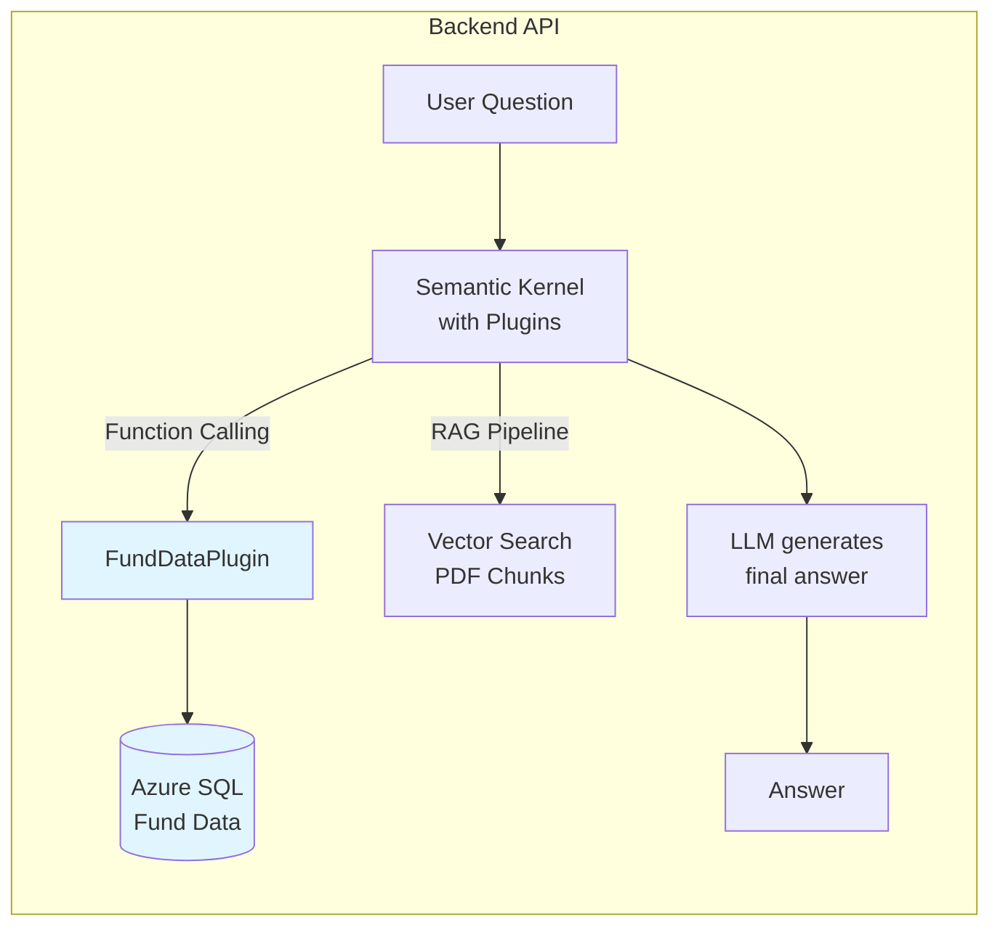
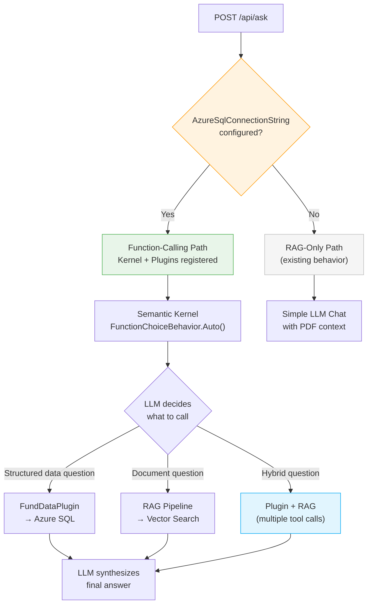
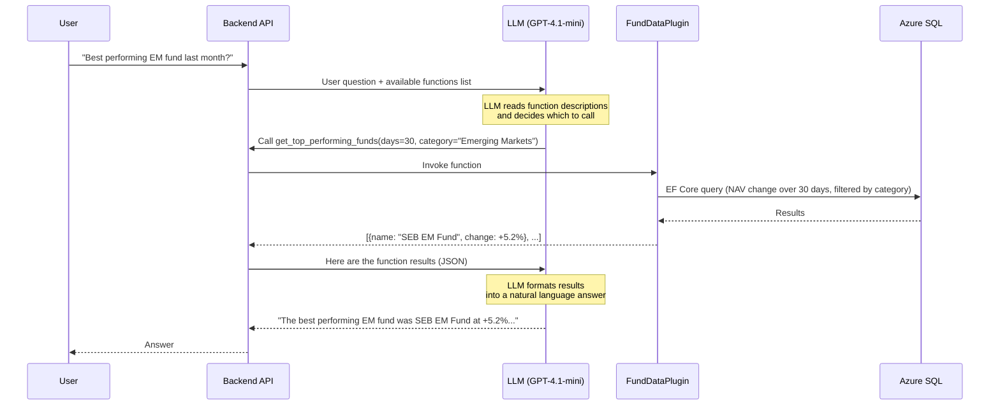
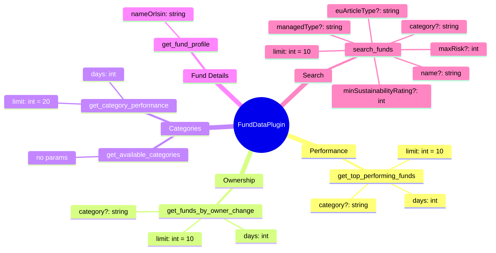
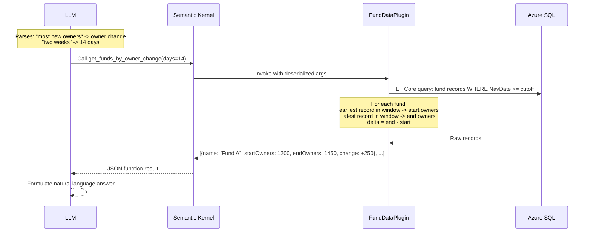
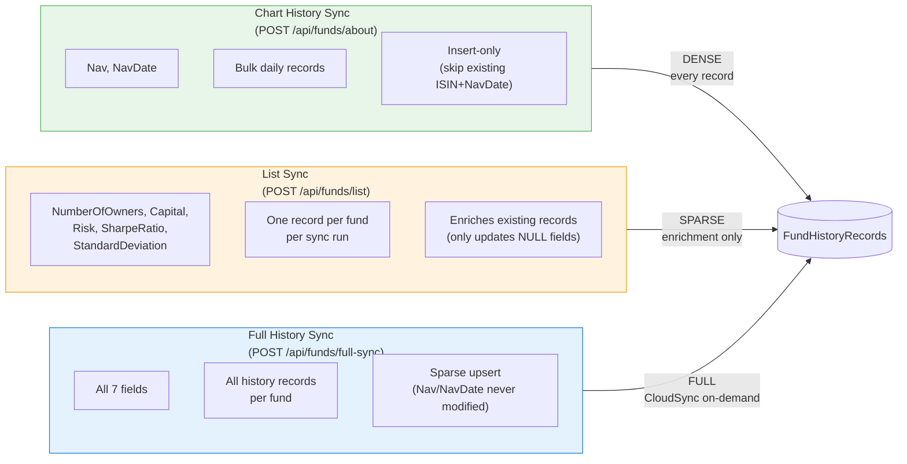
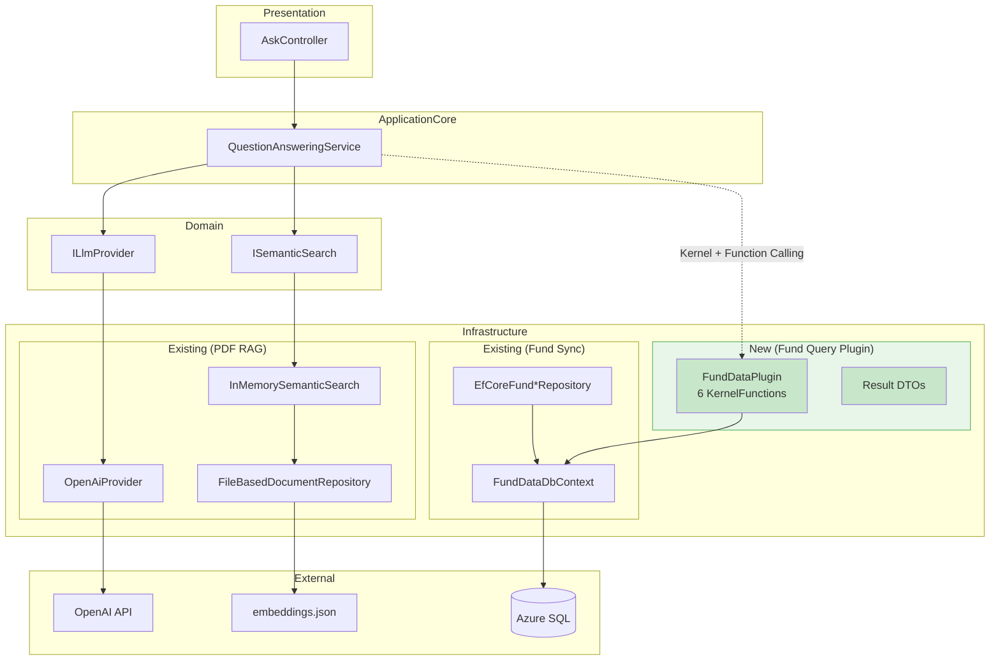

# Backend API - Fund Q&A Application

> Part of [PDF Q&A Application](../README.md). See [Configuration & Secrets Guide](../docs/SECRETS-MANAGEMENT.md) for all environment variables and API key setup.

ASP.NET Core Web API backend built with **Domain-Driven Design (DDD)** architecture that provides two complementary ways to answer questions about investment funds:

- **RAG Pipeline** — Semantic search over PDF fund documents (factsheets, PRIIP/KID documents) using OpenAI embeddings and vector similarity
- **Function Calling** — Structured data queries over Azure SQL fund data (performance rankings, ownership trends, category comparisons) using Semantic Kernel plugins

The LLM autonomously decides which approach to use — or combines both for hybrid answers.

**Vector Storage:** InMemory (default) or Azure Cosmos DB (persistent, optional)

## Tech Stack

- **ASP.NET Core 9** — Web API framework
- **Semantic Kernel 1.68.0** — AI orchestration, vector store, and function calling
- **OpenAI** — Query embeddings (text-embedding-3-small) + Chat completion (gpt-4.1-mini)
- **Azure SQL** — Fund profiles and historical NAV data (optional, enables function calling)
- **Azure Cosmos DB** — Persistent vector storage (optional)
- **Azure Application Insights** — Monitoring and telemetry
- **Azure Key Vault** — Secrets management (production)

## Architecture

### High-Level Overview

The backend combines document search (RAG) with structured data queries (function calling) behind a single `/api/ask` endpoint:



### Request Routing

All questions go through `POST /api/ask`. The LLM decides the routing based on the question type:



Without `AzureSqlConnectionString`, the backend works exactly as before — pure RAG over PDF documents.

> **Implementation note:** The `FundDataPlugin` is fully implemented and registered on the Semantic Kernel. The function-calling path in `QuestionAnsweringService` is under development — currently, all questions go through the RAG pipeline. Once integrated, the LLM will autonomously route between plugin calls and RAG.

### Function Calling Flow

When the LLM decides to query structured fund data, Semantic Kernel handles the plumbing:



## FundDataPlugin — Available Functions

The plugin exposes 6 functions — each answering a different class of question:



| Function | Answers Questions Like | What It Does |
| --- | --- | --- |
| `get_top_performing_funds` | "Best performing fund last month" | Compares NAV at start vs end of period, ranks by % change |
| `get_funds_by_owner_change` | "Which fund gained most owners in 2 weeks" | Compares `NumberOfOwners` at start vs end, ranks by delta |
| `get_category_performance` | "Best performing category this week" | Averages per-fund NAV % change within each category |
| `get_fund_profile` | "Tell me about SEB Emerging Markets Fund" | Returns static fund data: fees, risk, ESG, sustainability |
| `search_funds` | "Low-risk passive index funds" | Multi-criteria filter: risk, category, managed type, sustainability, EU article |
| `get_available_categories` | *(helper for LLM)* | Lists all categories so the LLM uses valid names |

Result limits are defined as constants in `QueryLimits` to keep LLM token usage compact.

### Example Queries

**Performance** (`get_top_performing_funds`):

- *"What are the top 5 best performing funds this year?"*
- *"Which funds lost the most value in the last 30 days?"*
- *"Best performing technology funds this week?"*

**Ownership** (`get_funds_by_owner_change`):

- *"Which funds are people selling the most right now?"*
- *"What emerging markets fund gained the most new investors this month?"*

**Categories** (`get_category_performance`):

- *"How did different fund categories perform last month?"*
- *"What's the worst performing category this year?"*

**Fund Profile** (`get_fund_profile`):

- *"What are the fees for SEB Emerging Markets Fund?"*
- *"What's the ESG score and sustainability rating for Spiltan Globalfond?"*
- *"Tell me everything about SE0008613939"*

**Search** (`search_funds`):

- *"Show me low-risk passive index funds with good sustainability ratings"*
- *"What Article 9 funds are available?"*
- *"Find me cheap actively managed funds with risk level below 4"*

**Hybrid** (plugin + RAG together) — the first half asks for numbers/rankings, the second half asks for explanations from PDF documents:

- *"How did Spiltan Globalfond perform last month, and what's their investment strategy?"*
- *"Which emerging markets fund grew the most, and what risks does its factsheet mention?"*
- *"Which fund performed best last month, and what's its investment objective?"*
- *"Which fund is losing the most owners? What does its PRIIP document say about liquidity risk?"*
- *"Find me a low-risk passive fund — what do the factsheets say about their fee structures?"*
- *"What are the fees for Spiltan Globalfond, and how does the factsheet describe its benchmark?"*
- *"What's the best performing category, and what do the fund documents say about that market segment?"*

### Query Flow Example

For *"What fund gained the most new owners in the last two weeks?"*:



## Prerequisites

- **.NET 9 SDK** — Download from [dotnet.microsoft.com](https://dotnet.microsoft.com/download)
- **API Keys** — OpenAI (required), Groq (optional) — See [Configuration & Secrets Guide](../docs/SECRETS-MANAGEMENT.md)
- **embeddings.json** — Generated by the Preprocessor (copy to `Backend.API/Data/embeddings.json`)

## Setup Instructions

### 1. Navigate

```bash
cd backend
```

### 2. Configure API Keys

```bash
cd Backend.API

# OpenAI (default, recommended)
dotnet user-secrets set "BackendOptions:OpenAIApiKey" "sk-your-openai-api-key"
dotnet user-secrets set "BackendOptions:LlmProvider" "OpenAI"

# Or Groq (free tier alternative — still needs OpenAI key for embeddings)
dotnet user-secrets set "BackendOptions:OpenAIApiKey" "sk-your-openai-api-key"
dotnet user-secrets set "BackendOptions:GroqApiKey" "gsk-your-groq-api-key"
dotnet user-secrets set "BackendOptions:LlmProvider" "Groq"
```

See **[Configuration & Secrets Guide](../docs/SECRETS-MANAGEMENT.md)** for all configuration options and production setup.

### 3. Copy Embeddings File

**Important:** Embeddings must be generated using OpenAI (not Ollama) for vector space compatibility.

```bash
cp ../Preprocessor/Preprocessor/bin/Debug/net9.0/output.json Backend.API/Data/embeddings.json
```

### 4. Run the Backend

```bash
cd Backend.API
dotnet run
```

The API starts at:

- HTTP: `http://localhost:5000`
- HTTPS: `https://localhost:5001`
- Swagger UI: `http://localhost:5000/swagger`

## Configuration Options

All configuration is in `appsettings.json` under `BackendOptions`. See **[Configuration & Secrets Guide](../docs/SECRETS-MANAGEMENT.md)** for complete details.

| Setting | Default | Description |
| --- | --- | --- |
| `LlmProvider` | `OpenAI` | LLM provider ("OpenAI" or "Groq") |
| `OpenAIChatModel` | `gpt-4.1-mini` | OpenAI chat model |
| `OpenAIEmbeddingModel` | `text-embedding-3-small` | OpenAI embedding model |
| `GroqModel` | `llama-3.3-70b-versatile` | Groq LLM model |
| `GroqApiUrl` | `https://api.groq.com/openai/v1` | Groq API endpoint |
| `MaxSearchResults` | `10` | Number of chunks to retrieve |
| `MemoryCollectionName` | `fund-documents` | Vector store collection name |
| `SystemPrompt` | *(hardened default)* | Custom LLM system prompt (optional) |
| `VectorStorageType` | `InMemory` | Vector storage ("InMemory" or "CosmosDb") |
| `EmbeddingsFilePath` | `Data/embeddings.json` | Path to embeddings file (InMemory only) |
| `CosmosDbEndpoint` | — | Cosmos DB endpoint URL (CosmosDb only) |
| `CosmosDbDatabaseName` | — | Cosmos DB database name (CosmosDb only) |
| `CosmosDbContainerName` | `embeddings` | Cosmos DB container name (CosmosDb only) |
| `EmbeddingApiKey` | — | API key for embedding + fund sync endpoints |
| `AzureSqlConnectionString` | — | Azure SQL connection string (enables FundDataPlugin) |
| `AllowedOrigins` | `["localhost:3000","localhost:3001"]` | CORS allowed origins |

## LLM Providers

### OpenAI (Default, Recommended)

Best quality responses, reliable availability, broad model selection. Cost: ~$0.15/1M input tokens, ~$0.60/1M output tokens (gpt-4.1-mini).

```bash
dotnet user-secrets set "BackendOptions:LlmProvider" "OpenAI"
dotnet user-secrets set "BackendOptions:OpenAIApiKey" "sk-your-openai-api-key"
```

### Groq (Free Tier Alternative)

Zero cost, fast inference, OpenAI-compatible API. Limited by rate limits and model selection. Groq does not reliably support function calling, so the FundDataPlugin won't work with this provider.

```bash
dotnet user-secrets set "BackendOptions:LlmProvider" "Groq"
dotnet user-secrets set "BackendOptions:GroqApiKey" "gsk-your-groq-api-key"
```

## Vector Storage

### InMemory (Default)

Loads embeddings from `Data/embeddings.json` on startup. Fast, zero infrastructure cost, ideal for development. Embeddings are lost on app restart.

### Cosmos DB (Optional, Persistent)

Persistent vector storage with native vector indexing. Survives restarts, supports dynamic updates via API, multi-instance deployments.

```bash
dotnet user-secrets set "BackendOptions:VectorStorageType" "CosmosDb"
dotnet user-secrets set "BackendOptions:CosmosDbEndpoint" "https://<your-account>.documents.azure.com:443/"
dotnet user-secrets set "BackendOptions:CosmosDbDatabaseName" "<your-database>"
dotnet user-secrets set "BackendOptions:CosmosDbConnectionString" "AccountEndpoint=...;AccountKey=...;"
dotnet user-secrets set "BackendOptions:EmbeddingApiKey" "$(openssl rand -base64 32)"
```

Upload embeddings using the Preprocessor with `--cosmosdb` flag. See [Azure Deployment Guide](../docs/AZURE-DEPLOYMENT.md#optional-cosmos-db-setup-for-persistent-vector-storage) for production setup with Managed Identity.

**Embedding management endpoints** (Cosmos DB only, API key required):

| Endpoint | Method | Description |
| --- | --- | --- |
| `/api/embeddings` | POST | Add new embeddings (batch) |
| `/api/embeddings/{sourceFile}` | PUT | Update embeddings for specific file |
| `/api/embeddings/{sourceFile}` | DELETE | Delete embeddings for specific file |
| `/api/embeddings/replace-all` | POST | Replace all embeddings (destructive) |

## Azure SQL — Fund Data

Persistent storage for fund profiles and historical NAV data, populated by the [YieldRaccoon](../YieldRaccoon/README.md) desktop crawler via cloud sync. When configured, this also enables the `FundDataPlugin` for structured fund queries.

```bash
dotnet user-secrets set "BackendOptions:AzureSqlConnectionString" "Server=tcp:<server>.database.windows.net,1433;..."
dotnet user-secrets set "BackendOptions:EmbeddingApiKey" "your-api-key"
```

EF Core auto-migrates the database on startup. See [Cloud Sync documentation](../YieldRaccoon/docs/CLOUD-SYNC.md) for the full YieldRaccoon sync workflow.

### Data Scope — Sync Density

`FundHistoryRecords` are populated by three sync paths with different data completeness:



| Data | Density | Source | Plugin Impact |
| --- | --- | --- | --- |
| `Nav` + `NavDate` | **Dense** — present on every record | Chart sync / Full sync | Performance queries use all records |
| `NumberOfOwners` | **Sparse** — only on enriched records | List sync / Full sync | Ownership queries filter `WHERE NumberOfOwners IS NOT NULL` |
| `Capital`, `Risk`, `SharpeRatio`, `StandardDeviation` | **Sparse** | List sync / Full sync | Outside plugin scope (available on `FundProfile` instead) |

## Security

### API Key Authentication

Protected endpoints (`/api/embeddings/*` and `/api/funds/*`) require an API key header:

```plaintext
Authorization: ApiKey <your-api-key>
```

The middleware uses constant-time comparison to prevent timing attacks.

### Input Validation

- **Question length:** 3–500 characters (model validation)
- **SafeQuestion attribute:** Rejects prompt injection patterns
- **User question sanitizer:** Strips dangerous characters before LLM processing
- **ISIN validation:** Value object with format validation on fund sync endpoints

### Rate Limiting

**60 requests per minute** with a queue of 5. Returns `429 Too Many Requests` with `Retry-After: 5` header.

### Request Size Limit

Max request body: **10 MB** (for embedding batch uploads).

## API Endpoints

### POST /api/ask

Ask a question about fund documents or fund data.

```bash
curl -X POST http://localhost:5000/api/ask \
  -H "Content-Type: application/json" \
  -d '{"question":"What is the risk level of Spiltan Globalfond?"}'
```

**Response:**

```json
{
  "answer": "The fund is classified as risk level 4 out of 7, indicating moderate risk.",
  "sources": [
    { "file": "Spiltan_Globalfond.pdf", "page": 1 }
  ]
}
```

| Status | Description |
| --- | --- |
| `200 OK` | Success |
| `400 Bad Request` | Invalid question (empty or too short) |
| `500 Internal Server Error` | Processing error |

### POST /api/ask/stream

Ask a question with **streaming response** via Server-Sent Events (SSE). Tokens arrive incrementally as the LLM generates them, providing a real-time typing effect.

```bash
curl -N -X POST http://localhost:5000/api/ask/stream \
  -H "Content-Type: application/json" \
  -d '{"question":"What is the risk level of Spiltan Globalfond?"}'
```

**Response** (`Content-Type: text/event-stream`):

```text
event: sources
data: [{"file":"Spiltan_Globalfond.pdf","page":1}]

event: delta
data: "The fund is "

event: delta
data: "classified as risk level 4..."

event: done
data: {}
```

| Event | Description |
| --- | --- |
| `sources` | Source references from semantic search (sent first, before LLM starts) |
| `delta` | A text chunk from the LLM response |
| `done` | Stream complete |
| `error` | Error occurred mid-stream (`{"message":"..."}`) |

| Status | Description |
| --- | --- |
| `200 OK` | SSE stream started |
| `400 Bad Request` | Invalid question (returned as JSON before stream starts) |

### Health Endpoints

| Endpoint | Description |
| --- | --- |
| `GET /health/live` | Liveness probe — is the app running? |
| `GET /health/ready` | Readiness probe — embeddings loaded, dependencies available? |

Both return `200 OK` with "Healthy" or `503 Service Unavailable`. When Cosmos DB or Azure SQL are configured, `/health/ready` includes connectivity checks.

### POST /api/funds/list

Batch sync fund profiles from YieldRaccoon. Requires API key.

```bash
curl -X POST http://localhost:5000/api/funds/list \
  -H "Content-Type: application/json" \
  -H "Authorization: ApiKey your-api-key" \
  -d '{"funds":[{"isin":"SE0008613939","name":"Fund A","nav":123.45,"navDate":"2025-01-15"}]}'
```

### POST /api/funds/about

Sync single fund profile + chart history records. Requires API key.

```bash
curl -X POST http://localhost:5000/api/funds/about \
  -H "Content-Type: application/json" \
  -H "Authorization: ApiKey your-api-key" \
  -d '{"profile":{"isin":"SE0008613939","name":"Fund A"},"historyRecords":[{"isin":"SE0008613939","nav":123.45,"navDate":"2025-01-15"}]}'
```

### POST /api/funds/full-sync

CloudSync full history sync for a single fund. Sends static profile metadata (insert-if-not-exists) and full history records with all time-varying fields. Requires API key.

```bash
curl -X POST http://localhost:5000/api/funds/full-sync \
  -H "Content-Type: application/json" \
  -H "Authorization: ApiKey your-api-key" \
  -d '{"profile":{"isin":"SE0008613939","name":"Fund A"},"historyRecords":[{"isin":"SE0008613939","nav":123.45,"navDate":"2025-01-15","capital":1500000000,"numberOfOwners":42000,"risk":4}]}'
```

Profile upsert semantics: insert-if-not-exists (existing profiles are never modified). History record upsert semantics: new `(ISIN, NavDate)` pairs are inserted with all fields; existing pairs have `Capital`, `NumberOfOwners`, `Risk`, `SharpeRatio`, `StandardDeviation` updated only when the incoming value is non-null — `Nav` and `NavDate` are never modified.

All fund endpoints return `503 Service Unavailable` if Azure SQL is not configured.

## DDD Architecture

The backend follows **Domain-Driven Design** principles:



**Dependency flow:** `Presentation → ApplicationCore → Domain ← Infrastructure`

**Domain Layer** (`Domain/`) — Zero external dependencies. Pure business logic: interfaces (ILlmProvider, IDocumentRepository, ISemanticSearch), models (DocumentChunk, SearchResult, QuestionAnswer), value objects (EmbeddingVector, DocumentMetadata, IsinId), domain services (UserQuestionSanitizer), and fund data entities (FundProfile, FundHistoryRecord) with repository interfaces.

**ApplicationCore Layer** (`ApplicationCore/`) — Use cases: QuestionAnsweringService (RAG pipeline), FundSyncService (fund data sync). DTOs for API communication. Depends only on Domain.

**Infrastructure Layer** (`Infrastructure/`) — Implements domain interfaces with external dependencies: LLM providers (OpenAiProvider, GroqProvider), repositories (FileBasedDocumentRepository, CosmosDbDocumentRepository), search (InMemorySemanticSearch, CosmosDbSemanticSearch), fund data (EF Core repositories, FundDataDbContext), and the FundDataPlugin (6 KernelFunctions querying Azure SQL via IDbContextFactory).

**Presentation Layer** (`Controllers/`) — Thin controllers: AskController, FundsController, EmbeddingsController. ApiKeyAuthenticationMiddleware protects fund + embedding endpoints. No business logic.

## Testing

### Unit Tests

```bash
cd Backend.Tests
dotnet test
```

### Deployment Verification Tests

These tests verify the live Azure deployment. They use NUnit's `[Explicit]` attribute — they won't run with `dotnet test`, you must select them manually in Test Explorer.

**Setup:**

```bash
cd Backend.Tests
dotnet user-secrets set "DeploymentTests:AzureApiUrl" "https://your-deployment-url"
```

**What gets tested:** liveness probe, readiness probe, valid question returns answer, invalid question returns 400.

**Note:** Azure free tier (F1) has cold start delays and daily quotas (60 CPU minutes). Tests may fail with 503 when quota is exceeded — resets at UTC midnight.

## Troubleshooting

### "Failed to initialize document repository"

1. Check `Backend.API/Data/embeddings.json` exists
2. Verify OpenAI API key: `dotnet user-secrets list`
3. Re-generate if corrupted: run Preprocessor with `--provider openai`, copy output

### "Groq API key is not set"

```bash
dotnet user-secrets set "BackendOptions:GroqApiKey" "gsk-your-key-here"
dotnet user-secrets set "BackendOptions:LlmProvider" "Groq"
```

### "Unknown LLM provider"

Set `LlmProvider` to exactly `"OpenAI"` or `"Groq"` (case-insensitive).

### CORS errors from frontend

Add your frontend URL to `AllowedOrigins`:

```bash
dotnet user-secrets set "BackendOptions:AllowedOrigins:0" "http://localhost:3000"
dotnet user-secrets set "BackendOptions:AllowedOrigins:1" "https://<your-app>.azurestaticapps.net"
```

Or in Azure: `BackendOptions__AllowedOrigins__0`, `BackendOptions__AllowedOrigins__1`, etc.

## Documentation

- **[Configuration & Secrets Guide](../docs/SECRETS-MANAGEMENT.md)** — All environment variables, API keys, and settings
- **[Azure Deployment Guide](../docs/AZURE-DEPLOYMENT.md)** — Complete guide for deploying to Azure App Service
- **[Project Status](../Status.md)** — Overall project progress and implementation status
