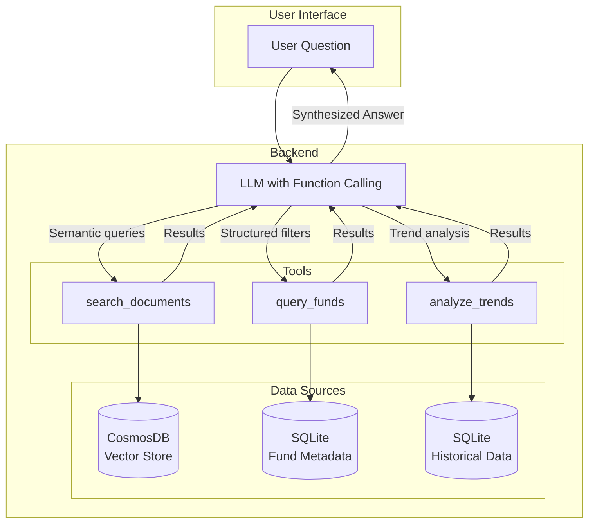
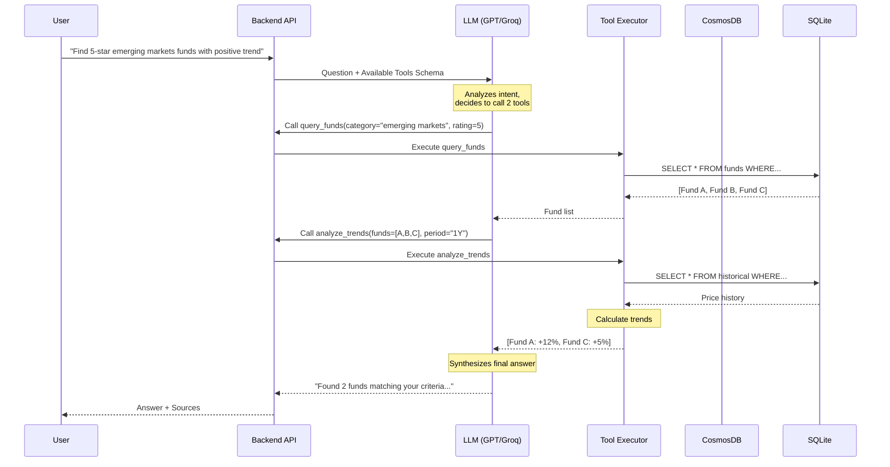

# Feature Plan: Structured Data Search via Function Calling

## Overview

Extend the existing RAG system to search structured data (Morningstar ratings, sales information, historical trends) stored in SQLite databases alongside the semantic search over PDF embeddings in CosmosDB.

**Approach:** LLM Function/Tool Calling - Let the LLM intelligently route queries to the appropriate data source.

## Architecture



## Query Flow



## Tool Definitions

### 1. search_documents

Existing semantic search over PDF embeddings.

**When LLM uses it:**

- Questions about fund factsheet content
- "What does the prospectus say about..."
- Risk descriptions, fee explanations, investment strategies

**Parameters:**

| Parameter | Type   | Description                      |
| --------- | ------ | -------------------------------- |
| query     | string | Natural language search query    |
| top_k     | int    | Number of results (default: 5)   |

### 2. query_funds

Structured query against fund metadata in SQLite.

**When LLM uses it:**

- Filter by Morningstar rating
- Filter by category/sector
- Filter by sales figures
- List funds matching criteria

**Parameters:**

| Parameter          | Type     | Description                              |
| ------------------ | -------- | ---------------------------------------- |
| category           | string?  | Fund category (e.g., "Emerging Markets") |
| morningstar_rating | int?     | Rating 1-5                               |
| min_sales          | decimal? | Minimum sales amount                     |
| max_sales          | decimal? | Maximum sales amount                     |

**Example queries:**

- "List all 5-star funds" -> `query_funds(morningstar_rating=5)`
- "Emerging markets funds" -> `query_funds(category="Emerging Markets")`

### 3. analyze_trends

Historical performance analysis from SQLite time-series data.

**When LLM uses it:**

- Trend analysis questions
- Performance comparisons
- "Funds with positive/negative trend"
- Historical returns

**Parameters:**

| Parameter  | Type      | Description                              |
| ---------- | --------- | ---------------------------------------- |
| fund_ids   | string[]? | Specific funds to analyze (optional)     |
| category   | string?   | Filter by category                       |
| period     | string    | Time period: "1M", "3M", "6M", "1Y", "3Y" |
| trend_type | string    | "positive", "negative", or "all"         |

**Example queries:**

- "Funds with positive trend this year" -> `analyze_trends(period="1Y", trend_type="positive")`
- "How has Fund X performed?" -> `analyze_trends(fund_ids=["X"], period="1Y")`

## Example Interactions

### Example 1: Pure Structured Query

```text
User: "Show me all funds with Morningstar rating 5"

LLM thinks: "This is a structured filter, no semantic search needed"
LLM calls: query_funds(morningstar_rating=5)
Result: [Fund A, Fund B, Fund C]

LLM responds: "I found 3 funds with a 5-star Morningstar rating:
1. Fund A - Emerging Markets
2. Fund B - Global Equity
3. Fund C - Technology Sector"
```

### Example 2: Pure Semantic Query

```text
User: "What are the main risks of investing in emerging markets?"

LLM thinks: "This needs document content"
LLM calls: search_documents(query="emerging markets investment risks")
Result: [chunks from PDF factsheets]

LLM responds: "Based on the fund factsheets, the main risks include:
- Currency fluctuation risk
- Political instability
- Lower liquidity..."
```

### Example 3: Hybrid Query

```text
User: "Find 5-star emerging markets funds and explain their risk profiles"

LLM thinks: "Need structured filter + document content"
LLM calls: query_funds(category="Emerging Markets", morningstar_rating=5)
Result: [Fund A, Fund B]

LLM calls: search_documents(query="Fund A Fund B risk profile")
Result: [risk-related chunks]

LLM responds: "I found 2 five-star emerging markets funds:

1. **Fund A** - Risk level 5/7. Key risks include currency exposure
   and concentration in Asian markets...

2. **Fund B** - Risk level 4/7. More diversified with lower
   volatility but still exposed to..."
```

### Example 4: Trend Analysis

```text
User: "Which technology funds have been performing well this year?"

LLM thinks: "Need trend analysis for a category"
LLM calls: analyze_trends(category="Technology", period="1Y", trend_type="positive")
Result: [{fund: "Tech Fund A", return: "+24%"}, {fund: "Tech Fund B", return: "+18%"}]

LLM responds: "Two technology funds show positive performance in 2024:
1. Tech Fund A: +24% YTD
2. Tech Fund B: +18% YTD"
```

## Implementation with Semantic Kernel

Semantic Kernel supports function calling natively. Define tools as kernel functions:

```csharp
public class FundSearchPlugin
{
    [KernelFunction("query_funds")]
    [Description("Query funds by structured criteria like rating, category, sales")]
    public async Task<List<FundInfo>> QueryFundsAsync(
        [Description("Fund category")] string? category = null,
        [Description("Morningstar rating 1-5")] int? morningstarRating = null)
    {
        // Query SQLite database
    }

    [KernelFunction("analyze_trends")]
    [Description("Analyze historical performance trends")]
    public async Task<List<TrendResult>> AnalyzeTrendsAsync(
        [Description("Time period: 1M, 3M, 6M, 1Y, 3Y")] string period,
        [Description("Trend direction: positive, negative, all")] string trendType = "all")
    {
        // Query SQLite + compute trends
    }
}
```

## SQLite Schema (Reference)

### Fund Metadata Table

```sql
CREATE TABLE funds (
    id TEXT PRIMARY KEY,
    name TEXT NOT NULL,
    category TEXT,
    morningstar_rating INTEGER,
    sales_ytd DECIMAL,
    isin TEXT
);
```

### Historical Data Table

```sql
CREATE TABLE historical_prices (
    fund_id TEXT,
    date DATE,
    nav DECIMAL,
    PRIMARY KEY (fund_id, date),
    FOREIGN KEY (fund_id) REFERENCES funds(id)
);
```

## Why Function Calling Over Alternatives

| Approach             | Pros                                         | Cons                                   | Verdict         |
| -------------------- | -------------------------------------------- | -------------------------------------- | --------------- |
| **Function Calling** | Flexible, handles trends, no data duplication | Slightly more LLM tokens               | **Recommended** |
| Metadata Filtering   | Simple, single query                         | Can't handle trends, data duplication  | Not suitable    |
| Text-to-SQL          | Very flexible                                | Security risks, error-prone            | Overkill        |

## Cost Impact

- **LLM tokens:** ~10-20% increase (tool schema + reasoning)
- **Storage:** No change (SQLite stays as-is)
- **CosmosDB RU:** No change (structured queries go to SQLite)

## Implementation Phases

### Phase 1: SQLite Integration

- [ ] Add SQLite database to Backend
- [ ] Create fund metadata table
- [ ] Create historical prices table
- [ ] Import sample data

### Phase 2: Semantic Kernel Functions

- [ ] Create `FundSearchPlugin` with kernel functions
- [ ] Implement `query_funds` function
- [ ] Implement `analyze_trends` function
- [ ] Register plugin with kernel

### Phase 3: Update Question Answering

- [ ] Enable automatic function calling in chat completion
- [ ] Update `QuestionAnsweringService` to handle tool results
- [ ] Add function call logging/telemetry

### Phase 4: Testing

- [ ] Unit tests for each function
- [ ] Integration tests for hybrid queries
- [ ] Update Status.md
